# Основные определения

Картография - это область науки, техники и производства, охватывающая изучение, создание и использование картографических произведений[^1].

[^1]: ГОСТ 21667-76 Картография. Термины и определения (с Изменением 1, 2) [https://docs.cntd.ru/document/1200006865](https://docs.cntd.ru/document/1200006865?section=status)

от греч. *сhartes* — лист, бумага и *grapho* — пишу, черчу, рисую

Картография:

-   искусство, наука и технология о создании и использовании карт;

-   уникальное средство для создания и манипулирования визуального или виртуального представления геопространства - карт - для исследования, анализа, понимания и коммуникации информации о пространстве[^2].

[^2]: A Strategic Plan for the International Cartographic Association 2003-2011 - <https://icaci.org/files/documents/reference_docs/ICA_Strategic_Plan_2003-2011.pdf>

Карты и другие картографическое изображения— пространственно-временные образно знаковые модели действительности[^3].

[^3]: Храмов В.М. Картография (лекции) - <https://geo.bsu.by/images/pres/cart/carto/carto01.pdf>

------------------------------------------------------------------------

Самое главное, чем занимается картография:

-   математическое обоснование картографирования, то есть как спроектировать карту максимально точно;

-   разработка знаковой системы, то есть как будут отображены те или иные объекты.

Этими задачами занимаются немного разные подотрасли картографии, а вторая из них вообще со временем переросла в картографический дизайн.

# Что такое карта?

В общем смысле карта - это символическое представление географической ситуации, выбранных объектов и характеристик, полученная как результат творческого авторского отбора и разработанная для использования в тех случаях, когда пространственные отношения представляют наибольшую важность.

> A symbolised representation of a geographical reality, representing selected features and characteristics, resulting from the creative effort of its author’s execution of choices, that is designed for use when spatial relationships are of primary relevance.

По ГОСТ карта - это построенное в картографической проекции, уменьшенное, обобщенное изображение поверхности Земли, поверхности другого небесного тела или внеземного пространства, показывающее расположенные на них объекты в определенной системе условных знаков.

::: callout-note
Карта могут быть географическими, общегеографическими, топографическими, отраслевыми, специального назначения, тематическими, комплексными, аналитическими, синтетическими, обзорными.
:::

# Элементы карты

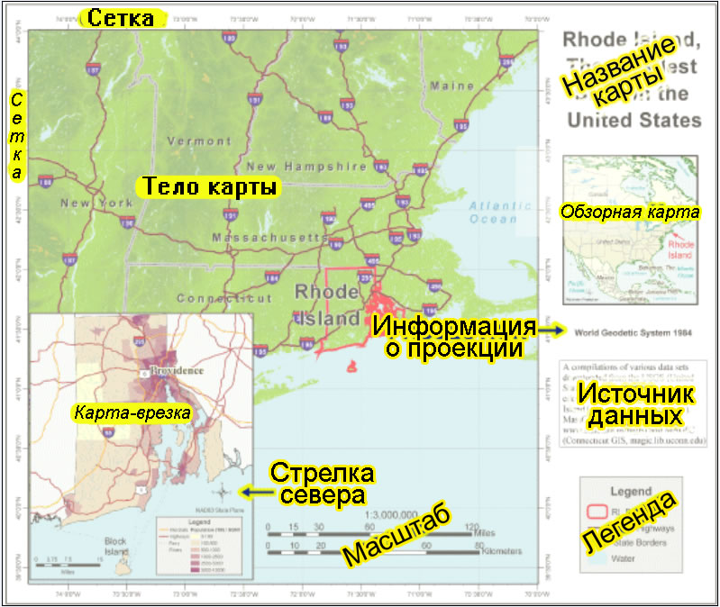{fig-align="center"}

# Чем карта отличается от изображения поверхности Земли?

. . .

Это математически определенное изображение

. . .

Она использует особую знаковую систему

. . .

Она использует генерализацию, то есть отбор и обобщение объектов

. . .

Она использует системный подход

---

> Обманывать при помощи географических карт не только легко, но еще и очень важно. Для того чтобы передать наполненные смыслом взаимосвязи в сложном трехмерном мире на листе бумаги или экране, карта должна искажать окружающую реальность. Все географические карты лгут[^4]

[^4]: Марк Монмонье ; перевод с английского Михаила Попова; научный редактор А. О. Захаров. - Москва : КоЛибри: Азбука-Аттикус, 2021.

{fig-align="center"}

# Математическая основа карты

В математическую основу карты входят:

-   геодезическая основа;

-   картографическая проекция;

-   масштаб;

-   картографическая или координатная сетка.

# Картографические проекции

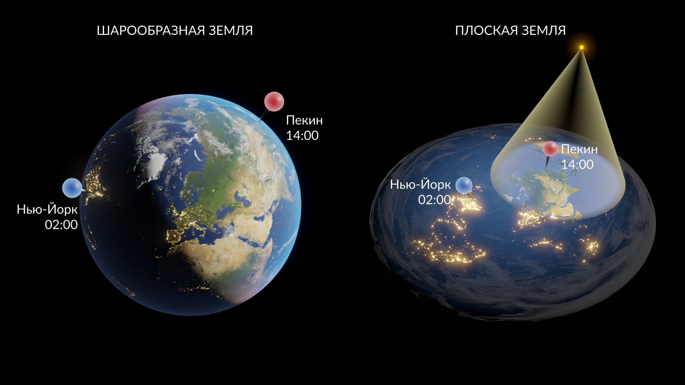{fig-align="center"}

------------------------------------------------------------------------

Картографическая проекция - это математически определенный способ отображения поверхности Земли (либо другого небесного тела) на плоскость.

Основная суть проекций связана с тем, что фигуру небесного тела заменяют на другую, которую легко развернуть на плоскость.

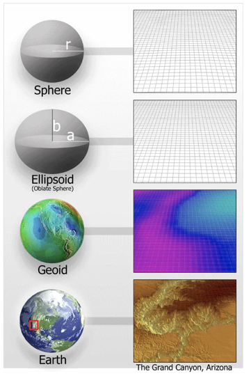{fig-align="center"}

------------------------------------------------------------------------

::::: columns
::: {.column width="40%"}
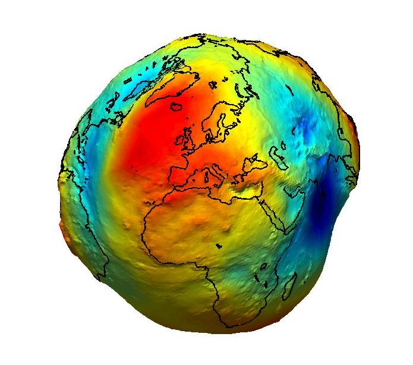{fig-align="center" width="679"}
:::

::: {.column width="60%"}
```{=html}
<video width="1000" height="700" controls>
  <source src="images/2103_061_AR_EN.mp4" type="video/mp4">
</video>
```
:::
:::::

------------------------------------------------------------------------

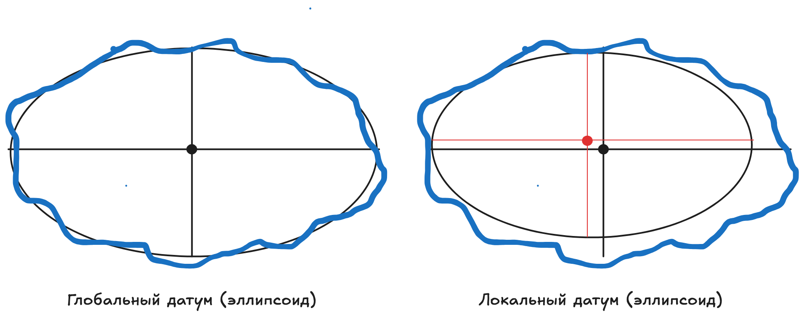{fig-align="center"}

------------------------------------------------------------------------

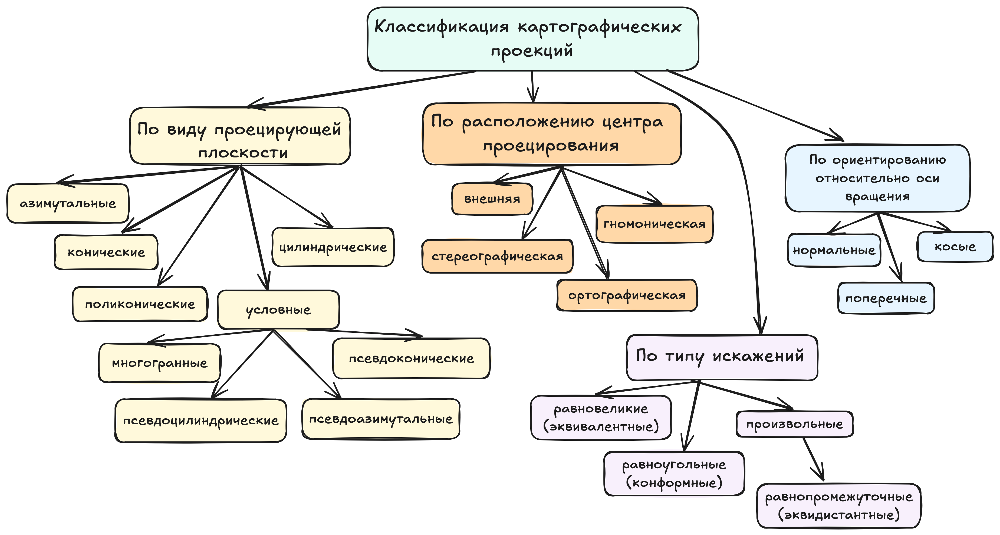{fig-align="center"}

------------------------------------------------------------------------

::: callout-important
Картографические проекции могут искажать размеры, форму и углы между линиями. Невозможно получить проекцию без искажений двух из трех величин. Как правило, подбор проекции осуществляется, исходя из того, какой из этих параметров важнее всего сохранить неизменным, пожертвовав остальными двумя.
:::

В первую очередь все картографические проекции можно разделить по типу искажений:

-   ***равновеликие или эквивалентные*** проекции сохраняют площади объектов, но искажают их форму и углы между линиями;

<!-- -->

-   ***равноугольные или конформные*** позволяют сохранить величину углов и формы малых фигур;
-   ***произвольные проекции*** искажают углы и площади объектов, но могут сохранять распределение искажений в некотором компромиссном состоянии.
-   ***равнопромежуточные проекции***, сохраняющие расстояния по одному из направлений (например, вдоль меридианов).

------------------------------------------------------------------------

Классификация по виду проецирующей поверхности:

::::: columns
::: {.column width="50%"}
-   ***азимутальные проекции*** используют плоскость, которая касается поверхности Земли в одной точке. Именно эта точка не будет иметь никаких искажений, при отдалении от нее к краю плоскости искажения, как правило, возрастают;
:::

::: {.column width="50%"}
{fig-align="center" width="436"}
:::
:::::

------------------------------------------------------------------------

-   ***конические проекции***, которые вписывают объемное тело в конус, касающийся тела по одной линии. Линия касания является линией отсутствия искажений, в то время как при удалении от нее эти искажения возрастают, при этом, при приближении к вершине конуса, искажение происходит в сторону уменьшения, а при приближении к основанию - в сторону увеличения. Впоследствии конус разворачивается на плоскость;

{fig-align="center"}

------------------------------------------------------------------------

-   ***цилиндрические проекции*** используют в качестве поверхности проецирования цилиндр, касающийся поверхности объемного тела по одной линии. Эта линия будет определять истинный масштаб карты и будет линией отсутствия искажений, при удалении от которой искажения будут возрастать;

{fig-align="center"}

------------------------------------------------------------------------

-   ***условные проекции***, использующие либо более сложные поверхности проецирования, либо более комплексные подходы при использовании простых поверхностей:

    -   **многогранные проекции**, которые используют сложные многогранные объемные тела, аппроксимирующие размеры и форму Земли и впоследствии разворачиваемые на плоскость;

    -   **псевдоцилиндрические, псевдоконические и псевдоазимутальные** - проекции, которые не вписывают объемное тело в поверхность проецирования (а в случае азимутальные проекций - не используют плоскость как касательную), а используют эту поверхность как секущую, образуя две линии пересечения.

------------------------------------------------------------------------

{fig-align="center" width="1166"}

{fig-align="center" width="1390"}

------------------------------------------------------------------------

Классификация по ориентированию относительно оси вращения:

-   ***нормальные или прямые*** (в случае с азимутальными проекциями - ***полярные***) - ось вращения Земли совпадает с осью вращения поверхности проецирования (для азимутальных проекций - точка касания находится на одном из полюсов);

-   ***поперечные*** - ось вращения поверхности проецирования находится в плоскости экватора и перпедикулярна оси вращения Земли (для азимутальных проекций - точка касания находится на линии экватора);

-   ***косые*** - ось вращения повеохности проецирования расположена под произвольным углом по отношению к оси вращения Земли (для азимутальных проекций - расположение точки касания на поверхности Земли произвольно).

------------------------------------------------------------------------

Классификация по расположению точки проецирования:

::::::: columns
::: {.column width="25%"}
-   в ***гномонических проекциях*** точка проецирования расположена в центре масс Земли;

{fig-align="center" width="438"}
:::

::: {.column width="27%"}
-   ***стереографическая проекция -*** центр проецирования расположен на противоположном полюсе;

{fig-align="center" width="441"}
:::

::: {.column width="22%"}
-   центр проецирования ***внешней проекции*** расположен на диаметре, на некотором расстоянии;

{fig-align="center" width="291"}
:::

::: {.column width="25%"}
-   ***ортографическая проекция -*** центр проецирования расположен на бесконечном удалении от Земли.

{fig-align="center" width="291"}
:::
:::::::

# Немного об искажениях проекций

[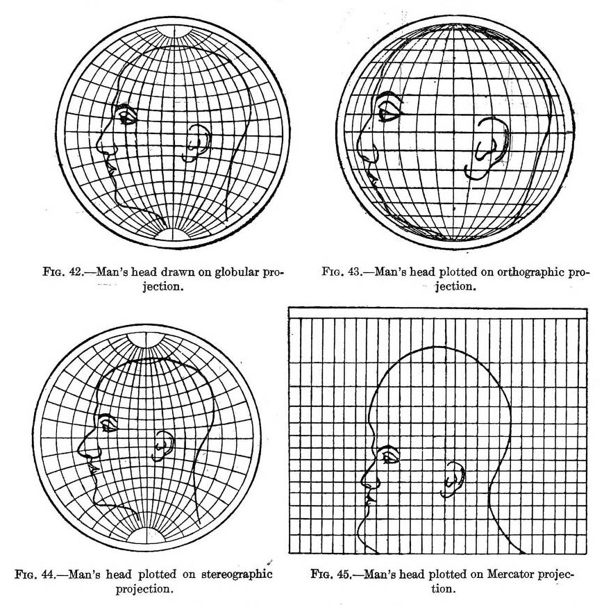{fig-align="center" width="749"}](https://archive.org/details/cu31924003898271/page/n56/mode/1up?view=theater)

---

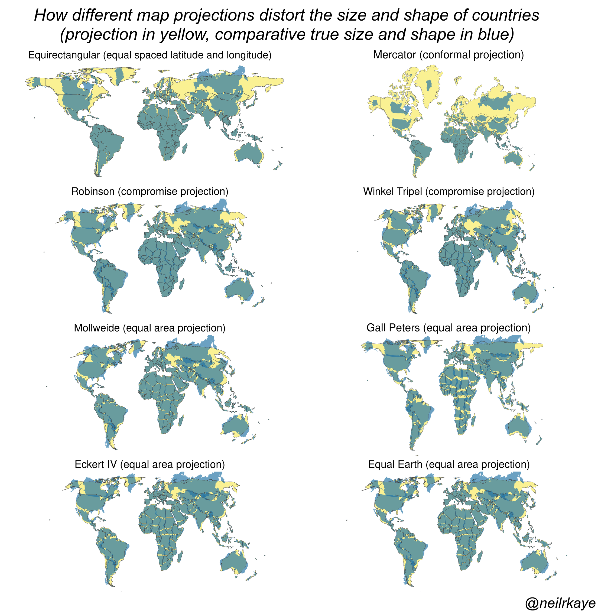{fig-align="center" width="881"}

---

::::: columns
::: {.column width="50%"}
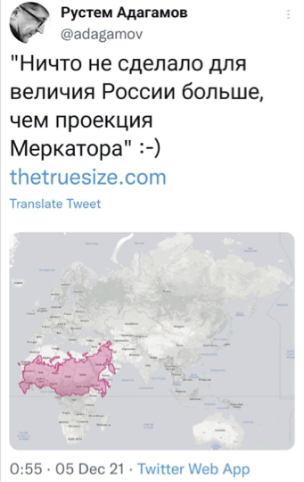{fig-align="center" width="442"}
:::

::: {.column width="50%"}
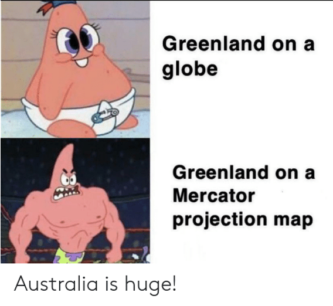{fig-align="center" width="653"}
:::
:::::

---

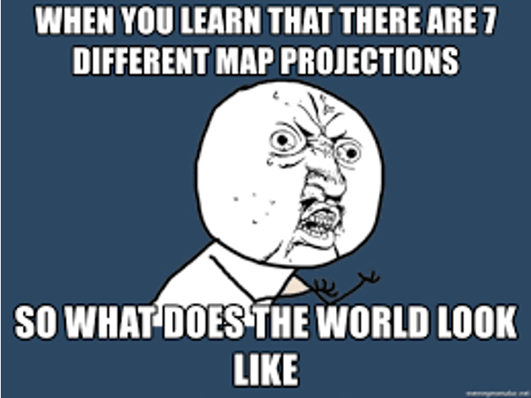{fig-align="center"}

Не так как вы привыкли видеть на карте 🤯

---

Для того, чтобы оценивать искажения и их характер существуют **эллипсы Тиссо или эллипсы искажений** - бесконечно малый эллипс в любой точке карты, являющийся отображением бесконечно малой окружности в соответствующей точке на поверхности земного эллипсоида или шара[^5].

[^5]: <http://www.gisa.ru/13458.html>

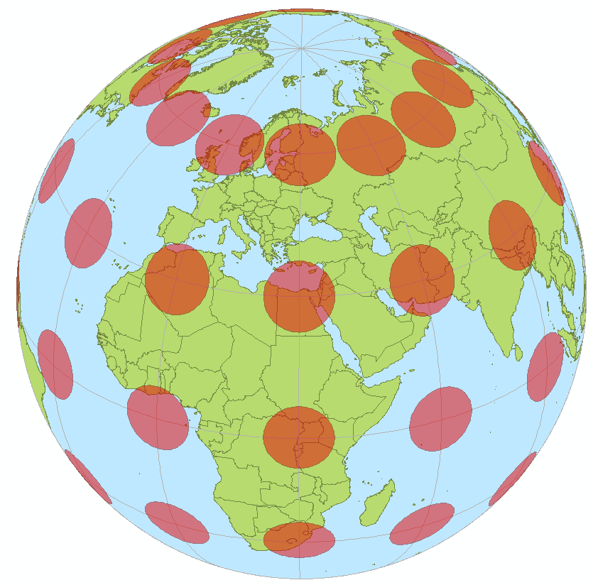{fig-align="center" width="613"}

---

::::: columns
::: {.column width="50%"}
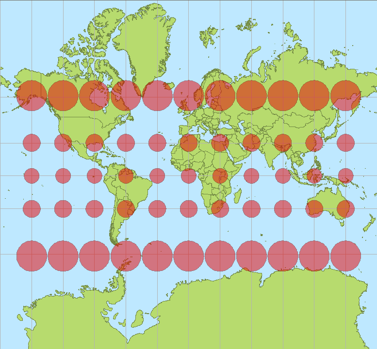{fig-align="center" width="863"}
:::

::: {.column width="50%"}
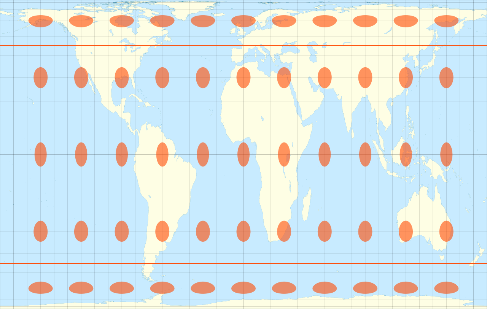{fig-align="center" width="1260"}
:::
:::::

# Как выбрать картографическую проекцию?

Однозначного ответа, увы, здесь нет.

В первую очередь, необходимо понять, какой параметр объектов наиболее важно сохранить: **размеры, длины или углы**? Кроме того, следует учитывать расположение картографируемой области, так как для разных типов проекций искажения будут наименее выраженными в определенных областях.

Если ориентироваться на минимазацию искажений, то можно использовать методику, предложенную в [Атласе картографический проекций для крупных регионов России](https://kartfak.ru/wp-content/uploads/2023/03/%D0%90%D1%82%D0%BB%D0%B0%D1%81_%D0%BF%D1%80%D0%BE%D0%B5%D0%BA%D1%86%D0%B8%D0%B9_%D0%98%D0%B2%D0%B0%D0%BD%D0%BE%D0%B2_%D0%97%D0%B0%D0%B3%D1%80%D0%B5%D0%B1%D0%B8%D0%BD.pdf)[^6].

[^6]: Иванов А.Г., Загребин Г.И. Атлас картографических проекций на крупные регионы Российской федерации: учебно-наглядное издание. – М.: МИИГАиК, 2012. – 19 с.: ил.

---

Если картографируемый участок находится в **экваториальной зоне**:

-   **вытянут вдоль параллелей**, то рекомендуется использовать *нормальную цилиндрическую или нормальную коническую проекции*

-   **компактной формы**, то рекомендуется использовать *нормальную коническую или азимутальную проекцию* с точкой касания к поверхности Земли у центра картографируемого участка (поперечную или косую)

-   **вытянут в произвольном направлении** (под углом к параллелям и меридианам), то рекомендуется использование *цилиндрической проекции* с таким расположением оси вращения, чтобы линия касания проходила максимально близко к центру участка.

---

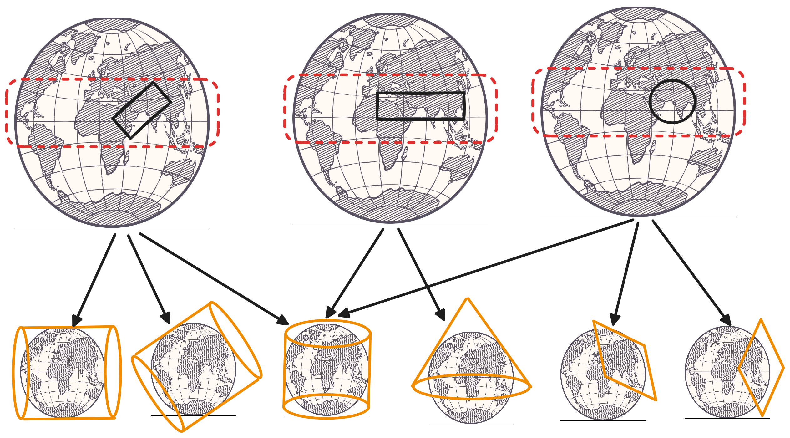{fig-align="center" width="1443"}

---

Если участок исследования расположен в **средних широтах** (применимо как к северному, так и южному полушарию):

-   **вытянут вдоль параллелей**, то рекомендуется использование *прямой конической проекции* для соответствующего полушария (северного или южного)

-   **компактной формы**, то рекомендуется использование *нормальной конической проекции или азимутальной проекции* с точкой касания в центре участка

-   **вытянут в произвольном направлении** (под углом к параллелям и меридианам), то рекомендуется использование *поперечной или косой цилиндрической проекции* (расположение оси вращения здесь выбирается так, чтобы минимизировать искажения на участке)

---

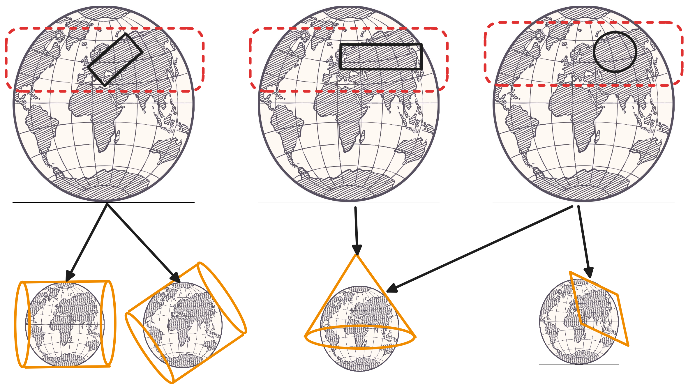{fig-align="center" width="1414"}

---

Если участок расположен в **приполярной области** (применимо к обоим полушариям):

-   **вытянут вдоль параллелей или вытянут в произвольном направлении**, то рекомендуется использовать *полярную азимутальную проекцию*

-   имеет **компактную форму**, то рекомендуется использование *полярной или косой азимутальной проекции* (в зависимости от конкретного расположения участка для минимизации искажений рекомендуется располагать точку касания по центру отображаемого участка)

---

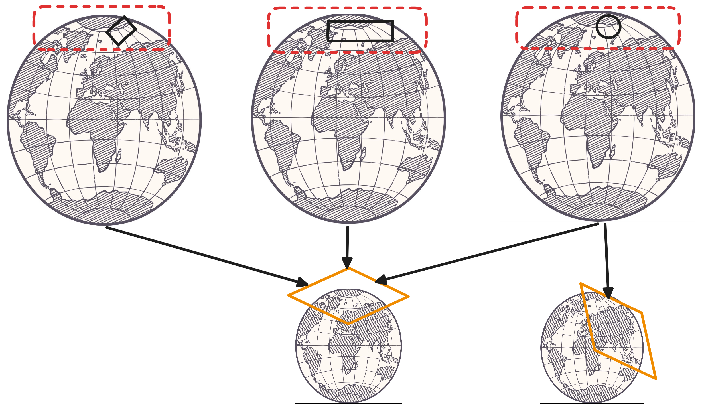{fig-align="center" width="1027"}

# Немного о масштабах

Масштаб - это отношение реальной длины линии на местности к ее длине на карте, то есть во сколько раз мы все уменьшаем на карте.

::: callout-note
Масштаб на карте на самом деле не является стабильной величиной и может изменяться от точки к точке, что связано с переходом от искривленной поверхности Земли к ее плоскому изображению.

То, что мы привыкли видеть в качестве масштаба на карте - это **главный масштаб**, то есть масштаб карты на точках или линиях нулевых искажений. Масштаб в любой другой точке называется **частным масштабом**.
:::

---

На картах вы, как правило, можете увидеть какой-то из этих масштабов:

-   **численный** - масштаб указан безразмерной дробью, в числителе которой всегда единица, а в знаменателе - число, показывающее степень уменьшения, например, 1:1000 или 1:500;

-   **графический** в виде графика для измерение длин линий, чаще всего вы видите на картах *линейный* графический масштаб;

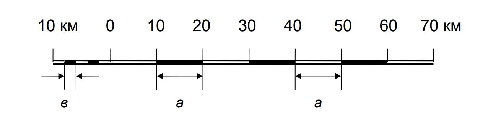{fig-align="center"}

-   **именованный**, указывающий соотношение длин линий на карте и на местности, например, в 1 см 1 км или в 1 см 50 км.

# Генерализация 

Генерализация должна осуществляться в соответствии с назначением, масштабом, содержанием карты, особенностями картографируемой территории и самого объекта[^7].

[^7]: Берлянт. «Картография», 2014

Два основных вида генерализации:

-   генерализация содержания, которая предполагает выбор объектов, подлежащих отображению на карте и того, какими символами они будут представлены;

-   генерализация геометрии предполагает изменение формы и размера объектов.

::: callout-note
Вообще эта классификация типов генерализации довольно условна и у разных картографов разное мнение на этот счет.
:::

## Генерализация содержания

По большей части она относится к способам отображения количественной информации: способ классификации и выбор цветовой палитры.

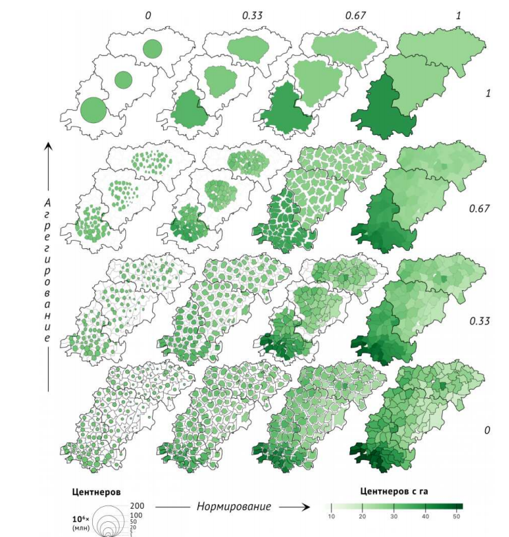{fig-align="center" width="663"}

---

Но к ней также относится отбор отображаемых на карте слоев и объектов.

::::: columns
::: {.column width="50%"}
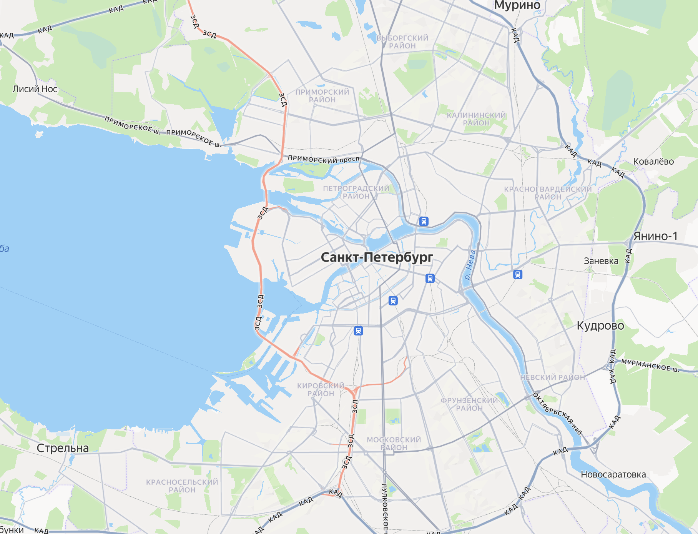{fig-align="center" width="1047"}
:::

::: {.column width="50%"}
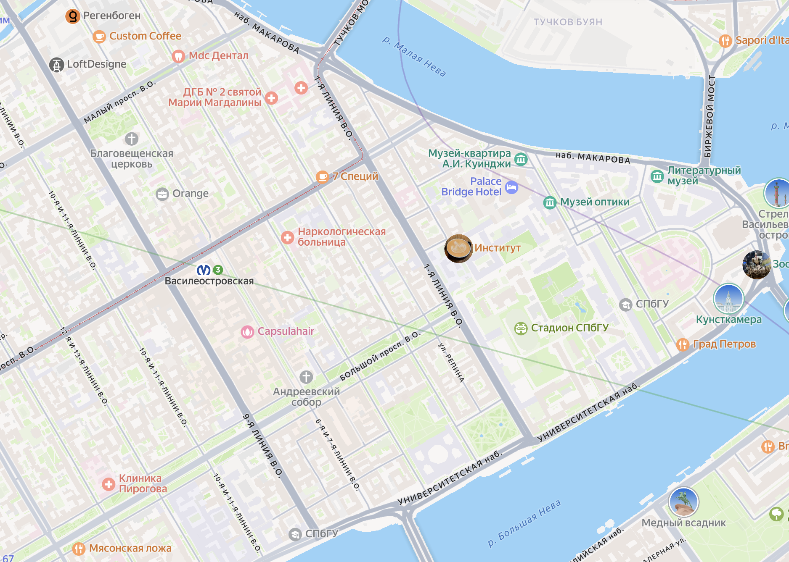{fig-align="center" width="1122"}
:::
:::::

## Генерализация геометрии

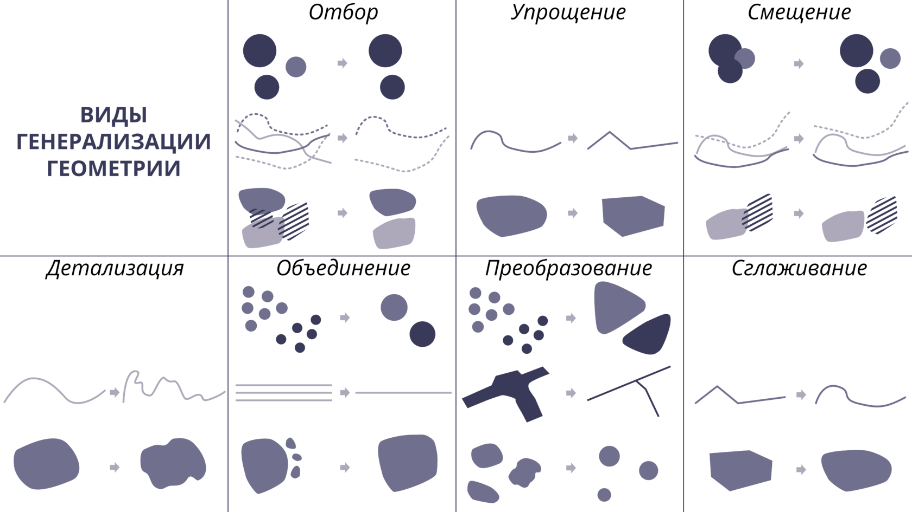{fig-align="center" width="1600"}
