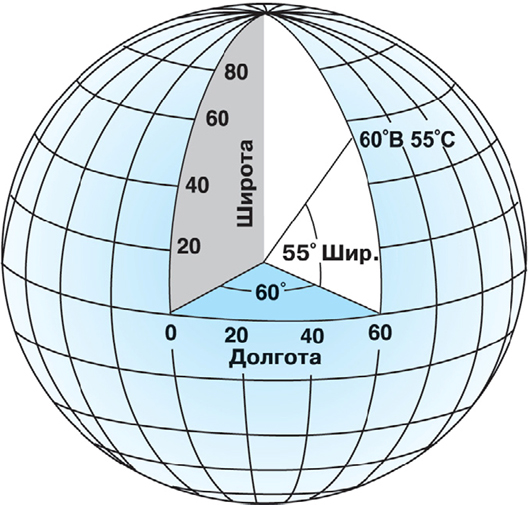
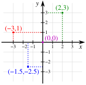
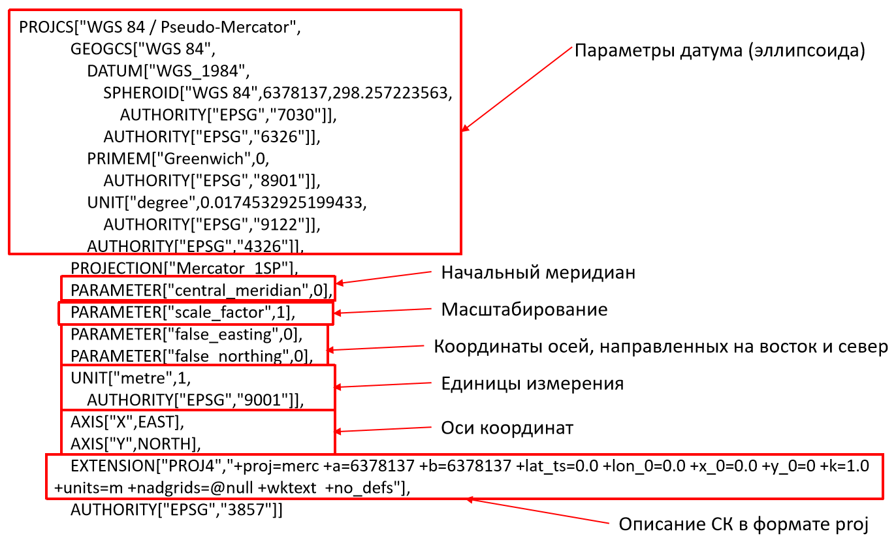
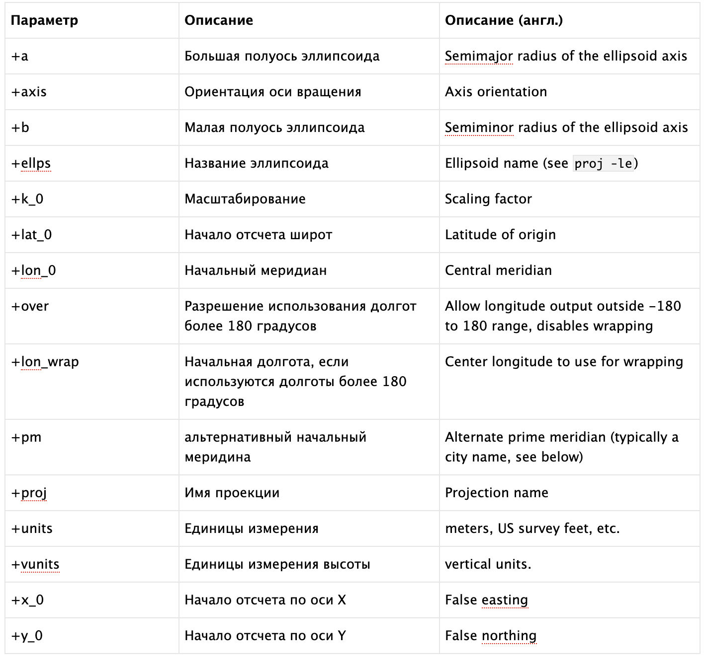
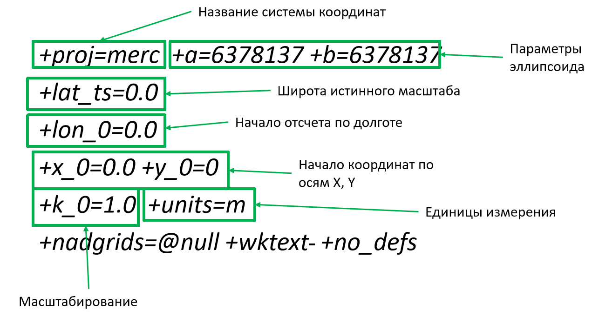
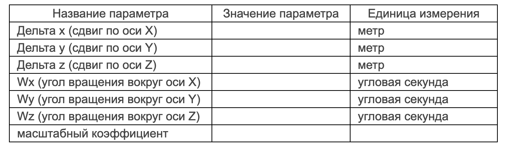
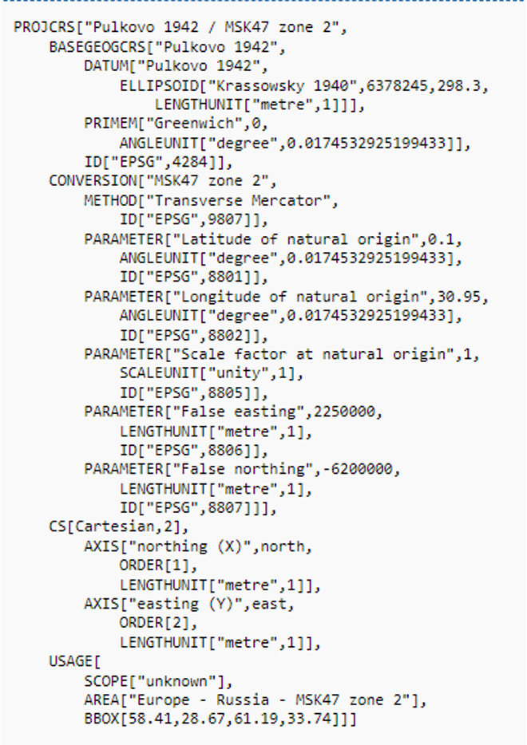
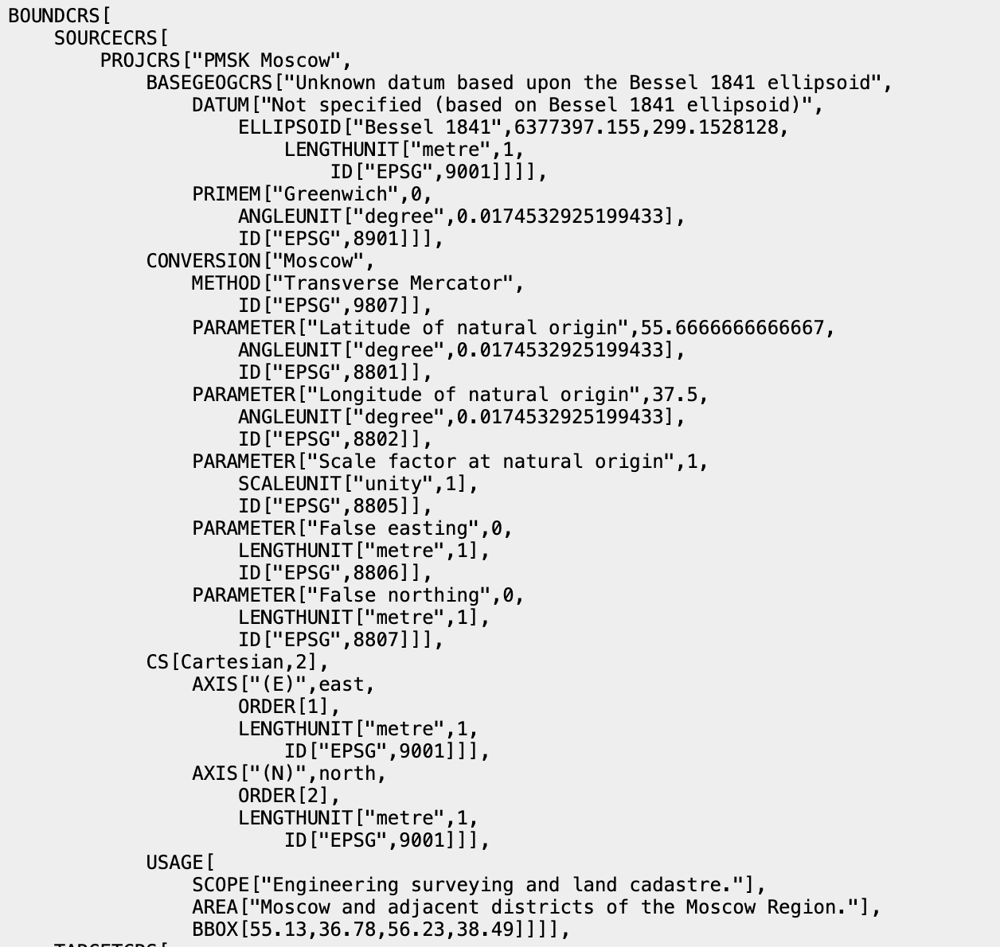
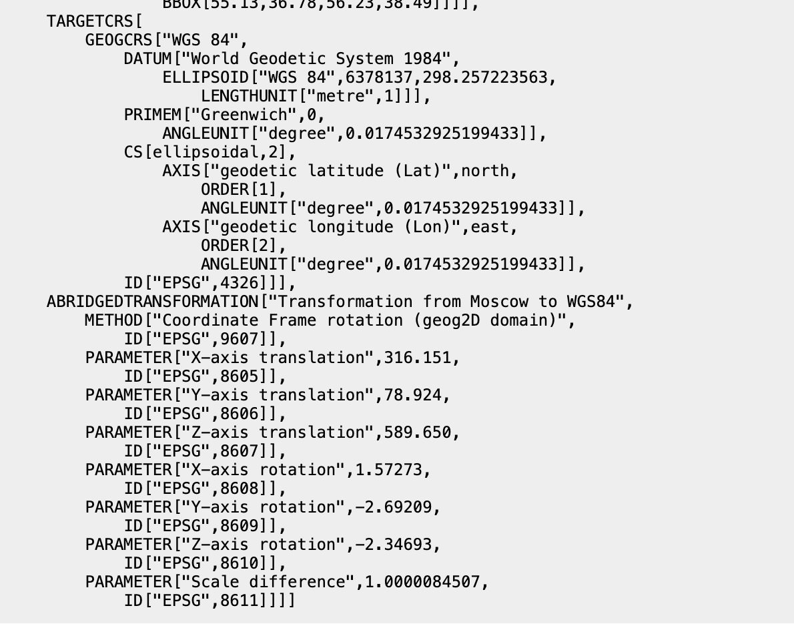

Все системы координат в ГИС можно поделить на две группы:

-   **географические** - общеземные системы координат, которые используют широту и долготу в качестве координат с градусами как единицами измерения, измерения здесь выполняются на сфере/эллипсоиде;

-   **прямоугольные** - стандартные плоские прямоугольные декартовы координаты, как правило, с метрическими единицами измерения, измерения ведутся на плоскости.

::: callout-note
Прямоугольные системы координат в современной литературе могут еще называться спроецированными (калька с английского слова "projected")
:::

# Географическая система координат

::::: columns
::: {.column width="50%"}
{fig-align="center"}
:::

::: {.column width="50%"}
**Широтой** точки называется угол, образованный отвесной линией в данной точке и плоскостью экватора. Этот угол отсчитывается от плоскости экватора на север или на юг, изменяясь от 0 до 90. Широта бывает северная (+) и южная (-).

**Долготой** точки называется двугранный угол, заключенный между плоскостью начального (Гринвичского) меридиана и плоскостью меридиана, проходящего через данную точку. От начального нулевого меридиана долготу отсчитывают на восток и запад, до 180. Соответственно, долгота называется восточной (+) и западной (-).[^1]
:::
:::::

[^1]: <https://portal.tpu.ru/SHARED/p/POCELUEV/ucheba/Geodesy/Lab3.pdf>

# Прямоугольная система координат

::::: columns
::: {.column width="50%"}
{fig-align="center"}
:::

::: {.column width="50%"}
**Прямоуго́льная (дека́ртова) систе́ма координа́т** — прямолинейная система координат с взаимно перпендикулярными координатными осями на плоскости или в пространстве. Часто используемая система координат. Просто обобщается для пространств любой размерности[^2].
:::
:::::

[^2]: Прямоугольная система координат <https://ru.wikipedia.org/wiki/%D0%9F%D1%80%D1%8F%D0%BC%D0%BE%D1%83%D0%B3%D0%BE%D0%BB%D1%8C%D0%BD%D0%B0%D1%8F_%D1%81%D0%B8%D1%81%D1%82%D0%B5%D0%BC%D0%B0_%D0%BA%D0%BE%D0%BE%D1%80%D0%B4%D0%B8%D0%BD%D0%B0%D1%82>

# Что такое система координат в ГИС

Любая система координат в ГИС состоит из нескольких компонентов:

-   картографическая проекция, в которую входят:

    -   датум или эллипсоид

    -   поверхность, на которую проецируется изображение

-   оси, их направление;

-   начало системы координат;

-   единицы измерения.

# Реестр систем координат

В настоящее время используется единая классификация систем координат в ГИС – ***реестр EPSG***, изначально созданный *European petroleum survey group* и получивший от нее свою аббревиатуру.

> *Эта организация в настоящее время называется The International Association of Oil & Gas Producers (IOGP). IOGP ведёт базу данных систем координат, которая в настоящее время является стандартом de facto в сфере ГИС. Поэтому часто вместо полного описания СК достаточно указать её EPSG-код, который являются её ключом в базе данных*[^3]*.*

[^3]: Трансформация описания систем координат из формата MapInfo в WKT и PROJ.4 <https://gis-lab.info/qa/mapinfo_to_wkt_proj4.html>

Кроме него также могут использоваться данные других реестров систем координат, например, одноименный реестр компании ESRI.

::: callout-tip
Официальный сайт реестра - <https://epsg.org/home.html>

(Неофициальный) сайт реестра - epsg.io
:::

------------------------------------------------------------------------

-   ***EPSG:4326***

    WGS 84 - WGS84 - World Geodetic System 1984, used in GPS

-   ***EPSG:3857***

    WGS 84 / Pseudo-Mercator - Spherical Mercator, Google Maps, OpenStreetMap, Bing, ArcGIS, ESRI

-   ***ESRI:102025***

    Asia North Albers Equal Area Conic

# Форматы описания систем координат в ГИС

Есть два основных формата описания параметров систем координат:

-   WKT (well known text) - текстовый формат описания параметров систем координат и параметров перехода между ними;

::: callout-note
Компания ESRI использует несколько иную реализацию формата WKT для описания СК, она обычно называется **ESRI WKT** и используется, в частности, в ArcGIS.
:::

-   proj4 - строковое описание системы координат, базирующее на проекте [proj](https://github.com/OSGeo/PROJ).

::: callout-tip
proj как библиотека широко используется в работе с системами координат в различных языках программирования.
:::

# Формат описания WKT

Международный формат описания WKT закреплен [стандартом Open Geospatial Consortium](https://www.ogc.org/standards/wkt-crs/).

Описание системы координат состоит из **ключевых слов и атрибутов** этих ключевых слов. Ключевые слова указываются перед квадратными скобками, а атрибуты — внутри скобок. Кроме того, атрибуты могут содержать вложенные ключевые слова.

Пример фрагмента описания системы координат: `KEYWORD1[attribute1,KEYWORD2[attribute2,attribute3]]`

------------------------------------------------------------------------

# Формат описания PROJ {.scrollable}

{fig-align="center"}

# Формат описания PROJ {visibility="hidden"}

| Параметр | Описание | Описание (англ.) |
|----|----|----|
| +a | Большая полуось эллипсоида | Semimajor radius of the ellipsoid axis |
| +axis | Ориентация оси вращения | Axis orientation |
| +b | Малая полуось эллипсоида | Semiminor radius of the ellipsoid axis |
| +ellps | Название эллипсоида | Ellipsoid name (see `proj -le`) |
| +k_0 | Масштабирование | Scaling factor |
| +lat_0 | Начало отсчета широт | Latitude of origin |
| +lon_0 | Начальный меридиан | Central meridian |
| +over | Разрешение использования долгот более 180 градусов | Allow longitude output outside -180 to 180 range, disables wrapping |
| +lon_wrap | Начальная долгота, если используются долготы более 180 градусов | Center longitude to use for wrapping |
| +pm | альтернативный начальный меридина | Alternate prime meridian (typically a city name, see below) |
| +proj | Имя проекции | Projection name |
| +units | Единицы измерения | meters, US survey feet, etc. |
| +vunits | Единицы измерения высоты | vertical units. |
| +x_0 | Начало отсчета по оси X | False easting |
| +y_0 | Начало отсчета по оси Y | False northing |

------------------------------------------------------------------------

# Сервисы для поиска и подбора систем координат

-   Projection wizard <https://projectionwizard.org/>

-   World map generator <https://www.worldmapgenerator.com/en/wizard/step/projection/>

-   Map projection explorer <https://www.geo-projections.com/>

-   Compare map projections <https://map-projections.net/singleview.php>

-   Map projections <https://bella-mir.github.io/proj-guesser/#/>

-   <https://spatialreference.org/>

# Есть подвох

. . .

Подвох в том, что значительное количество документов в кадастре и градостроительстве ведутся в ***местных системах координат***.

Местные системы координат определяются в границах субъектов РФ.

. . .

::: callout-important
Этих систем координат нет ни в каких реестрах, поэтому их параметры необходимо прописывать самостоятельно.
:::

# Немного про местные системы координат

Местные системы координат вообще вводились для ведения кадастра недвижимости.

Все, что вносится в ЕГРН с координатами, должно быть вычислено в местной системе координат, но в силу своей специфики они имеют значительные ошибки и искажения.

Какие могут быть особенности местных систем координат с точки зрения параметров:

-   требуется указать параметры сдвига начала отсчета;

-   необходимо использовать нестандартный датум (эллипсоид);

-   необходимы дополнительные преобразования.

------------------------------------------------------------------------

Первый вариант самый простой, так как необходимость изменения минимальна.

Во втором варианте возможны несколько ситуаций:

-   параметров датума нет в EPSG;

-   в EPSG нет параметров перехода от WGS 84 к нужному датуму;

-   в EPSG есть параметры перехода от WGS 84, но они рассчитаны для другого датума.

::: callout-note
В некоторых случаях может использоваться до 7 параметров преобразования, например, в МСК-33[^4].

:::

[^4]: Постановление Губернатора Владимирской обл. от 26.10.2009 N 876 «Об утверждении Положения о местной системе координат Владимирской области (МСК-33)» <https://docs.cntd.ru/document/965012231>

## МСК-47, зона 2

{fig-align="center" width="565"}

## МСК Москвы на эллипсоиде Бесселя[^5]

[^5]: Положение о пространственной местной системе координат Москвы (ПМСК) <https://sngo.mggt.ru/documents/sngo/PMSK_Moscow.pdf>

::::: columns
::: {.column width="50%"}

:::

::: {.column width="50%"}

:::
:::::

# Системы координат в QGIS

В QGIS каждый добавленный слой и набор данных имеет свою собственную систему координат, а также есть система координат проекта, в которой отрисовываются данные на экране и выполняются некоторые расчеты. Эти системы координат могут (а в некоторых случаях для расчетов - должны) совпадать, а могут быть различны и могут изменяться независимо друг от друга.

::: callout-important
Взаимная независимость систем координат позволяет работать одновременно с данными в разных системах, при этом отображая их в той системе координат, которая более удобна пользователю.
:::

------------------------------------------------------------------------

Работа с системами координат в QGIS имеет несколько вариантов:

-   **перепроецирование слоев** (для растровых слоев иногда называемое деформацией) - пересчет слоя из одной системы координат в другую;

-   **присвоение/назначение системы координат** слоям, в которых ее нет или задана некорректно;

-   **создание пользовательских систем координат** - внесение параметров нестандартных систем координат в каталог программы;

-   **перепроецирование на лету** - изменение системы координат проекта, то есть системы координат, в первую очередь используемой для отображения данных на экране, которое не затрагивает системы координат отдельных слоев.

# Литература

1.  Запорожченко А.В. Картографические проекции и методика их выбора для создания карт различных типов <https://gistoolkit.ru/download/doc/projections.pdf>

2.  Мозжерин В.В. Практикум по картографии. Математическая основа карт (учебно-методическое пособие). Казань: Изд-во КГУ, 2005. – 99 с. <https://kpfu.ru/docs/F1435536248/mozzherinmetodichkaofcartography_61.pdf>

3.  Иванов А.Г., Загребин Г.И. Атлас картографических проекций на крупные регионы Российской федерации: учебно-наглядное издание. – М.: МИИГАиК, 2012. – 19 с.: ил. <https://kartfak.ru/2023/03/14/картографические-проекции/>
