# Картометрические операции

***Картометрические операции*** - это *операции, позволяющие измерять расстояния, площади, периметры, объемы, заключенные между секущими поверхностями и т.д*.

То есть, картометрические операции - это буквальное измерение чего-либо на карте.

## Измерение расстояния

В первую очередь необходимо знать, что существует как минимум три метрики расстояния:

- евклидово расстояние;

- манхеттенское расстояние;

- геодезическое расстояние.

::: callout-important
Евклидово и манхэттенское расстояние измеряется на плоскости, в то время как геодезическое расстояние предполагает измерение на эллипсоиде. Следовательно, геодезическое расстояние будет зависеть от параметров используемого эллипсоида, тогда как остальные два еще и от вида картографической проекции и имеющихся в ней искажений.
:::

::: callout-note
Так как измерение геодезического расстояния происходит на эллипсоиде, его более корректно использовать для измерения расстояния между точками, которые находятся на значительном удалении, чтобы учесть кривизну Земли.
:::

------------------------------------------------------------------------

### Евклидово расстояние

:::::: columns

:::: {.column width="60%"}
**Евклидово расстояние** - это кратчайшее расстояние между двумя точками в евклидовом пространстве, вычисляемое по теореме Пифагора.

$$d\:(A,B)=\sqrt{(X_B-X_A)^2+(Y_B-Y_A)^2}$$

::: callout-important
Евклидово расстояние рассчитывается только на плоскости и будет рассчитано с учетом существующих искажений картографической проекции.
:::
::::

::: {.column width="40%"}
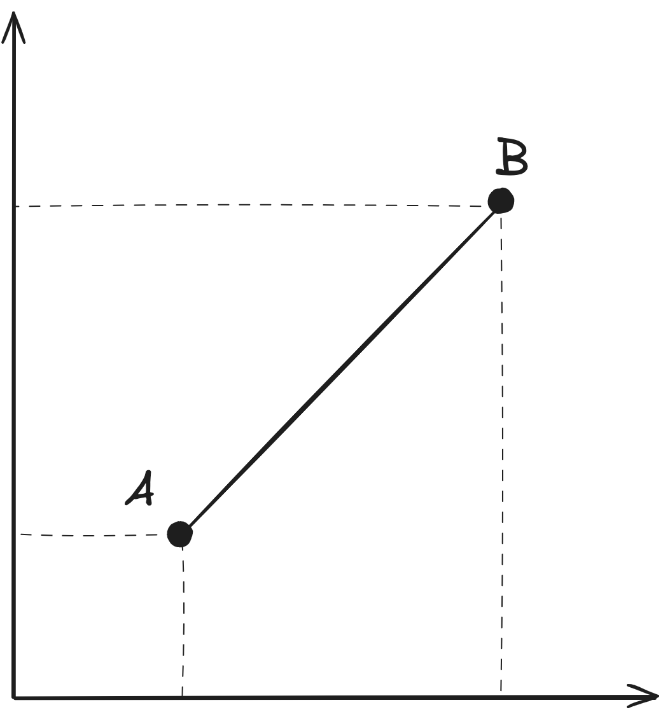{fig-align="center" width="565"}
:::
::::::

## Измерение расстояния

### Манхеттенское расстояние

::::: columns
::: {.column width="60%"}
Также в некоторых случаях может называться расстоянием городских кварталов

**Манхэттенское расстояние** измеряет дистанцию между двумя точками в пространстве, учитывая только перемещение по осям координат. Эта метрика названа в честь уличной планировки Манхэттена, где движение происходит по прямым линиям вдоль улиц.[^1]

$$d\:(A,B)=|X_B-X_A| +|Y_B-Y_A|$$
:::

::: {.column width="40%"}
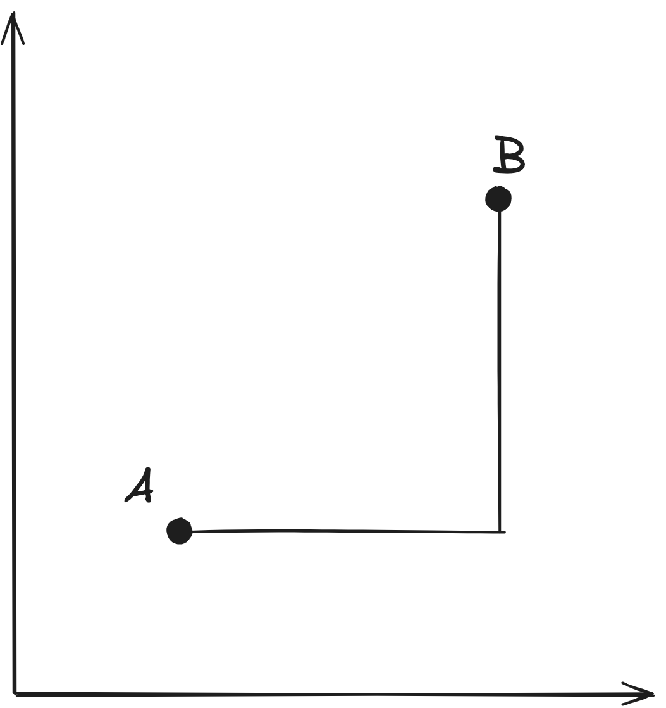{fig-align="center" width="565"}
:::
:::::

[^1]: **Меры расстояния: выбираем наиболее практичные решения** <https://habr.com/ru/companies/digitalleague/articles/875212/>

## Измерение расстояния

### Геодезическое расстояние

::::: columns
::: {.column width="30%"}
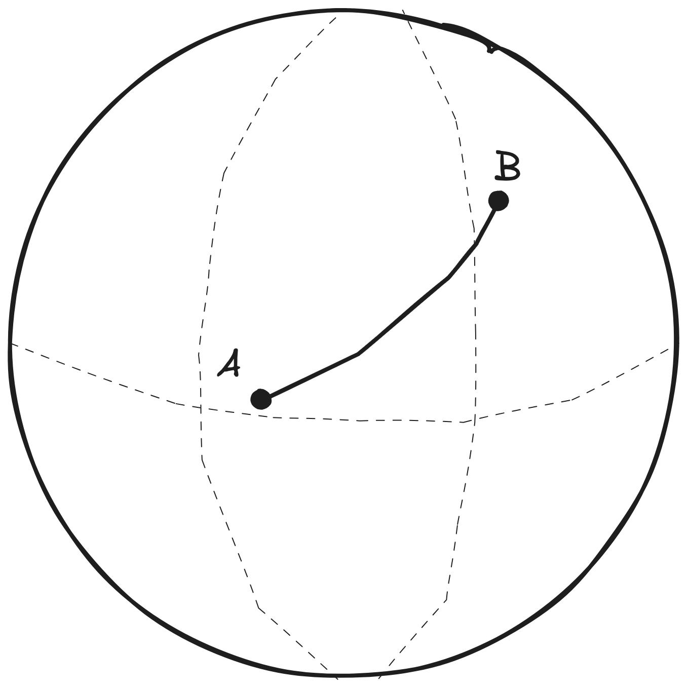{fig-align="center" width="500"}
:::

::: {.column width="70%"}
Геодезическим расстоянием называют кратчайшее расстояние между двумя точками на эллипсоиде.

$$d\:(A,B)=arccos(sin\,\phi_𝐴\: sin\,\phi_𝐵+cos\,\phi_𝐴\:cos\,\phi_𝐵\:cos(\lambda_𝐴−\lambda_𝐵))$$

где $\lambda$ - долгота, $\phi$ - широта.
:::
:::::

## Измерение расстояния

:::::: columns
::: {.column width="30%"}
### Евклидово расстояние

{fig-align="center" width="565"}
:::

::: {.column width="30%"}
### Манхэттенское расстояние

{fig-align="center" width="565"}
:::

::: {.column width="30%"}
### Геодезическое расстояние

{fig-align="center" width="600"}
:::
::::::

## Определение площади

Площадь объектов может определяться как площадь многоугольника по координатам поворотных точек с использованием формулы Гаусса.

$$S=\dfrac{1}{2}|(X_1Y_2+X_2Y_3+\cdots+X_nY_1)-(Y_1X_2+Y_2X_3+\cdots+Y_nX_1)|$$

.svg.png){fig-align="center" width="684"}

## Преобразование типа геометрии

::::::: columns
:::: {.column width="50%"}
::: callout-caution
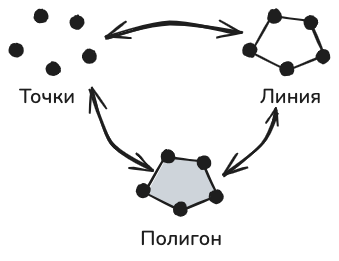{fig-align="center" width="500"}

Не все преобразования типов геометрий могут быть возможны. Например, из одной точки вы не сможете получить полигон или линию, это возможно только при наличии набора точек
:::
::::

:::: {.column width="50%"}
::: callout-tip
## Пример

Можно получить центроид полигона или граничные его точки. Также из полигона можно получить линейные границы.

По границам можно восстановить полигон.

По набору упорядоченных точек может быть построена линия или полигон.
:::
::::
:::::::

## Преобразование в мультиобъекты

Отдельные геометрии можно преобразовать в составной объект и наоборот: составной объект можно разбить на несколько простых

::: callout-note
В QGIS это функции *Собрать геометрии* и *Разбить составную геометрию* соответственно.
:::

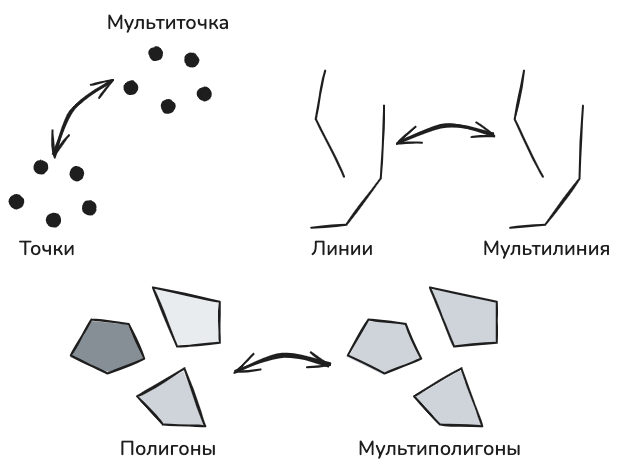{fig-align="center"}

## Объединение объектов по признаку (слияние)

При выполнении этой операции осуществляется слияние объектов с совпадающими значениями атрибута.

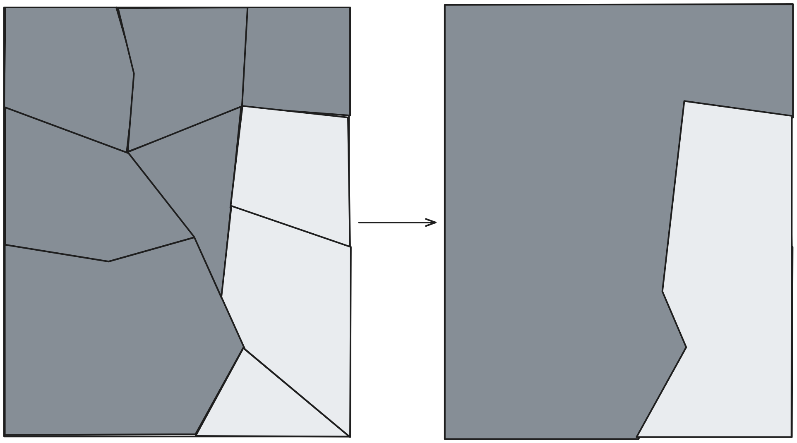{fig-align="center" width="900"}

::: callout-caution
При слиянии объектов атрибуты будут агрегироваться. Как правило, эта операция используется для укрупнени единиц картографирования.
:::

## Буферные зоны

:::::: columns
::: {.column width="50%"}
**Буферная зона** - это область на карте, каждая точка внутри которой находится в пределах заданного расстояния от исходного объекта.

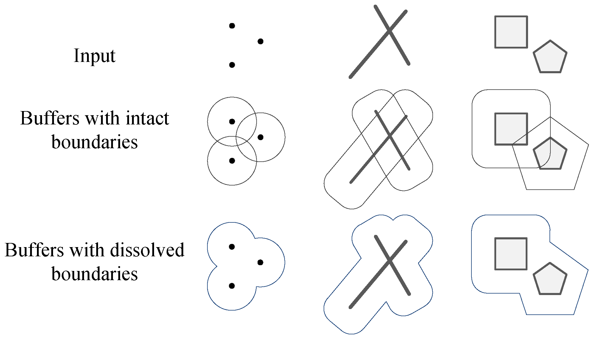{fig-align="center" width="1226"}
:::

:::: {.column width="50%"}
::: callout-note
В анализе буферные зоны часто используются для определения зон обслуживания объектов сервиса или для установления зон ограниченного использования, например, водоохранных зон.
:::

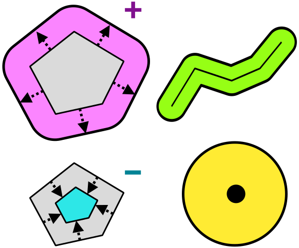{fig-align="center" width="480"}
::::
::::::

------------------------------------------------------------------------

Пример: кафе в 100-метровой буферной зоне р. Москвы[^2]

[^2]: *Самсонов Т.Е.* **Основы геоинформатики: курс лекций** : сайт. 2025. — URL: https://tsamsonov.github.io/gis-course/. Дата публикации: 24.04.2025. DOI: 10.5281/zenodo.7902351

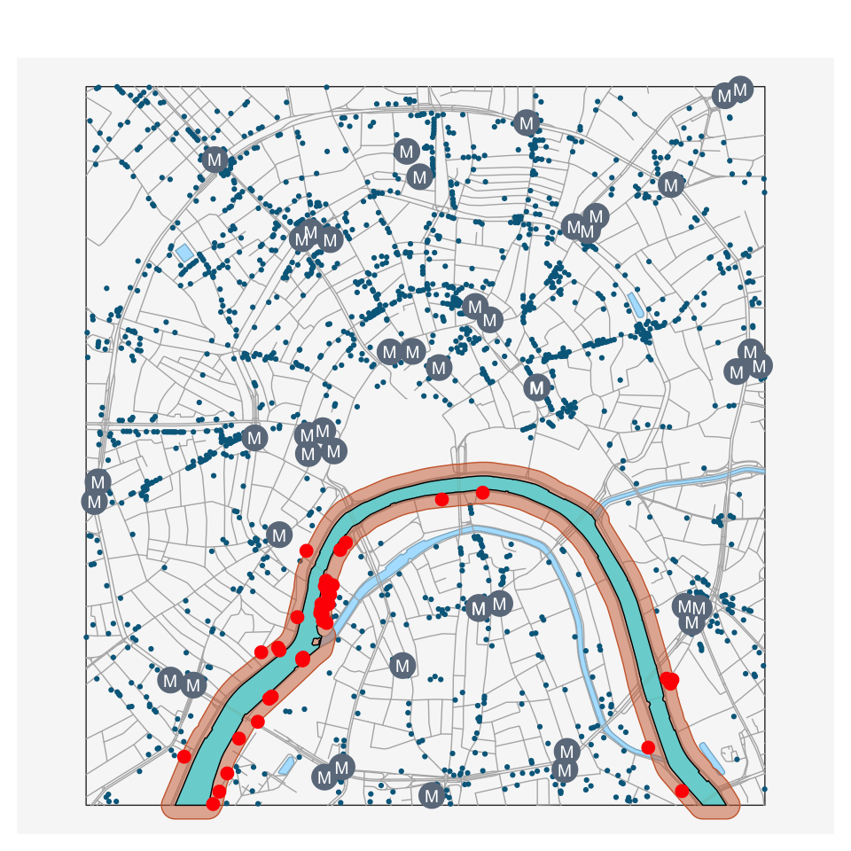{fig-align="center" width="800"}

## Минимальная охватывающая геометрия

***Минимальная охватывающая (ограничивающая) геометрия*** — это *простая стандартная фигура наименьшего возможного размера*, которая полностью заключает в себе набор точек, объектов или полигонов.

Существует несколько вариантов минимальных охватывающих геометрий:

- *выпуклая оболочка* - минимальный по размеру выпуклый многоугольник, содержащий в себе все исходные объекты;

- *охват* - прямоугольник по минимальным и максимальным координатам слоя;

- *минимальный ориентированный прямоугольник* - прямоугольник, ориентированный с учетом разброса наблюдений;

- *минимальная описывающая окружность* - окружность минимального радиуса, описывающая все исходные объекты.

------------------------------------------------------------------------

:::::: columns
:::: {.column width="50%"}
В англоязычной или переводной литературе может называться *bounding box*.

Фактически определяет охват территории по осям координат.

Задается координатами левого нижнего $x_{min}$ , $y_{min}$ и правого верхнего угла $x_{max}$ , $y_{max}$

::: callout-tip
Как правило, это часть описания метаданных слоя, но также может использоваться при решении пространственных задач.
:::
::::

::: {.column width="50%"}
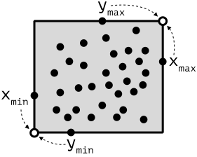{fig-align="center" width="752"}
:::
::::::

## Топологические отношения

***Топология** - это (от греч. τόπος – место), раздел математики, связанный с выяснением и исследованием в рамках математики идеи непрерывности*[^3].

[^3]: Большая Российская энциклопедия <https://bigenc.ru/c/topologiia-6b610e>

Предметом топологии является исследование свойств фигур и их взаимного расположения.

> «Под топологией будем понимать учение о модальных отношениях пространственных образов — или о законах связности, взаимного положения и следования точек, линий, поверхностей, тел и их частей или их совокупности в пространстве, независимо от отношений мер и величин»[^4].

[^4]: Математика XIX века. Геометрия. Теория аналитических функций / Колмогоров А. Н., Юшкевич А. П. (ред.).. — М.: Наука, 1981. — Т. 2. — С. 98—99.

::: callout-tip
Топологические свойства фигур, то есть свойства, не изменяющиеся при любых деформациях, производимых без разрывов и склеиваний (точнее, при взаимно однозначных и непрерывных отображениях). Иными словами, при сгибании, скручивании, сжимании, растягивании и вообще любых деформациях, кроме разрывов и склеиваний, все свойства фигуры сохраняются (с точки зрения топологии).
:::

## Топологические отношения

::: callout-important
Топологические отношения между объектами можно описать пересечением трех множеств каждого объекта:

- Внутреннее множество (𝐴𝑜)

- Граничное множество (∂𝐴)

- Внешнее множество (𝐴−)
:::

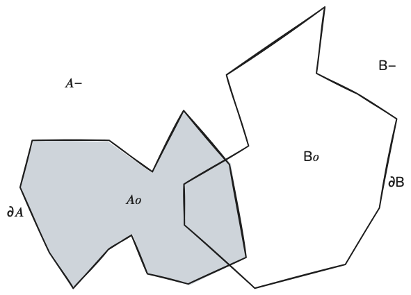{fig-align="center" width="600"}

## Топологические отношения

::::: columns
::: {.column width="50%"}
### Не пересекает

Ни одно из трех пространственных множеств объектов не имеет общих точек и пересечений.

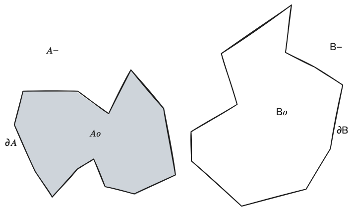
:::

::: {.column width="50%"}
### Совпадает

Все три множества объектов совпадают.

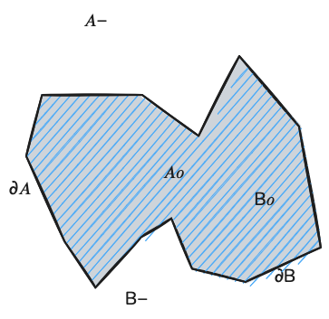{fig-align="center" width="500"}
:::
:::::

## Топологические отношения

::::: columns
::: {.column width="50%"}
*Объект покрывает другой*, если каждая точка второго объекта находится во внутреннем или граничном множестве объекта.

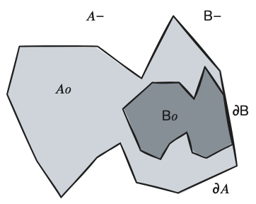{fig-align="center" width="500"}
:::

::: {.column width="50%"}
*Объект покрыт другим*, то есть каждая точка объекта является точкой внутреннего или граничного множества второго объекта.

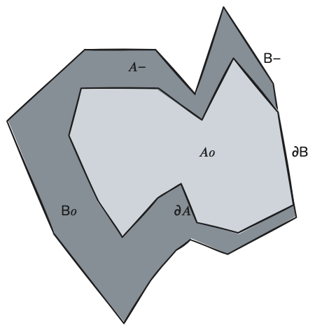{fig-align="center" width="500"}
:::
:::::

## Топологические отношения

::::: columns
::: {.column width="50%"}
### Содержит

Ни одна из точек второго объекта (other) не находится в наружном множества объекта и как минимум одна точка внутреннего множества второго объекта попадает во внутренее множество объекта.

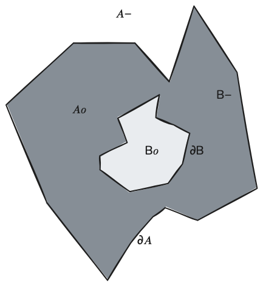{fig-align="center"}
:::

::: {.column width="50%"}
### Находится внутри

Граничное или внутреннее множество объекта пересекается с внутренним множеством второго объекта, но не граничным или внешним множеством.

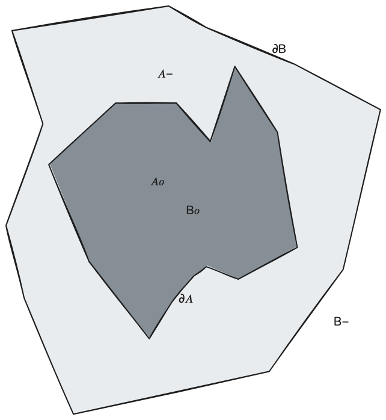{fig-align="center" width="460"}
:::
:::::

## Топологические отношения {.smaller}

::::: columns
::: {.column width="50%"}
### Пересекается

Граничное или внутреннее множество пересекает аналогичные множества второго объекта, то есть объекты пересекаются, если у них есть общая точка на границе или во внутреннем множестве.

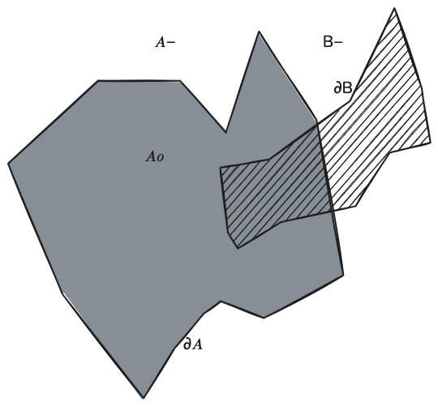{fig-align="center"}
:::

::: {.column width="50%"}
### Пересекается линейно

Внутреннее множество объекта пересекает внутреннее множество второго объекта, но не содержит его; размерность пересечения меньше размерности любого из объектов (например, пересечение полигонов, размерность которых 2, - это линия с размерностью 1) (линия не может пересекать точку, которую содержит).

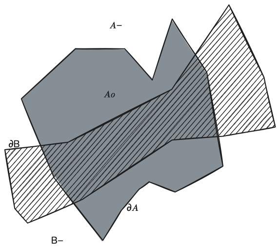{fig-align="center"}
:::
:::::

## Топологические отношения

::::: columns
::: {.column width="50%"}
### Касается

У объектов есть хотя бы одна общая точка, но их внутренние множества не пересекаются
:::

::: {.column width="50%"}
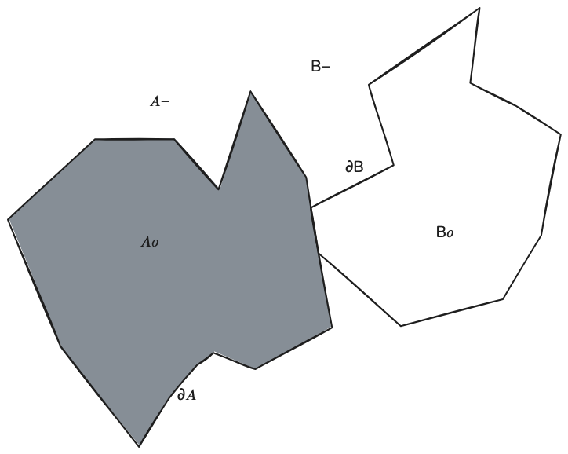{fig-align="center"}
:::
:::::

## Топологические отношения

::::: columns
::: {.column width="50%"}
### Накладывается

У объектов более одной общей точки, но не все, они имеют одинаковую размерность и размерность пересечения такая же, как размерность исходных объектов.
:::

::: {.column width="50%"}
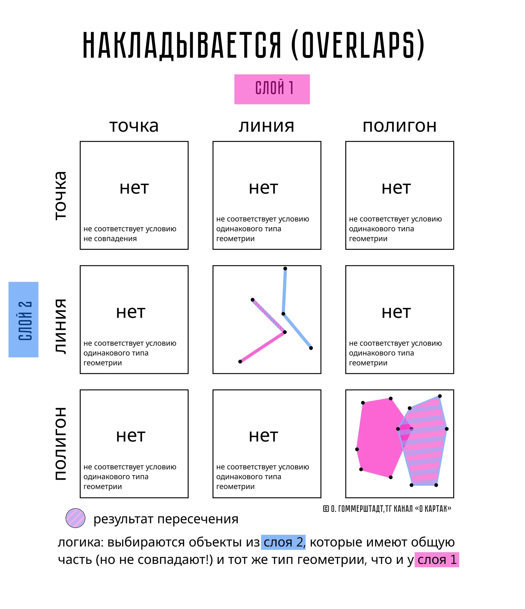{fig-align="center" width="690"}
:::
:::::

## Топологические отношения

::: callout-tip
С точки зрения топологии все варианты взаимного расположения объектов кроме отсутствия пересечения являются частными случаями пересечения объектов.
:::

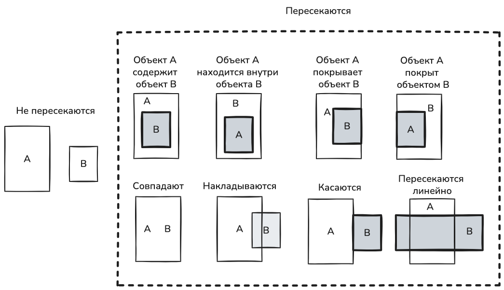{fig-align="center"}

## Оверлейные операции

Оверлейные операции (от англ. *overlay* - наложение) - это наложение друг на друга двух слоев и создание на их основе третьего с использованием определенных операторов.

::: callout-note
Оверлейные операции - это, пожалуй, одна из первых функциональных особенностей именно геоинформационных систем, которая стала возможной исключительно благодаря послойной организации работы с данными.
:::

---

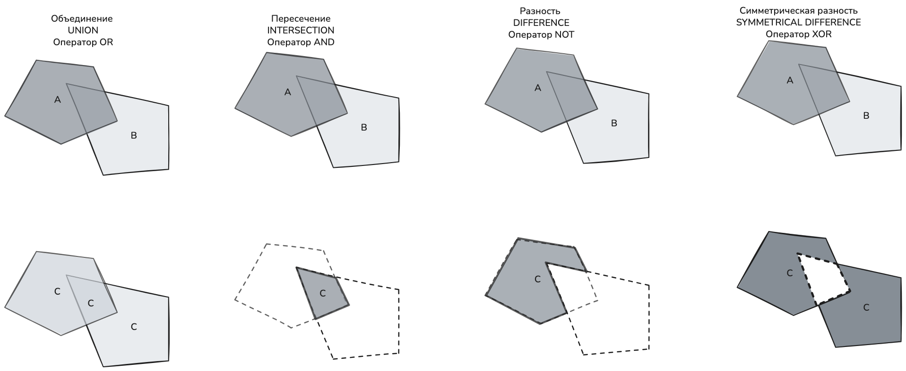{fig-align="center" width="1000"}

## Оверлейные операции[^5]

[^5]: Cai, H. (2022). Overlay. The Geographic Information Science & Technology Body of Knowledge (1st Quarter 2022 Edition), John P. Wilson (ed.). DOI: [10.22224/gistbok/2022.1.2](https://doi.org/10.22224/gistbok/2022.1.2).

::: custom-small
+---------------------+--------------------------------------------------------------------------------------------------------+------------------------------------------------------------------------------------------+--------------------------------------------------+
| Логический оператор | Описание                                                                                               | Графическое описание                                                                     | Оверлейная операция                              |
+=====================+========================================================================================================+==========================================================================================+==================================================+
| AND                 | Должны быть получены части, которые совпадают для обоих слоев                                          | {fig-align="center"} | Пересечение (Intersection)                       |
|                     |                                                                                                        |                                                                                          |                                                  |
|                     | "Какие участки находятся одновременно в зоне ограниченного использования и в жилой зоне?"              |                                                                                          |                                                  |
+---------------------+--------------------------------------------------------------------------------------------------------+------------------------------------------------------------------------------------------+--------------------------------------------------+
| NOT                 | Должны быть получены объекты, которые попадают только в один из двух слоев                             | {fig-align="center"} | Вырезать (Erase)                                 |
|                     |                                                                                                        |                                                                                          |                                                  |
|                     | "Какие участки попадают в зону ограниченного использования, но находятся за пределами жилой зоны?"     |                                                                                          |                                                  |
+---------------------+--------------------------------------------------------------------------------------------------------+------------------------------------------------------------------------------------------+--------------------------------------------------+
| OR                  | Результат должен попадать хотя бы в один из слоев                                                      | {fig-align="center"}  | Объединение (Union)                              |
|                     |                                                                                                        |                                                                                          |                                                  |
|                     | "Какие участки находятся или в зоне ограниченного использования или в жилой зоне?"                     |                                                                                          |                                                  |
+---------------------+--------------------------------------------------------------------------------------------------------+------------------------------------------------------------------------------------------+--------------------------------------------------+
| XOR                 | Операция противоположная пересечению.                                                                  | {fig-align="center"} | Симметрическая разность (Symmetrical Difference) |
|                     |                                                                                                        |                                                                                          |                                                  |
|                     | "Какие участки находятся или в зоне ограниченного использования или в жилой зоне, но не одновременно?" |                                                                                          |                                                  |
+---------------------+--------------------------------------------------------------------------------------------------------+------------------------------------------------------------------------------------------+--------------------------------------------------+
:::

# Взаимосвязь между атрибутами и геометрией

::::::: columns
:::: {.column width="50%"}
**Пространственно-экстенсивные атрибуты** или глобальные атрибуты, то есть тем, которые могут быть соотнесены только с пространственной единицей целиком как суммой ее составных частей.

Такие атрибуты суммируются при объединении объектов.

::: callout-tip
## Пример

Количество населения, суммарный ВВП по регионам
:::

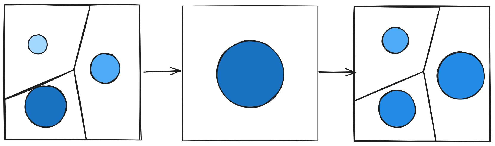
::::

:::: {.column width="50%"}
**Пространственно-интенсивные атрибуты** - это те, величина которых может быть соотнесена с любой частью объекта вне зависимости от ее формы и размера.

::: callout-tip
## Пример

Например, распределение какой-то общей суммы между людьми - плотность населения, ВВП на душу населения или уровень рождаемости на 1000 населения.
:::

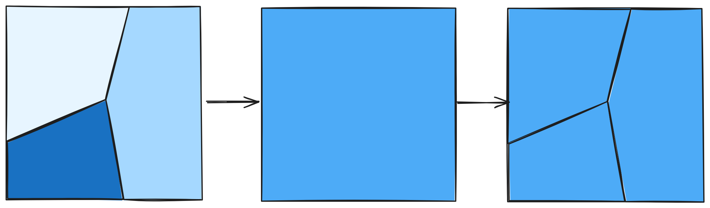
::::
:::::::

# Операции с атрибутами

**Фильтрация** необходима для того, чтобы в вашем слое остались только те данные, которые соответствуют заданным условиям.

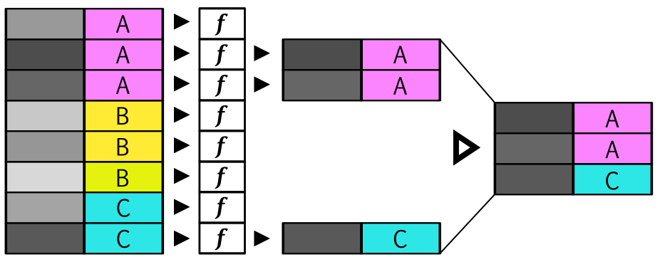{fig-align="center" width="2017"}

::: callout-tip
## Пример

Выбор зданий определенной этажности
:::

# Операции с атрибутами

**Агрегирование** позволяет вычислить сводные значения для групп объектов.

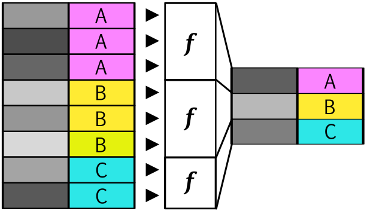{fig-align="center" width="1040"}

::: callout-tip
## Пример

Определение средней этажности зданий в районе.

Расчет суммарной площади зданий в квартале.
:::

# Операции с атрибутами

**Классификация** предназначена для разделения объектов на группы.

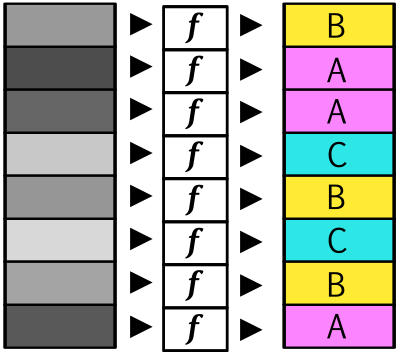{fig-align="center" width="684"}

::: callout-tip
## Пример

Классификация зданий по этажности

Классификация населенных пунктов по количеству населения
:::

# Операции с атрибутами

**Объединение или соединение таблиц** позволяет объединить атрибуты из двух таблиц в одну или присоединить атрибуты одних объектов другим.

::: callout-tip
## Пример

Присоединение домам атрибутов объектов сервисов, расположенных в домах

Присоединение статистических данных районам
:::

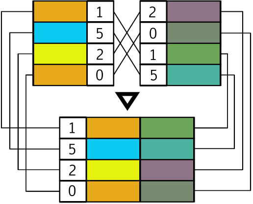{fig-align="center" width="623"}
