# Общие принципы визуализации

> **Соотношение данных и чернил (data ink ratio)**, которое должно показывать количество информации, отображаемое определенным количеством чернили (или пикселей). Идеальным соотношением является единица, то есть количество информации соответствует количеству затраченных графических элементов.
>
> *Эдвард Тафти "Визуальное представление количественной информации" (Edward Tufte "The Visual Display of Quantitative Information")*

Цель этого соотношения данных и чернил состоит в том, чтобы устранить избыточность визуализации так, чтобы она по-прежнему отображала необходимую информацию, но при этом была легко воспринимаемой. *Все, что не несет значимой информации должно быть убрано: метки осей, иногда сами оси, подписи и маркеры линий, линии сетки.*

------------------------------------------------------------------------

Основные цели создания визуализаций, от которых будет зависеть выбор конкретной методики ее подготовки:

-   **описание**, то есть простое и ясное представление имеющихся данных;

-   **исследование** - визуализация как что-то что позволяет аудитории увидеть неочевидные на первый взгляд закономерности и паттерны;

-   **организация** - представление данных в четком и структурированном виде;

-   **декоративность** - создание визуально привлекательной картинки, зачастую вызывающей определенный эмоциональный отклик, но не всегда точной.

------------------------------------------------------------------------

-   кто будет являться основной аудиторией? должна ли эта визуализация быть понятна широкому кругу людей или предполагается ее использование только для специалистов (в научной статье, докладе, результатах исследования)?

-   что за переменная или переменные будут отображаться?

-   какой метод будет наиболее простым и понятным?

-   что является наиболее важным для отображения?

-   нужно ли акцентировать внимание на отдельных деталях?

::: callout-important
В нашем случае при визуализации пространственных данных следует учитывать еще и их специфику.
:::

# Визуальные характеристики

::::: columns
::: {.column width="40%"}
Визуальные характеристики включают в себя:

-   расположение;

-   размер;

-   форму;

-   яркость цвета;

-   цвет;

-   ориентацию символа;

-   текстуру (штриховку).
:::

::: {.column width="60%"}
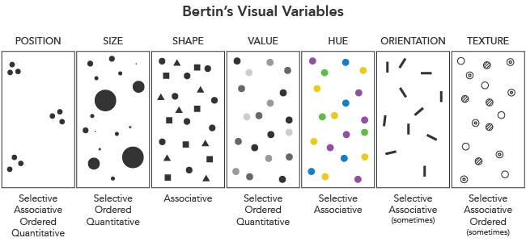{fig-align="center" width="1517"}
:::
:::::

------------------------------------------------------------------------

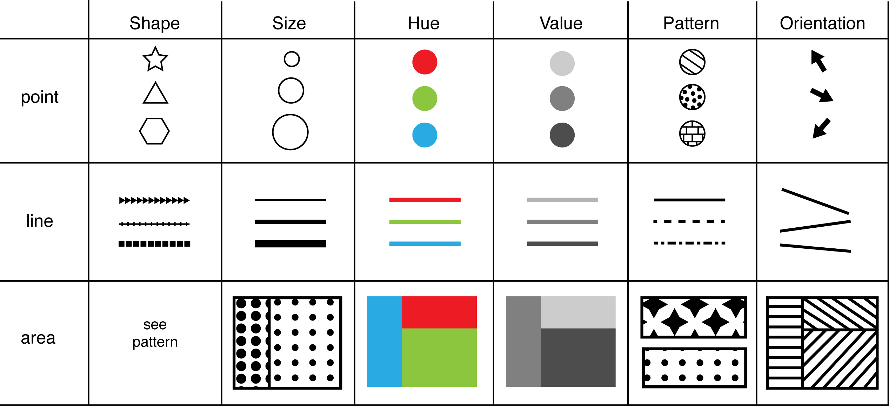

# Визуальные переменные для пространственных данных {visibility="hidden"}

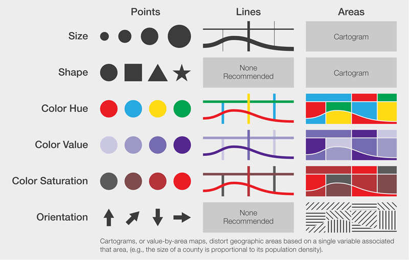{fig-align="center"}

# Аспекты восприятия

Существует четыре основных аспекта восприятия визуальных характеристик. Именно эти аспекты и особенности интерпретации будут влият на то, как их понимают на карте:

-   селективность - возможность однозначно выделить группу объектов на основе изменения визуальной переменной;

-   ассоциативность - возможность отнести объекты к одной группе, несмотря на разницу в визуальной переменной;

-   диссоциативность - возможность определять значимость символов;

-   упорядоченность - возможность распознать последовательность изменения величины.

::: callout-note
Ассоциативность или диссоциативность могут нарушать восприятие "одинаковости" объектов на карте, поэтому, если важно, чтобы объекты воспринимались единой группой, рекомендуется избегать изменений размера и светлоты в символах.
:::

## Селективность

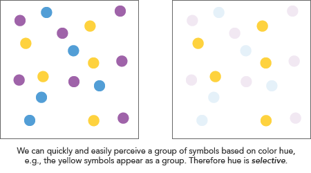{fig-align="center" width="720"}

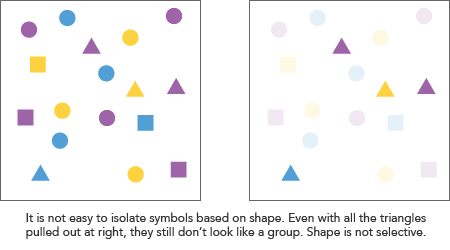{fig-align="center" width="720"}

## Ассоциативность и диссоциативность

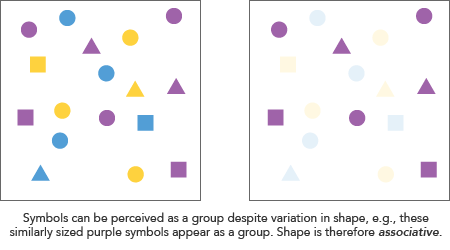{fig-align="center" width="720"}

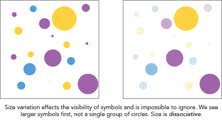{fig-align="center" width="720"}

## Упорядоченность

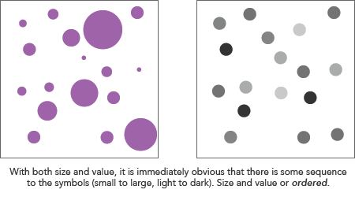{fig-align="center" width="720"}

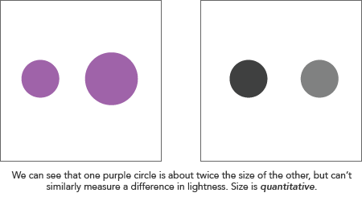{fig-align="center" width="720"}

# Типы переменных (атрибутов)

Основные типы переменных, которые могут отображаться на карте:

-   качественные

    -   номинальные (категориальные) - группы, которым нельзя присвоить числовой эквивалент и нельзя ранжировать по возрастанию/убыванию;

    -   ранговые - группы, которые можно упорядочить, но нельзя присвоить числовой эквивалент и количественно сравнить группы между собой;

-   количественные

------------------------------------------------------------------------

{fig-align="center" width="1296"}

# Цветовые палитры

Самый простой вариант выбора палитры - воспользоваться уже готовой 🤓

. . .

Но и в этом случае желательно знать некоторые особенности палитр.

С точки зрения теории цвета мы воспринимаем:

-   собственно цвет;

-   яркость цвета, также уже упоминавшуюся в предыдущем разделе;

-   насыщенность или чистота цвета, которая изменяется при добавлении в чистый цвет черного или белого.

------------------------------------------------------------------------

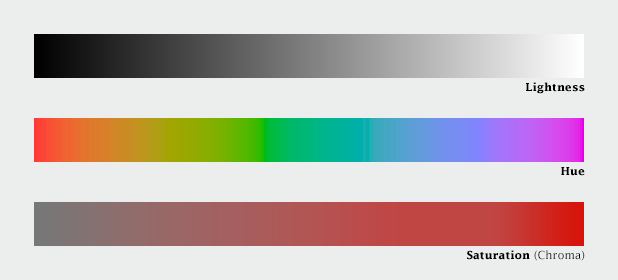{fig-align="center" width="1324"}

------------------------------------------------------------------------

Сложность в создании хороших палитр, которые будут правильно восприниматься на экране компьютера в том, что компьютер и человеческий глаз воспринимают цвета по-разному:

-   компьютер строит изображение из нескольких узких цветовых каналов, в то время как человеческий глаз воспринимает спектр шире;

-   компьютеры распознают яркость по линейному закону, а человеческий глаз - по экспоненциальному, поэтому оттенки темных цветов различать проще;

-   человеческий глаз более восприимчив к зеленой части спектра, чем красной, и более восприимчив к красной, чем к синей части спектра.

## Последовательные палитры

Наиболее хорошо и очевидно мы воспринимаем изменения в яркости (причем это общее и для компьютеров, и для человеческого глаза).

Поэтому изменение от светлого к темному и наоборот будут наиболее просты и однозначны в восприятии, даже если концы палитры будут слабо насыщенными, а центральная часть - наиболее чистой по цвету.

То есть, если яркость меняется последовательно, цвет отчасти отходит на второй план.

С учетом этого факта в 2015 году Натаниелем Смитом и Стефаном ван дер Вольтом (Nathaniel J. Smith, Stefan van der Walt) были разработаны цветовые палитры *magma, inferno, plasma, viridis* в составе библиотеки [matplotlib colormaps](https://bids.github.io/colormap/).

Позднее этот набор был дополнен еще одной палитрой *cividis*[^1].

[^1]: Nuñez JR, Anderton CR, Renslow RS (2018) Optimizing colormaps with consideration for color vision deficiency to enable accurate interpretation of scientific data. PLoS ONE 13(7): e0199239. <https://doi.org/10.1371/journal.pone.0199239>.)

------------------------------------------------------------------------

{fig-align="center" width="800"}

## Расходящиеся палитры

Основной принцип их построения состоит в том, что центр имеет максимальную яркость, а вправо и влево однородно оно уменьшается, переходя в цвета с противоположных концов спектра: к синему и красному или оранжевому и фиолетовому.

То есть они объединяют два градиента разных цветов по яркости.

::: callout-note
Чаще всего вы видите такие палитры при отображении температуры: белый центр, от которого расходятся в противоположные стороны красный и синий градиенты. Также такие цветовые схемы могут быть использованы для отображения доходов и убытков, изменений во времени, отклонений от нормы или среднего значения.
:::

------------------------------------------------------------------------

{fig-align="center" width="1515"}

::: callout-warning
Использование таких палитр обосновано тогда, когда данные подразумевают, что середина и значение ей соответствующее имеет определенный смысл.
:::

## Радужная палитра

В настоящее время рекомендуется избегать так называемой радужной палитры, потому что сама по себе она искажает изображение объектов.

Это связано с тем, что в ней содержатся различные по яркости и цвету фрагменты, которые не позволяют однозначно последовательно выстроить цвета[^2].

[^2]: How rainbow colour maps can distort data and be misleading <https://theconversation.com/how-rainbow-colour-maps-can-distort-data-and-be-misleading-167159>

{fig-align="center"}

------------------------------------------------------------------------

## Сервисы для создания палитр {.smaller}

Примеры сервисов:

-   [ColorBrewer](http://www.colorbrewer.org/)

-   [chroma.js](https://github.com/gka/chroma.js) by Gregor Aisch and its [helper tool](https://gka.github.io/palettes/)

-   [Colorpicker](http://tristen.ca/hcl-picker/) based on chroma.js

-   [Adobe Color CC](https://color.adobe.com/)

-   [color-hex popular palettes](http://www.color-hex.com/color-palettes/popular.php)

-   [COLOURlovers](http://www.colourlovers.com/palettes)

-   [**carto**](https://carto.com/carto-colors/)

-   [**Color Buddy**](https://color-buddy.netlify.app/)

-   [**Viz Palette**](https://projects.susielu.com/viz-palette)

-   [**Color Tool**](https://colortools.interworks.com/)

-   [**Datafam Colors by Ken Flerlage**](https://public.tableau.com/app/profile/ken.flerlage/viz/DatafamColors/StartPage)

-   [**Color Contrast & Accessibility Tester**](https://public.tableau.com/app/profile/sam.epley/viz/ColorContrastAccessibilityTester/ColorContrastAccessibilityTester)

-   [**Hex Code Previewer + XML Generator**](https://public.tableau.com/app/profile/brrosenau/viz/HexCodePreviewerXMLGenerator/HexCodePreviewerXMLGenerator)

# Классификация числовых значений {.smaller}

Классификация для числовых значений подразумевает разбивку на интервалы.

Самые широко применяемые методы классификации в геоинформационных системах:

-   *Равное количество (квантиль)*: в каждом классе будет одинаковое количество элементов;
-   *Равный интервал*: каждый класс будет иметь одинаковый размер.
-   *Стандартное отклонение*: классы строятся в зависимости от стандартного отклонения значений.
-   *Фиксированный интервал*: каждый класс будет иметь фиксированный диапазон значений (например, при значениях от 1 до 16 и размере интервала 4 классами будут 1-4, 5-8, 9-12 и 13-16).
-   *Логарифмическая шкала*: подходит для данных с широким диапазоном значений.
-   *естественные интервалы* (Natural Breaks (Jenks)): дисперсия внутри каждого класса минимизируется, а дисперсия между классами максимизируется.
-   *форматированные отступы*: вычисляет последовательность из примерно n+1 равномерно распределенных "красивых" значений, которые покрывают диапазон значений x. Значения выбираются таким образом, чтобы они были в 1, 2 или 5 раз больше 10.

------------------------------------------------------------------------

{fig-align="center"}

------------------------------------------------------------------------

В методе **равных интервалов** длина интервала рассчитывается по формуле: $$Интервал = \frac{max X_i - min X_i}{ Количество \ интервалов} $$

**Метод квантилей** использует несколько другой подход: вместо деления всего диапазона на интервалы здесь на группы равного размера делится все количество объектов.

$$Количество\ объектов\ в\ группе  = \frac{Всего\ объектов}{ Количество \ интервалов} $$

::: callout-important
При использовании равных интервалов может получиться так, что какие-то из них будут пустыми.

При применении квантилей вы не получите пустых интервалов. Как правило, этот метод рекомендуется при наличии значительных выбросов, если вам необходимо уменьшить их влияние.

Но следует помнить, что метод квантилей фактически не будет учитывать вариацию показателя внутри группы.
:::

------------------------------------------------------------------------

Если исходные данные распределены по нормальному закону или необходимо показать отклонение от среднего значения, то оптимальным может быть метод на основе стандартного отклонения: $$Интервал = n \cdot\sigma$$

$n$ - номер интервала, $\sigma$ - стандартное отклонение: $$\sigma=\sqrt{\frac{\sum_{i=1}^{n} (x_i-\overline{x})^2}{N-1}} $$

где $x_i$ - величина показателя для $i-го$ объекта, $\overline{x}$ - среднее значение показателя, $N$ - общее количество объектов.

::: callout-important
Однако при использовании этого метода необходимо помнить, что будет учитываться фактически вариация от среднего, а не в рамках интервалов относительно друг друга.

Кроме того, интервалы здесь рассчитываются отдельно, что может привести к потере данных.
:::

------------------------------------------------------------------------

Расчет интервалов по методу естественных интервалов происходит итеративно:

-   случайным образом разбить данные на интервалы;

-   рассчитать сумму квадратов отклонений от среднего по формуле $\sum_{i=1}^{n} (x_i-\overline{x})^2$;

-   сравнить полученные значения между классами;

-   изменить интервалы;

-   пересчитать сумму квадратов отклонений.

Процесс повторяется до тех пор, пока для каждого интервала не будет достигнуто условие $\sum_{i=1}^{n} (x_i-\overline{x})^2 \rightarrow min$.

------------------------------------------------------------------------

Как понять какое количество интервалов вам нужно?

Вы можете опираться на общеизвестные теории восприятия информации, которые говорят нам о том, что кратковременная память не способна удерживать более 7 интервалов (максимум 10). Поэтому, как правило, рекомендуют использовать от 3 до 7 интервалов.

Чем больше у вас будет интервалов/категорий, тем сложнее будет вашему потенциальному зрителю.

Если вы хотите опираться на количественную методику расчета числа интервалов, можно воспользоваться распространенной формулой Стерджесса, где $n$ - количество интервалов, $N$ - число объектов:

$n = 1+|log_2 N|$ или $n = 1+|3.322 \lg N|$

# Способы визуализации пространственных данных

::: callout-warning
Отметим, что здесь мы ведем речь не о топографических картах, а о так называемых тематических картах, на которых отображается какой-то показатель.
:::

Способы отображения различных показателей на карте можно поделить на несколько больших групп:

-   карты символов;

-   картограммы;

-   карты линейных знаков;

-   картодиаграммы.

## Карты символов

Карты символов делятся на две основные группы:

-   пропорциональные или градуированные символы

-   карты плотности точек.

Карты пропорциональных символов в литературе по картографии могут еще называться картами точечных символов

---

### Карта пропорциональных символов

Карта пропорциональных символов или карта точечных символов (второй термин более характерен для отечественной литературы) - это тип тематической карты, на которой символы различной величины показывают значение количественного показателя. Размер символа здесь напрямую зависит от величины показателя.

В качестве символов может быть использована любая простая геометрическая фигура (круг, квадрат, треугольник и т.д.) или пиктограмма.

{fig-align="center" width="1660"}

---

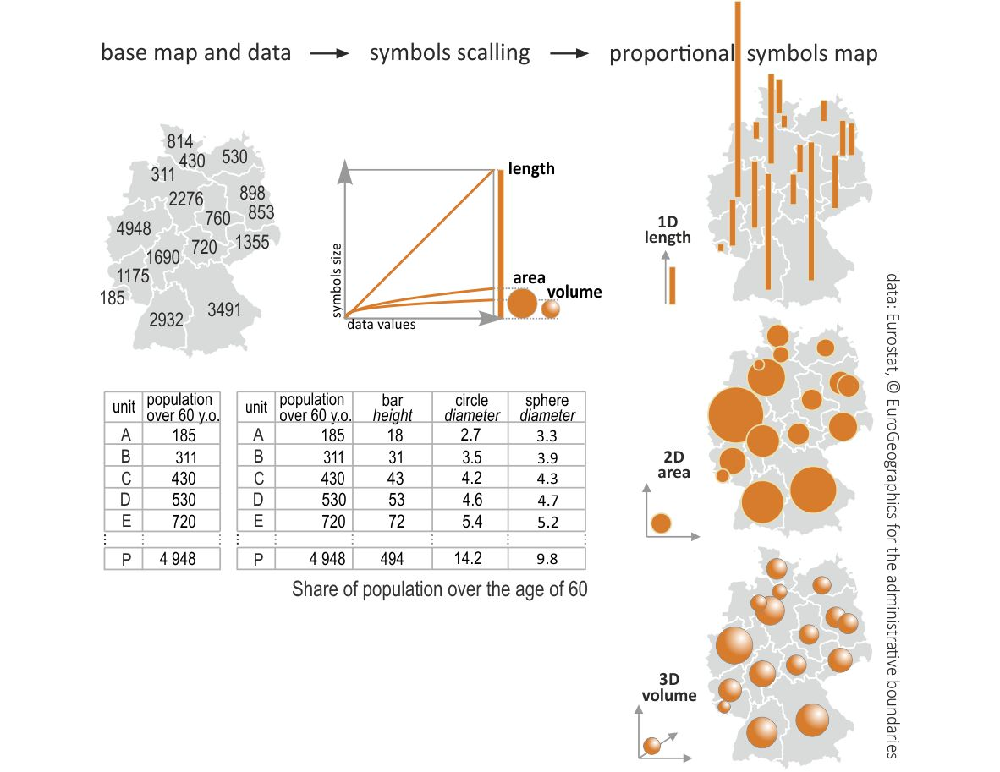{fig-align="center"}

::: callout-caution
Использование кругов влечет за собой определенные сложности для их масштабирования, так как площадь круга при увеличении изменяется нелинейно.

Джеймс Флэннери в своей диссертации оценил, насколько люди способны сравнивать между собой площади круга, что послужило основой для метода масштабирования символов, названного его именем.
:::

---

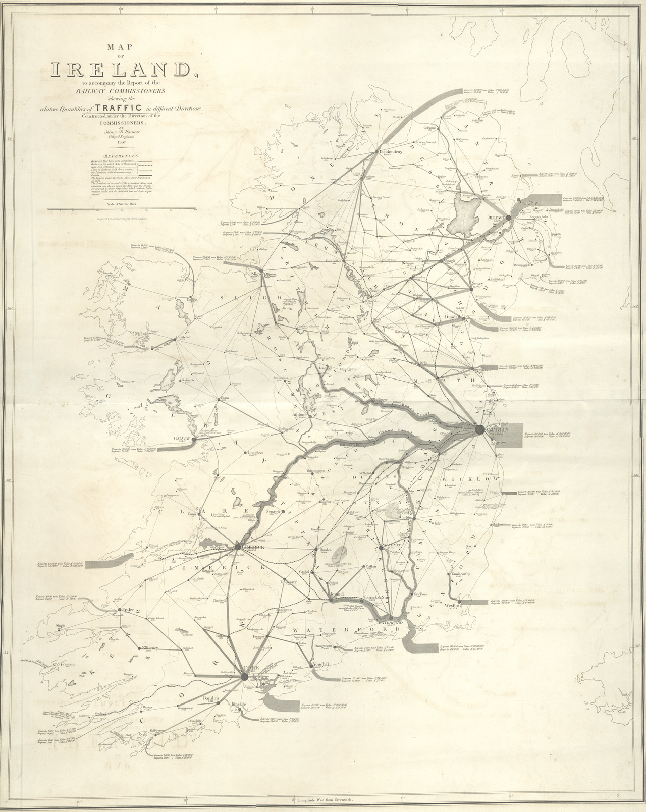{fig-align="center" width="796"}

---

Основной визуальной характеристикой при создании карты пропорциональных символов является размер, который может быть однозначно интерпретируемым только для количественных переменных.

::: callout-note
Пропорциональные символы могут быть использованы для отображения абсолютных значений показателей, в которых отсутствуют отрицательные значения. Как правило, это относится к пространственно экстенсивным или глобальным переменным, то есть тем, которые могут быть соотнесены только с пространственной единицей целиком как суммой ее составных частей.
:::

---

Размещение символов зависит от того, какие данные лежат в основе карты:

-   если исходные данные представляют собой отдельные точечные наблюдения, то символы размещаются в месте наблюдения;

-   если исходные данные отнесены к какой-то площадной единице (административного деления, например), то они размещаются в геометрическом центре этой площадной единицы. В том случае, если площадной объект представляет собой неправильные многоугольник, геометрический центр которого лежит за его пределами, то символ может быть смещен внутрь.

---

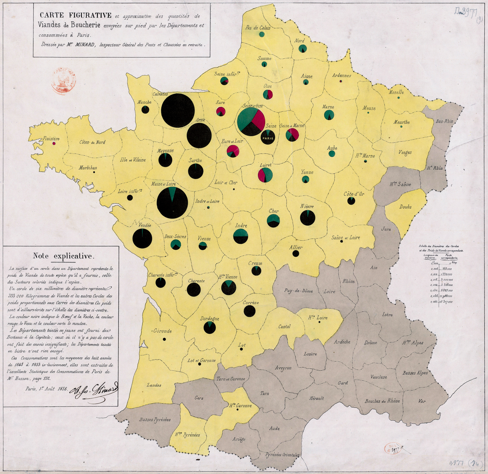{fig-align="center"}

---

{fig-align="center"}

---

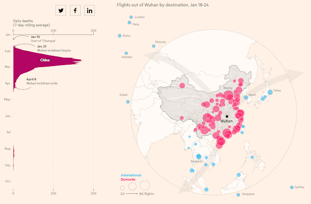{alt="Источник: https://ig.ft.com/coronavirus-global-data/" fig-align="center"}

---

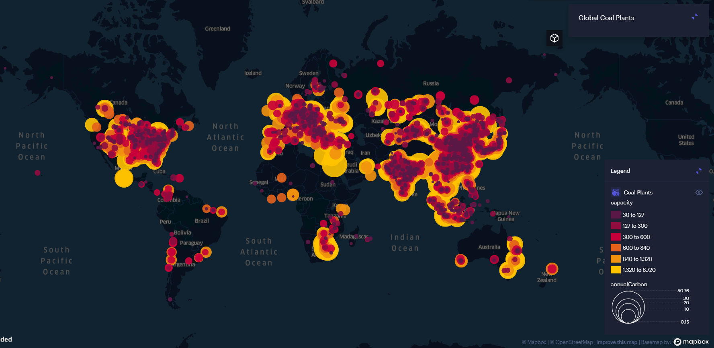{fig-align="center"}

---

::: callout-tip
Карты пропорциональных символов позволяют комбинировать несколько визуальных переменных. Например, вы можете отобразить один показатель размером, а другой цветом или формой.
:::

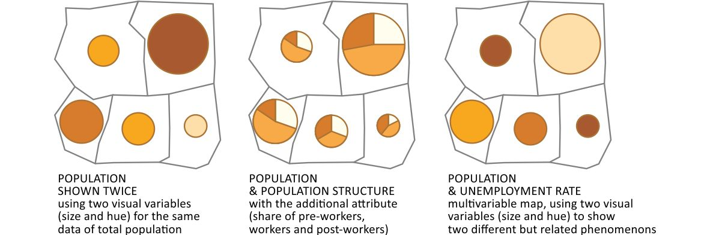

---

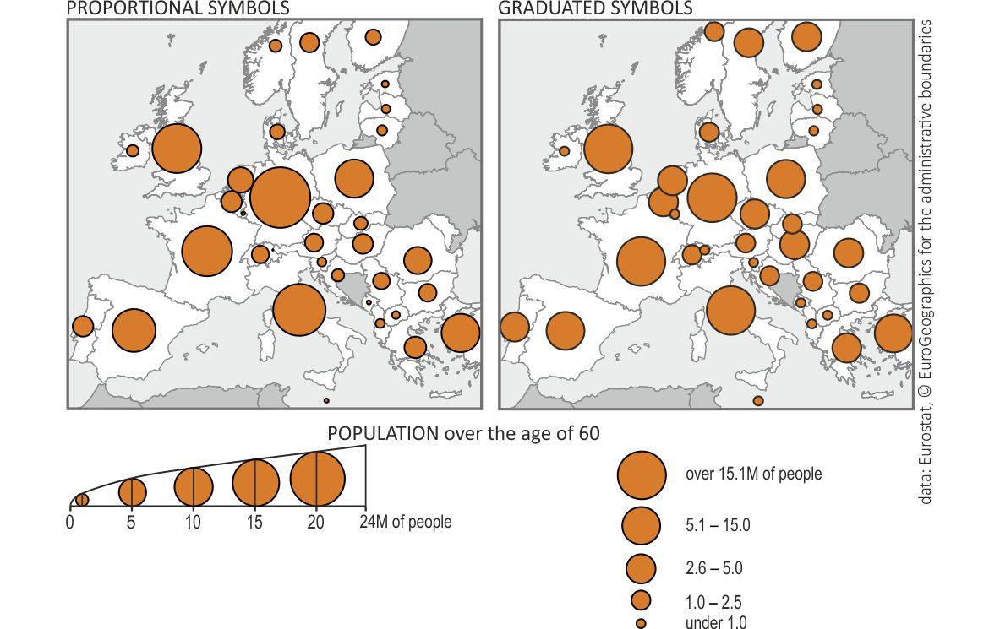

---

### Карта плотности точек

Подход отображения величины показателя с помощью скопления точек равномерно и случайным образом в пределах административного района.

{fig-align="center"}

---

Самым знаменитым примером карты плотности точек является карта Джона Сноу, которая положила начало пространственному анализу, тематическому картографированию, ГИС, кластеризации и современной эпидемиологии, но на самом деле история не совсем такая, как ее обычно рассказывают[^3].

[^3]: <https://www.esri.com/arcgis-blog/products/arcgis-pro/mapping/something-in-the-water-the-mythology-of-snows-map-of-cholera/>

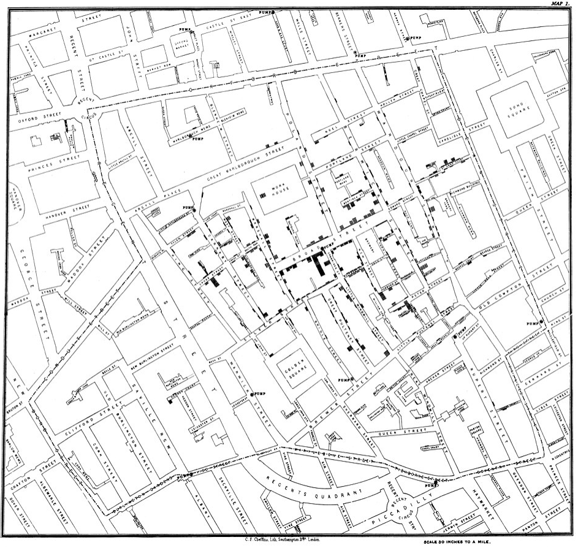{fig-align="center" width="738"}

---

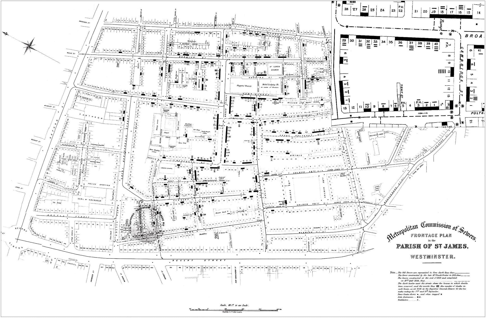{fig-align="center"}

---

В картах плотности точек выделяют два основных типа, которые некоторыми картографами рассматриваются как радикально различные:

-   карты плотности **один-к-одному**, где каждая точка соответствует индивидуальному случаю, например, одному заболевшему

-   **один-ко-многим**, где каждая точка соответствует не индивидуальному наблюдению, а группе.

Некоторые исследователи предлагают разделить описанные два типа карт и называть карты плотности один-к-одному - картами распределения точек, а карты один-ко-многим - картами плотности точек.

---

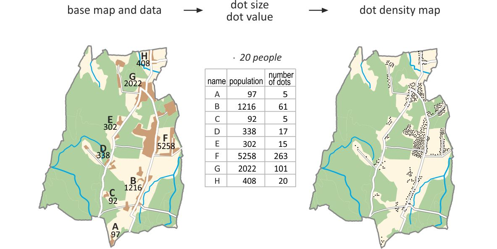{fig-align="center" width="1789"}

---

{fig-align="center" width="1730"}

## Картограммы
