# Что такое растр?

Растр - это набор ячеек, организованных в строки и столбцы.

Строго говоря, растр - это некоторая матрица значений.

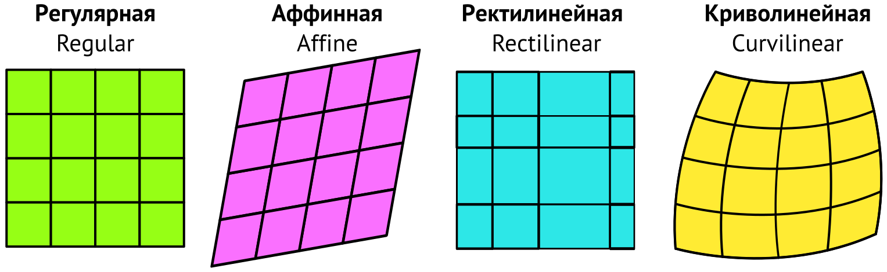{fig-align="center" width="1304"}

::: callout-tip
Чаще всего растры двумерны, но существуют и трехмерные растры - кубы данных
:::

------------------------------------------------------------------------

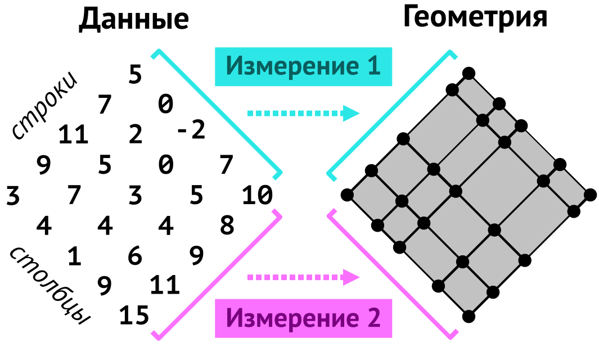{fig-align="center"}

{fig-align="center" width="600"}

# Перепроецирование растра

::::: columns
::: {.column width="50%"}
**Трансформация растра (transform)**, при которой пересчитываются координаты узлов растра. Матрица остается неизменной, но меняется геометрия ячеек/пикселей.

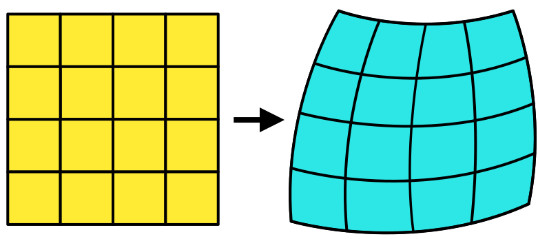{fig-align="center" width="1353"}
:::

::: {.column width="50%"}
**Деформация (warp)** создает новую регулярную геометрию растра в указанной проекции. Матрица значений пересчитывается, поскольку местоположение узлов изменяется.

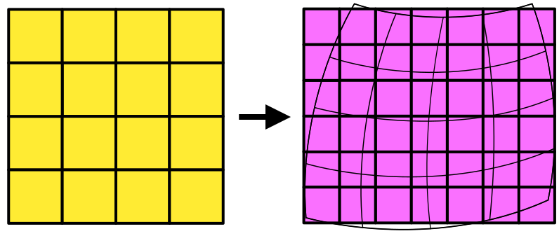{fig-align="center" width="1417"}
:::
:::::

# Передискретизация растра

**Передискретизация** — изменение пространственного положения узлов растра.

:::::: columns
::: {.column width="50%"}
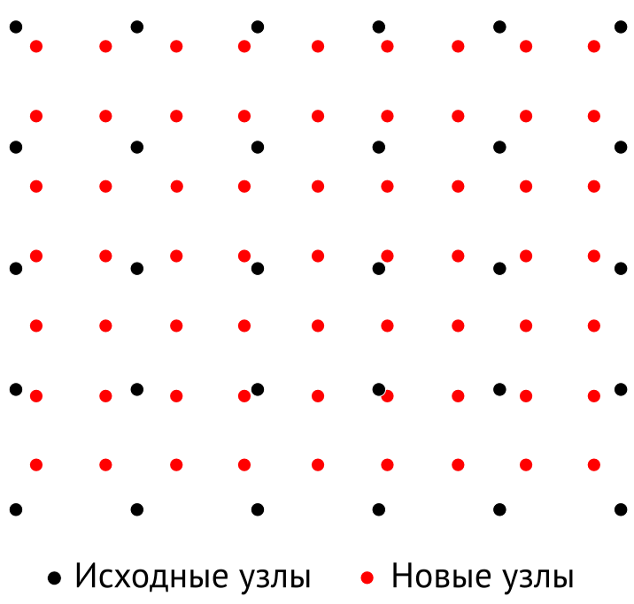{fig-align="center" width="628"}
:::

:::: {.column width="50%"}
::: callout-tip
## Пример

Переход к растру меньшего разрешения для уменьшения размера файла и меньшей детализации
:::
::::
::::::

## Передискретизация[^1]

[^1]: https://docs.nextgis.ru/docs_ngqgis/source/transformations.html

### Метод ближайшего соседа

::::: columns
::: {.column width="50%"}
{fig-align="center" width="1343"}
:::

::: {.column width="50%"}
**Ближайший сосед** - самый быстрый алгоритм. Значение берется из ближайшего пикселя с известным значением.

-   Использует только те значения, которые встречаются в исходном растре.

-   Изображение не сглаживается, возможно появление артефактов в виде ступенек или ареалов.
:::
:::::

## Передискретизация

### Линейный метод

::::: columns
::: {.column width="50%"}
{fig-align="center"}
:::

::: {.column width="50%"}
**Линейная передискретизация** - использует 4 (2х2) ближайших пикселя исходного растра и рассчитывает значение итоговой ячейки с помощью линейной функции интерполяции.

-   Итоговые значения могут отличаться от исходного набора.

-   Изображение слегка сглаживается.
:::
:::::

## Передискретизация

### Кубическая передискретизация

::::: columns
::: {.column width="50%"}
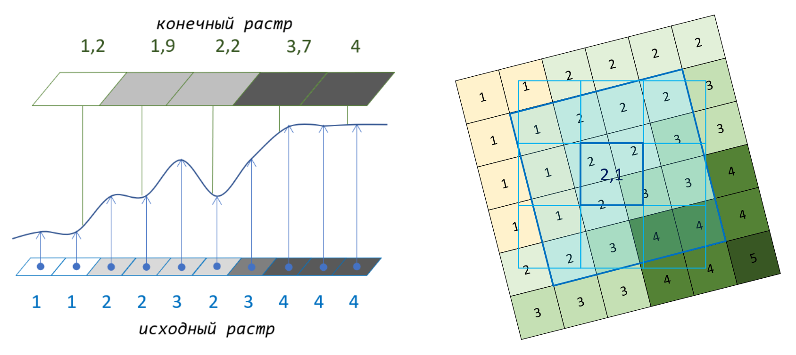{fig-align="center"}
:::

::: {.column width="50%"}
**Кубическая** и **кубическая с b-сплайном** - использует 16 (4х4) ближайших пикселей исходного растра и рассчитывает значение итоговой ячейки с помощью кубической/сплайновой функции.

-   Итоговые значения могут отличаться от исходного набора.

-   Изображение сильно сглаживается.
:::
:::::

## **Как выбрать алгоритм передискретизации?**

Метод передискретизации имеет смысл выбирать в зависимости от типа растра:

-   *Индексированный растр* - подойдёт только **ближайший сосед**, иначе при трансформации получатся значения, не совпадающие ни с одним из индексов.

-   *Цветная карта/снимок* (в каждом пикселе - значение цвета, например, в RGB) - можно использовать все алгоритмы, но лучше всего подходит **линейный**

-   *Одноканальный растр* (например, цифровая модель рельефа) - можно использовать любой алгоритм *кроме ближайшего соседа*, если нужно сохранить плавность переходов. Ближайший сосед можно выбрать, если критично важно сохранить исходные значения, и появляющаяся ступенчатость не принципиальна.

-   *Многоканальный растр* (пиксели содержат числовые значения определённого спектра, например, инфракрасного) - лучше всего подходит **линейная передискретизация**, но можно использовать и другие способы.

# Растровая алгебра[^2]

[^2]: *Самсонов Т.Е.* **Визуализация и анализ географических данных на языке R.** М.: Географический факультет МГУ, 2024. DOI: [10.5281/zenodo.901911](https://doi.org/10.5281/zenodo.901911)

Существует классификация операций растрового анализа, введенная американским профессором Даной Томлином, которая объединяет их под общим названием “алгебра карт” или “растровая алгебра”[^3].

[^3]: Tomlin, Dana. 2012. *GIS and Cartographic Modeling*. 2nd Editio. ESRI Press.

Предполагая, что обработке подвергается *каждая* ячейка растра, данная классификация разделяет все операции по охвату относительно текущей ячейки

------------------------------------------------------------------------

1.  *Локальные* — анализируется одна ячейка растра или совпадающие в пространстве ячейки нескольких растров

2.  *Фокальные* — анализируются все ячейки в окрестности. Окрестность может быть как фиксированной, так и расширенной (expanded), когда ее размер управляется внешними факторами, например множеством объектов, до которых требуется вычислить расстояние. Информация по соседним ячейкам может быть как из исходного растра, так и из внешнего. Фокальные методы алгебры карт также называются *методами анализа соседства*.

3.  *Зональные* — анализируются все ячейки в пределах зон, определяемых извне (например, вторым растровым слоем).

4.  *Глобальные* — анализируются все ячейки растра.

## Локальные операции

:::::: columns
::: {.column width="50%"}
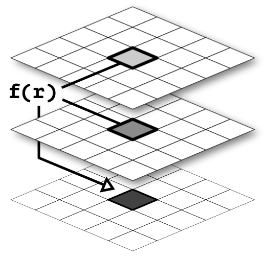{fig-align="center" width="616"}
:::

:::: {.column width="50%"}
::: callout-tip
## Пример

Пересчет высоты из метров в футы

Расчет спектральных индексов
:::
::::
::::::

## Фокальная растровая алгебра

В фокальных операциях участвует не только сама ячейка или совпадающие с ней ячейки других растров, но также ячейки, находящиеся в некоторой окрестности (опять же, в одном или нескольких растрах одновременно).

::: callout-tip
## Пример

Все операции морфометрического анализа и построение теневого рельефа.
:::

## Фокальная растровая алгебра

Область может быть задана **фиксированно**.

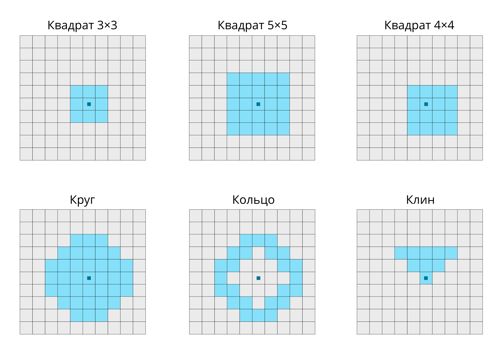{fig-align="center" width="851"}

------------------------------------------------------------------------

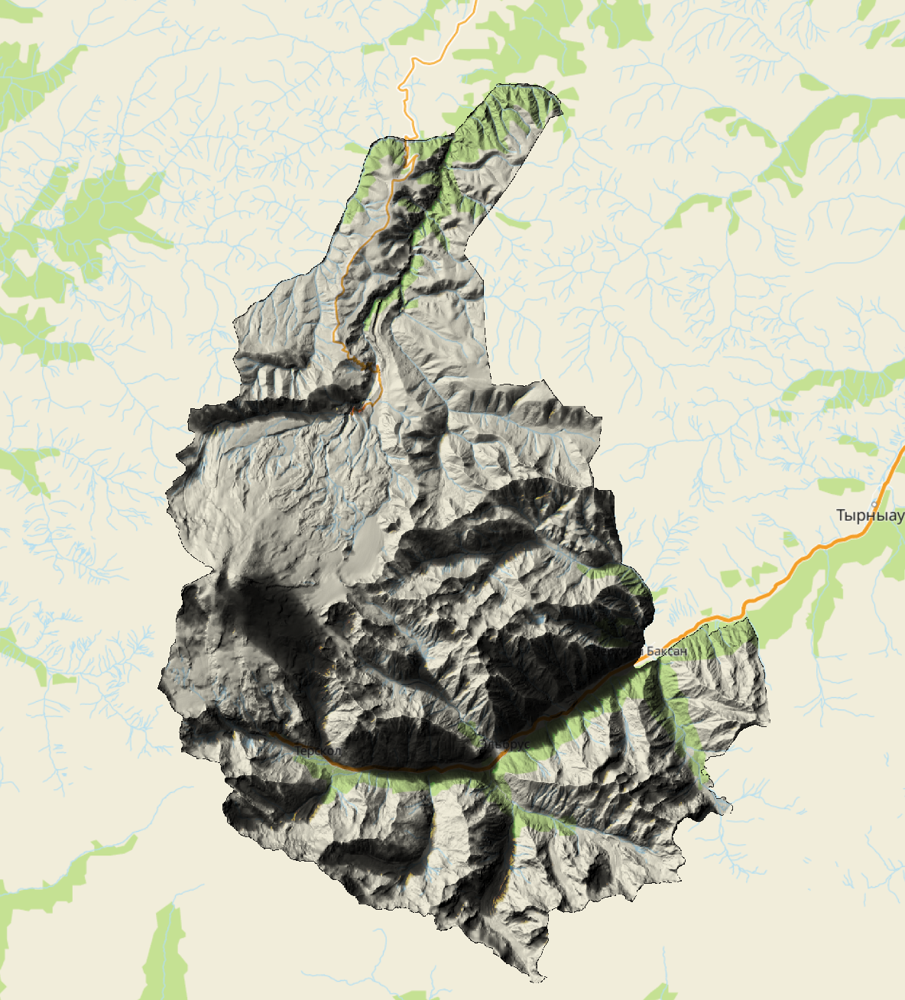{fig-align="center" width="724"}

## Фокальная растровая алгебра

### Морфометрический анализ рельефа

**Уклон поверхности** – это угол наклона в точке пересечения между горизонтальной плоскостью и плоскостью касательной к земной поверхности; фиксирует интенсивность перепада высот (градиент) между двумя заданными точками.

**Экспозиция поверхности** – это угол по часовой стрелке между определенным направлением (как правило, на север) и проекцией уклона на горизонтальную плоскость; фиксирует направление (азимут) максимального уклона (градиента) земной поверхности.

## Фокальная растровая алгебра

### Морфометрический анализ рельефа

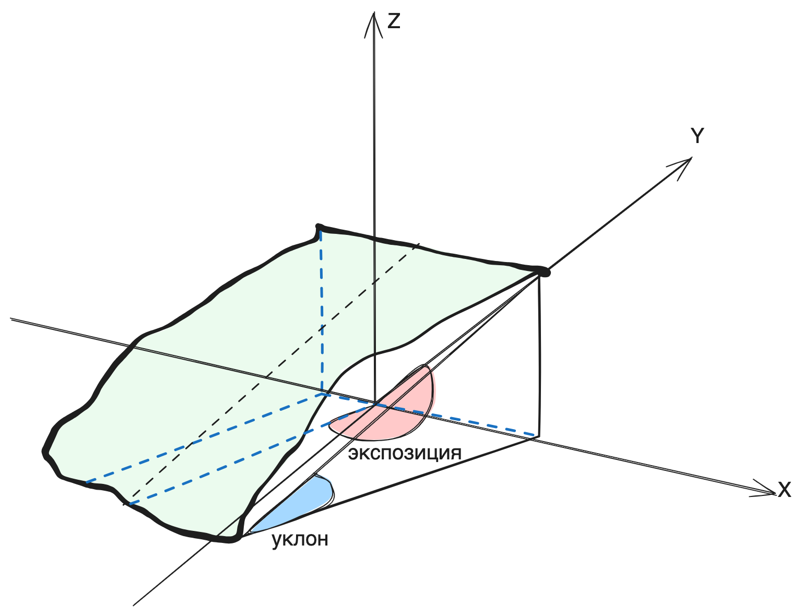{fig-align="center" width="911"}

## Фокальная растровая алгебра

### Морфометрический анализ рельефа

::::: columns
::: {.column width="50%"}
{fig-align="center"}
:::

::: {.column width="50%"}
Расчет крутизны склонов ($\alpha$) или их уклона ($\beta$) и экспозиции осуществляется на основе производных первого порядка.

$$
\alpha=arctan (\sqrt{G^2+H^2}),\: где\: G=\dfrac{z_6-z_4}{2l},\\H=\dfrac{z_2-z_8}{2l}
$$

$$
\beta=180^\circ-arctan(\dfrac{\pm\,H}{\pm\,G})+90^\circ(\dfrac{\pm\,G}{|G|})
$$
:::
:::::

## Фокальная растровая алгебра

### Морфометрический анализ рельефа

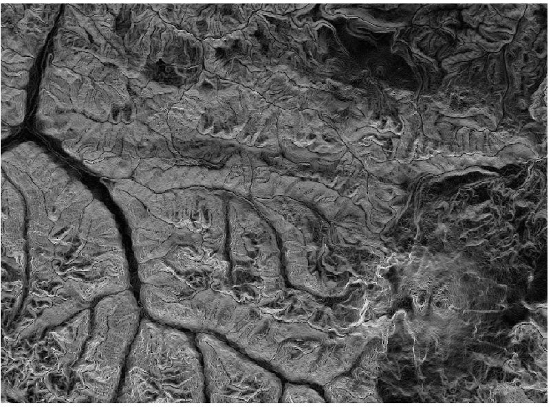{fig-align="center"}

## Фокальная растровая алгебра

### Морфометрический анализ рельефа

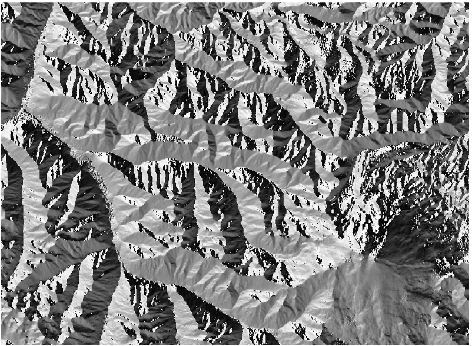{fig-align="center"}

## Фокальная растровая алгебра

Расширенность окрестности означает, что она определяется не фиксированным шаблоном, а условием, которое должно выполниться для того, чтобы анализ в ячейке считался выполненным.

:::::: columns
::: {.column width="50%"}
{fig-align="center"}
:::

:::: {.column width="50%"}
::: callout-tip
## Пример

**Евклидово распределение** (Euclidean allocation) относит каждый пиксел растра к ближайшему по расстоянию объекту.
:::
::::
::::::

## Зональные операции

При выполнении зональных операций производится агрегирование значений в пределах заданной зоны, определяемой другим растром или векторным объектом.

:::::: columns
::: {.column width="50%"}
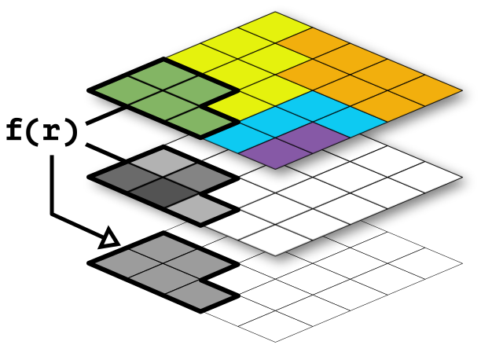{fig-align="center" width="812"}
:::

:::: {.column width="50%"}
::: callout-tip
## Пример

Расчет средней высоты в пределах района

Расчет среднего угла наклона для заданной территории
:::
::::
::::::

## Зональные операции

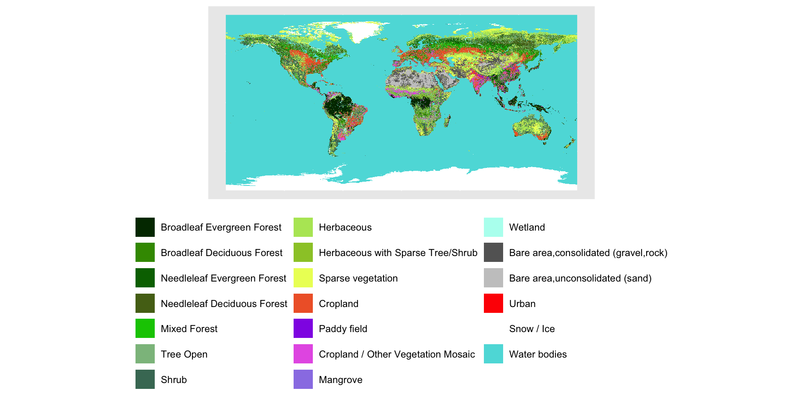{fig-align="center" width="1800"}

## Глобальные операции

:::::: columns
::: {.column width="50%"}
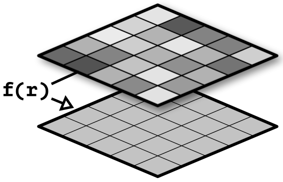{fig-align="center" width="932"}
:::

:::: {.column width="50%"}
В глобальных операциях расчеты производятся для всех ячеек сразу.

::: callout-tip
## Пример

Расчет средней высоты по всей цифровой модели рельефа

Определение наиболее часто встречающегося значения растра
:::
::::
::::::

## Растровый оверлей

:::::: columns
::: {.column width="50%"}
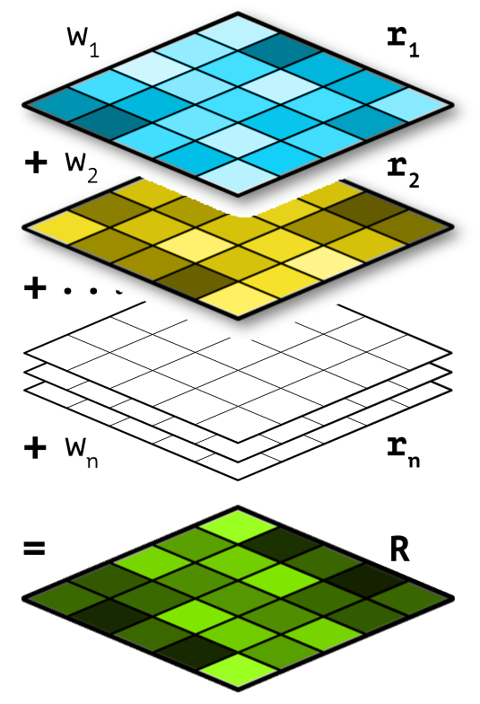{fig-align="center" width="476"}
:::

:::: {.column width="50%"}
Является частным случаем зональной операции, в котором вычисляется линейная комбинация (сумма, среднее, максимальное значение и т.д.) из нескольких накладывающихся растров.

::: callout-note
Если коэффициенты линейной комбинации представляют собой веса, то растровый оверлей называют **взвешенным**.
:::
::::
::::::

## Взвешенный растровый оверлей

Пример **взвешенного оверлея** — выбор территорий, обладающих оптимальной совокупностью признаков[^4]

[^4]: *Самсонов Т.Е.* **Основы геоинформатики: курс лекций** : сайт. 2025. — URL: https://tsamsonov.github.io/gis-course/. Дата публикации: 24.04.2025. DOI: 10.5281/zenodo.7902351

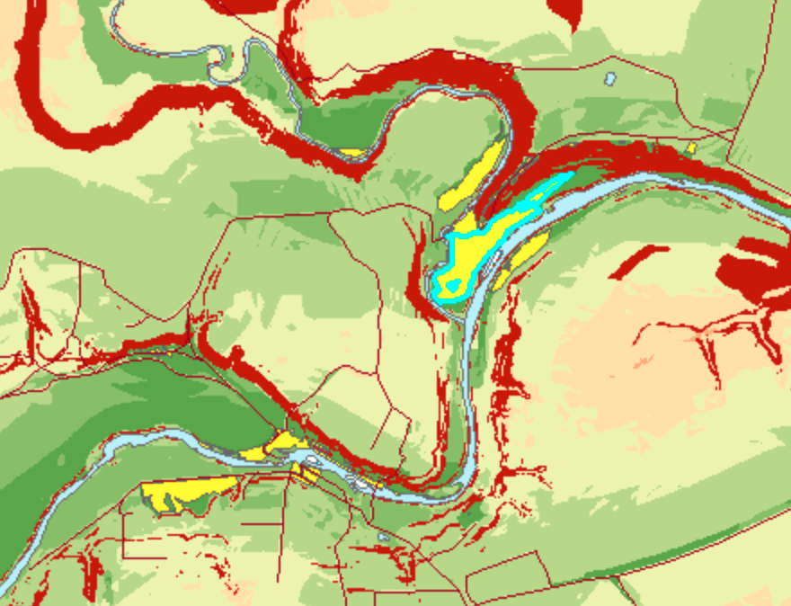{fig-align="center"}

## Взвешенный растровый оверлей

::::: columns
::: {.column width="50%"}
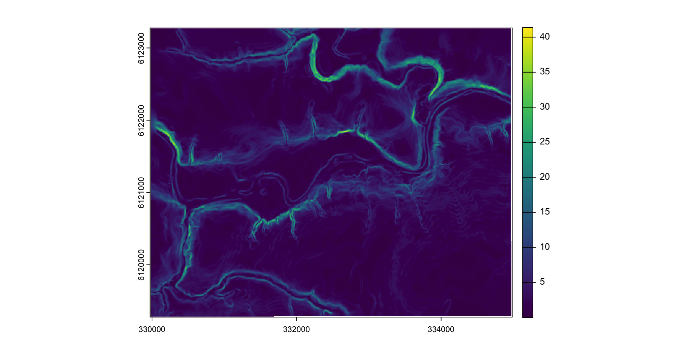{fig-align="center" width="700"}

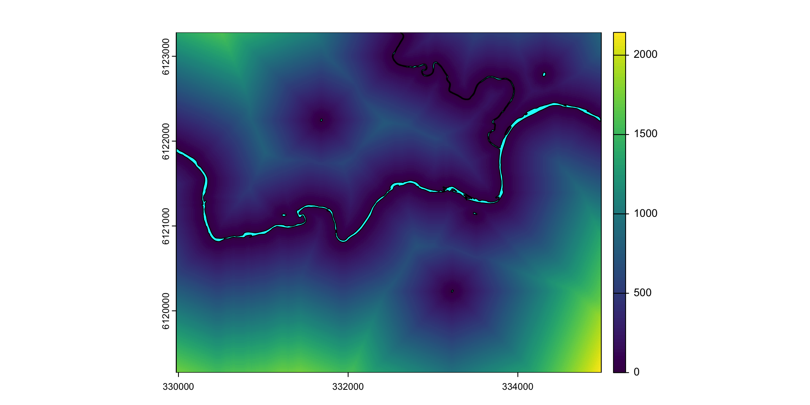{fig-align="center" width="700"}
:::

::: {.column width="50%"}
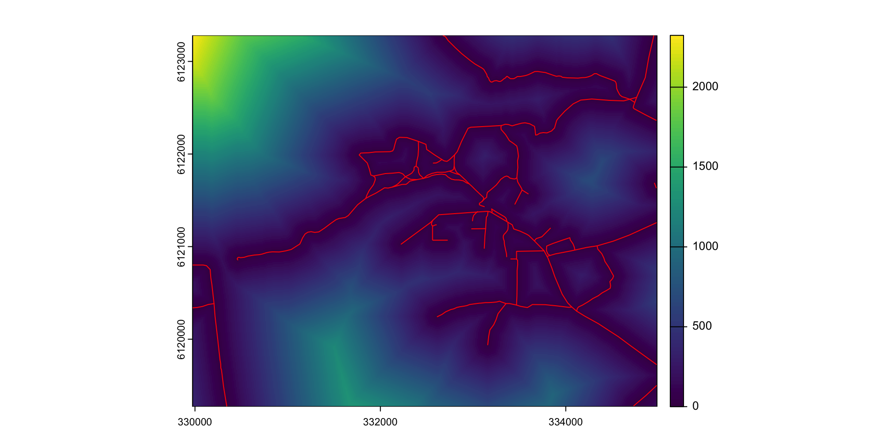{fig-align="center" width="700"}

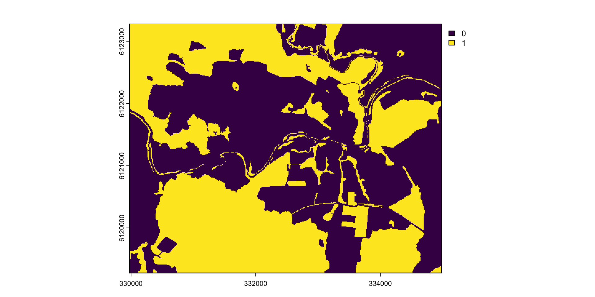{fig-align="center" width="700"}
:::
:::::

## Взвешенный растровый оверлей

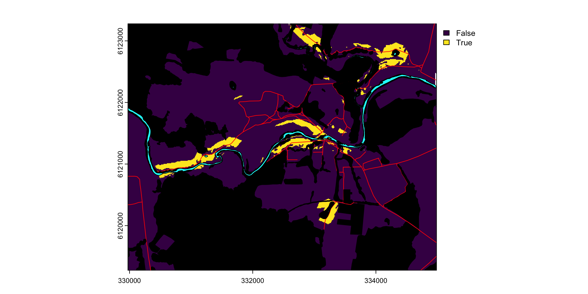{fig-align="center" width="1200"}

## Извлечение значений растра

Из растра можно извлекать данные с использованием векторных объектов.

Например, получить значение растра в конкретной точке.

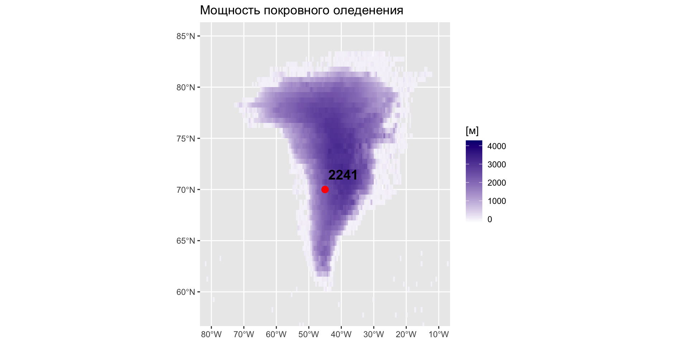{fig-align="center" width="1400"}

## Извлечение значений растра

Или получить высотный профиль путем извлечения значений вдоль линейного объекта.

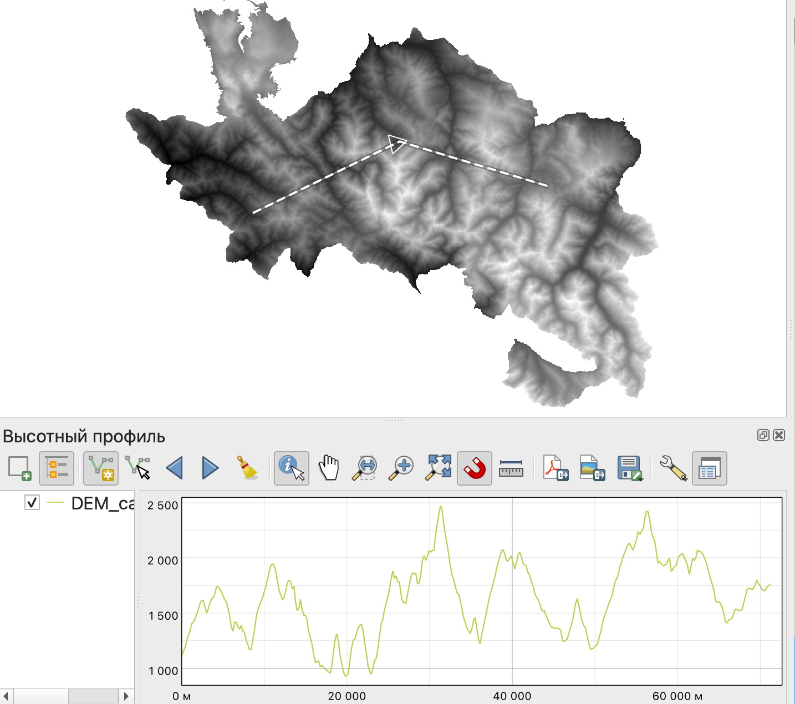{fig-align="center" width="903"}
