Как уже говорилось в [лекции](https://baltti.github.io/bachelor-gis-course/04-coordinate-reference-systems.html), в QGIS *каждый добавленный слой и набор данных имеет свою собственную систему координат*, а также есть **система координат проекта**, в которой отрисовываются данные на экране и выполняются некоторые расчеты. Эти системы координат могут (а в некоторых случаях для расчетов - должны) совпадать, а могут быть различны и могут изменяться независимо друг от друга.

# Система координат проекта

Система координат проекта отображается в правом нижнем углу основного окна программы.

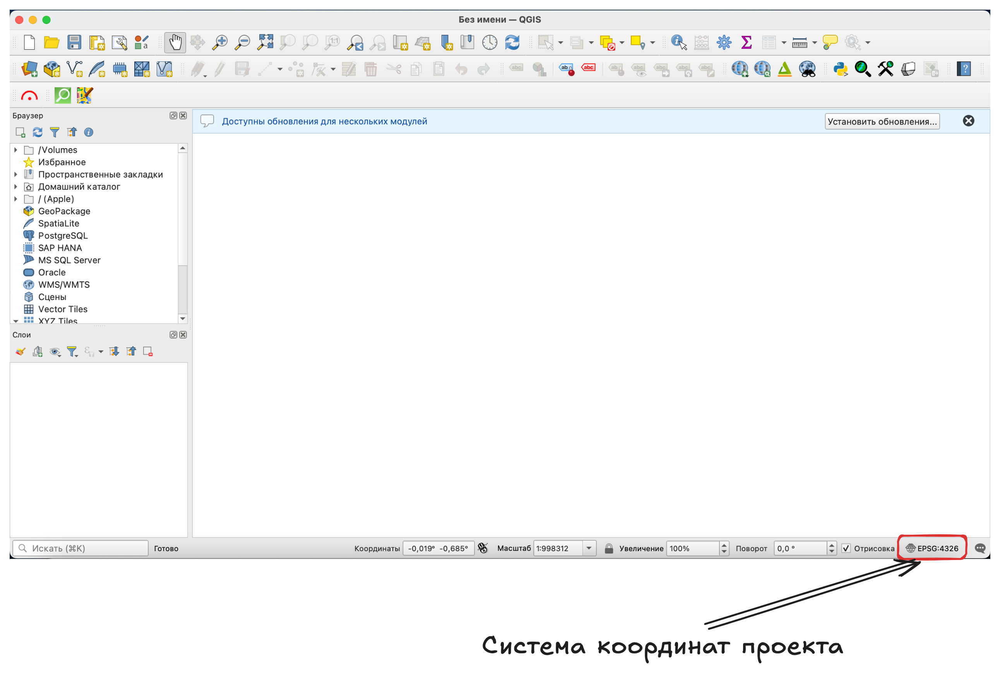{fig-align="center" width="1485"}

# 

::: callout-important
Если вы начинаете проект с открытия какого-то слоя, то система координат проекта будет установлена такой же как система координат этого слоя.
:::

## Перепроецирование на лету

Если вы хотите изменить систему координат текущего проекта, то вам необходимо нажать на эту кнопку и в открывшемся окне свойств проекта выбрать нужную вам систему координат.

{fig-align="center" width="1465"}

Это действие называется "***перепроецированием на лету***" и фактически меняет отрисовку вашей карты в окне (на самом деле не только, но пока остановимся на этом).

::: callout-important
Это действие никак не затрагивает системы координат ваших слоев.
:::

## Задание системы координат проекта по умолчанию

По умолчанию все проекты создаются в общегеографической системе координат *EPSG: 4326.*

Если вы хотите задать какую-то конкретную систему координат для всех новых проектов, то вы можете это сделать в настройках программы: *Настройка* $\longrightarrow$ *Параметры*.

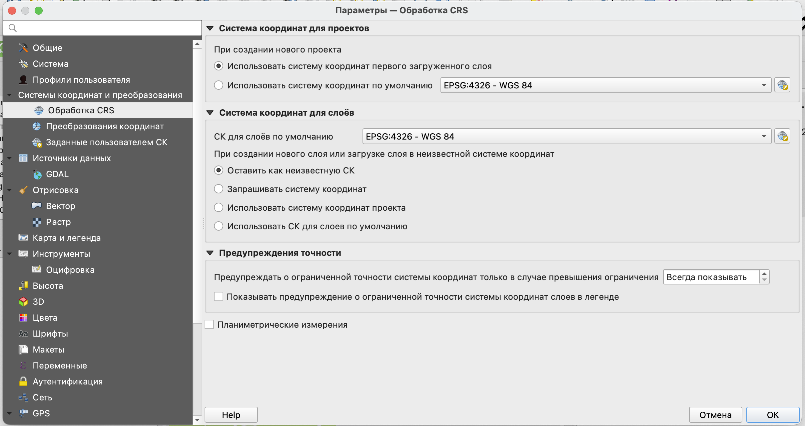{fig-align="center" width="1696"}

# Создание пользовательских систем координат

Если вам необходима система координат, которой нет в каталоге (например, вам нужно работать в местной системе координат), то вы можете прописать ее параметры в настройках программы, чтобы она была добавлена в качестве пользовательской.

Для добавления пользовательской системы координат нужно перейти в параметры из строки меню: *Настройки* $\longrightarrow$ *Параметры*.

В открывшемся окне нужно найти пункт *Заданные пользователем СК*, в котором вы можете создать свою систему координат (кнопкой {width="32"}).

Для системы координат вам нужно обязательно указать имя и ввести ее параметры в формате WKT или proj.

::: callout-important
Несмотря на то, что вы увидите предупреждение, что формат proj устаревший, он все равно будет работать, так что тут для вас нет принципиальной разницы, какой формат использовать.
:::

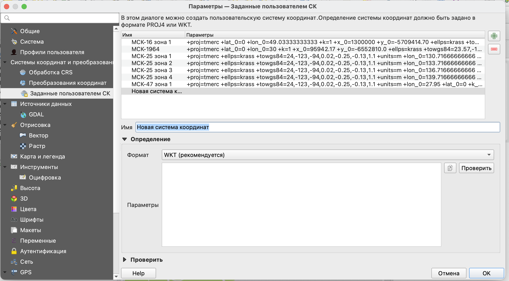

Свои пользовательские системы координат вы после этого сможете найти в каталоге в группе *Пользовательские*.

{fig-align="center" width="881"}

# Назначение системы координат

В том случае, если у вас в проекте есть слой с неизвестной системой координат, то он будет обозначен иконкой {width="36" height="31"} справа от названия слоя. Это символ того, что у данного слоя не задана система координат.

::: callout-note
Здесь назначение системы координат проиллюстрировано на примере кадастрового плана территории для Выборгского района Ленинградской области.

Для этого района необходимо использовать местную систему координат МСК-47 зона 1.
:::

Систему координат для слоя можно назначить из контекстного меню.

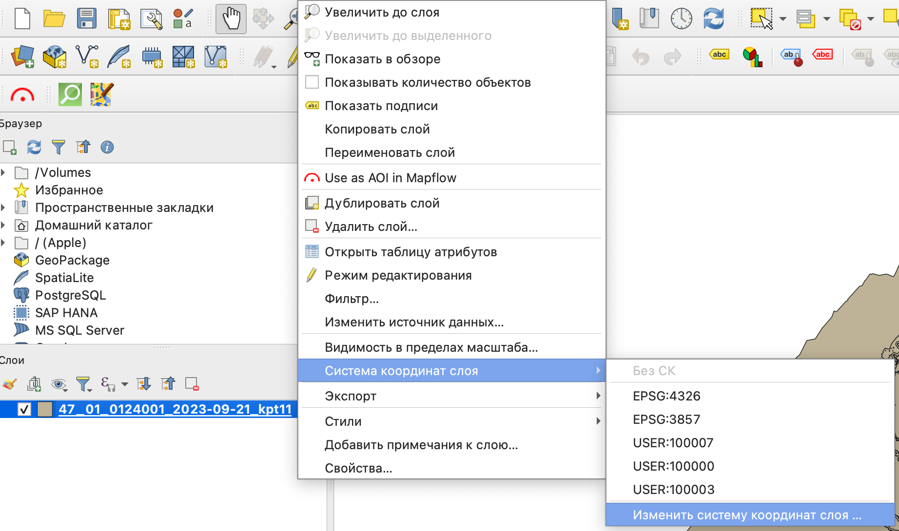{fig-align="center" width="1523"}

В открывшемся окне необходимо выбрать нужную систему координат.

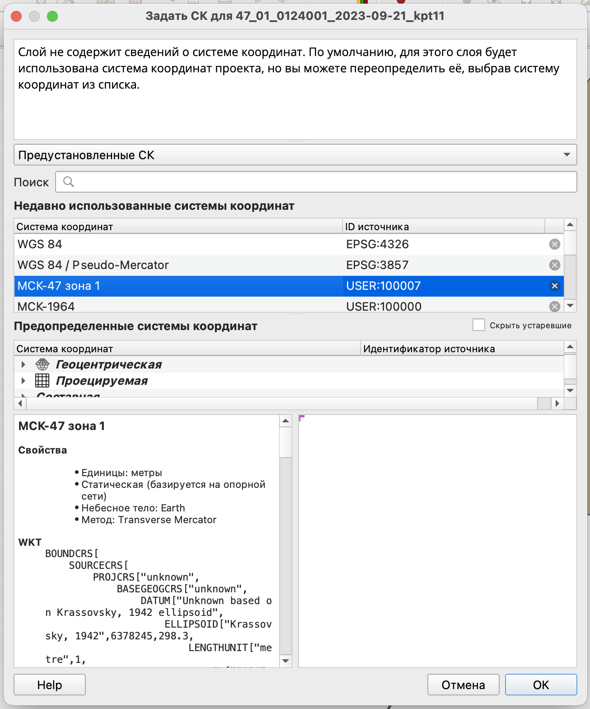{fig-align="center" width="750"}

После этого слой появится там, где он должен быть расположен на самом деле.

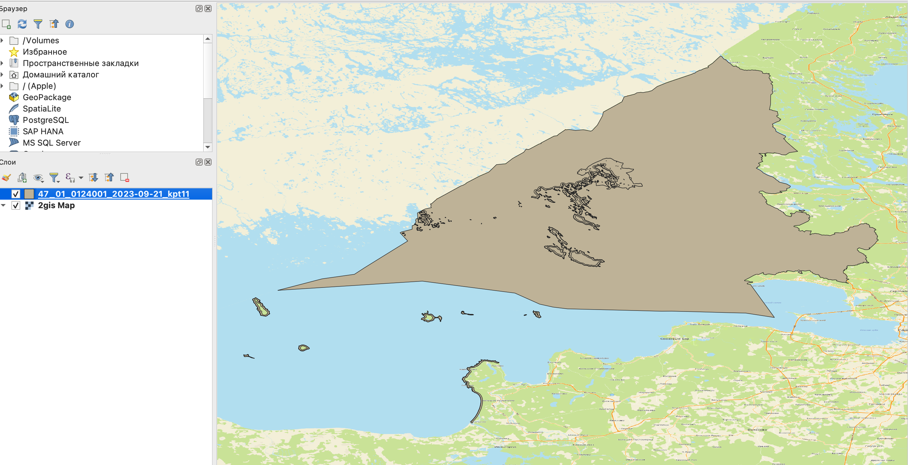{fig-align="center" width="1754"}

::: callout-tip
Также вы можете назначить систему координат из свойств слоя.

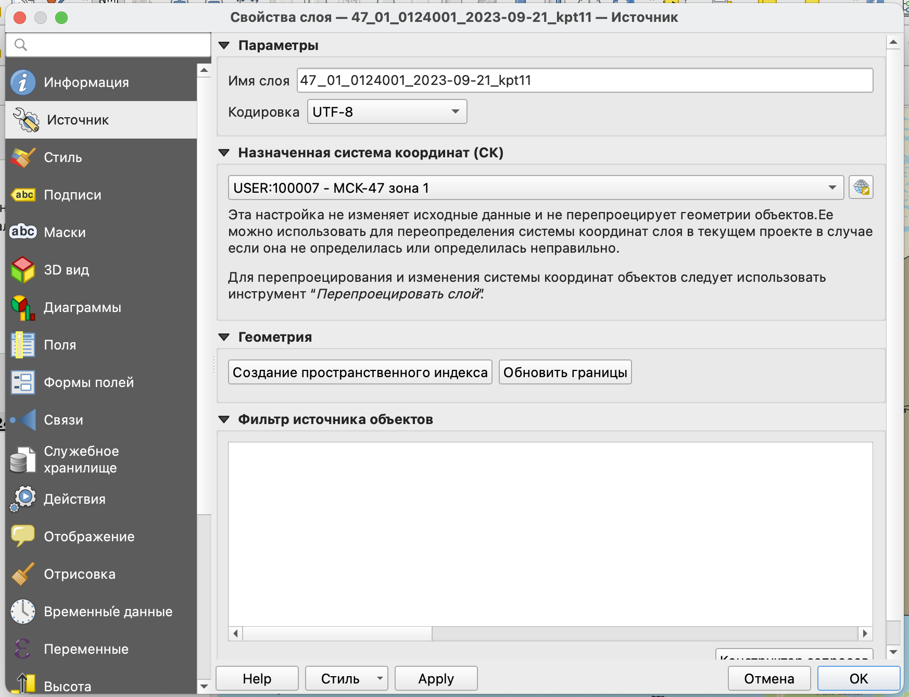{fig-align="center" width="1044"}

Кроме того, если вам нужно, здесь вы можете переназначить систему координат слою, у которого она была установлена неправильно.
:::

::: callout-important
Обратите внимание, что на моем изображении карты она немного "наклонена" или "под углом", это связано с тем, что система координат проекта отличается от той системы координат, в которой вы привыкли видеть карту.

Если сделать перепроецирование на лету в систему координат *EPSG: 3857*, то вы увидите, что карта приняла привычный вид.

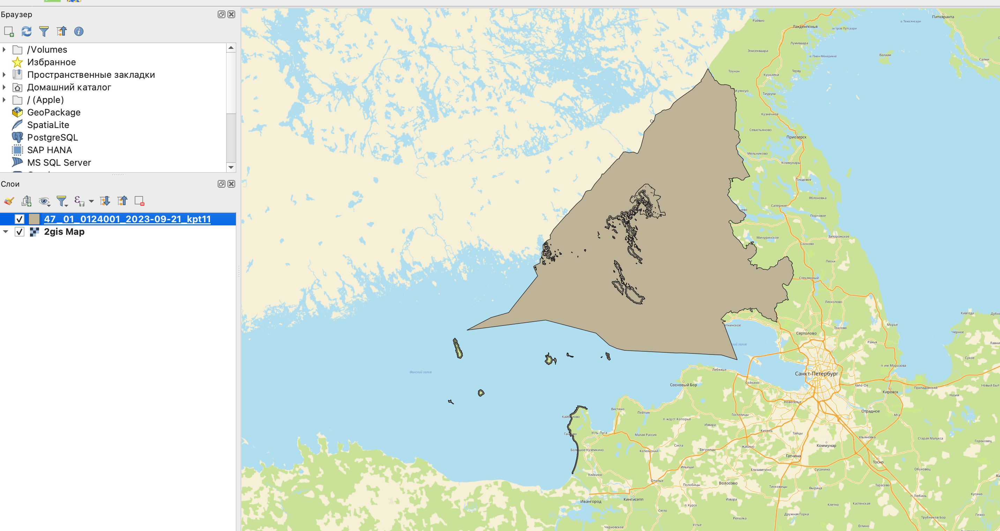{fig-align="center" width="1695"}
:::

# Перепроецирование слоя

::: callout-important
Для того, чтобы воспользоваться инструментом перепроецирования слоя, нам нужно сначала открыть *Панель инструментов анализа*, которая еще понадобится в будущем.

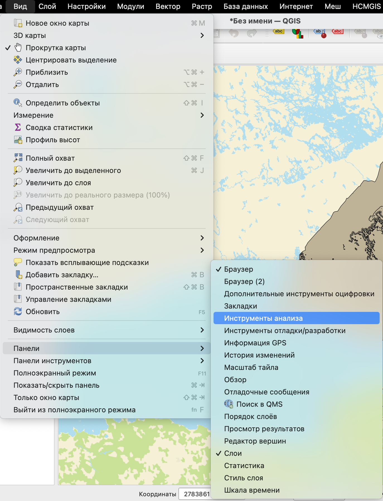{fig-align="center" width="612"}

Эта панель появится в правой части вашего основного окна программы.

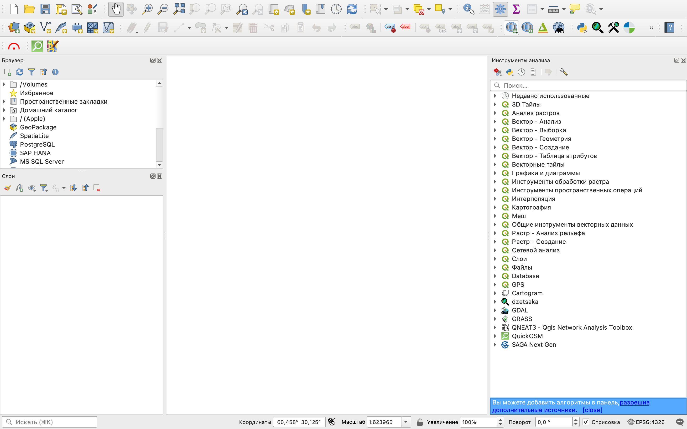{fig-align="center" width="1440"}

В *Панели инструментов анализа* находится большинство основных инструментов для манипуляции с данными, поэтому мы будем активно пользоваться ей в дальнейшем.
:::

Для того, чтобы перепроецировать слой, необходимо воспользоваться одноименным инструментом. Найти его можно с помощью строки поиска в верхней части *Панели инструментов анализа* или в группе инструментов *Общие инструменты векторных данных*.

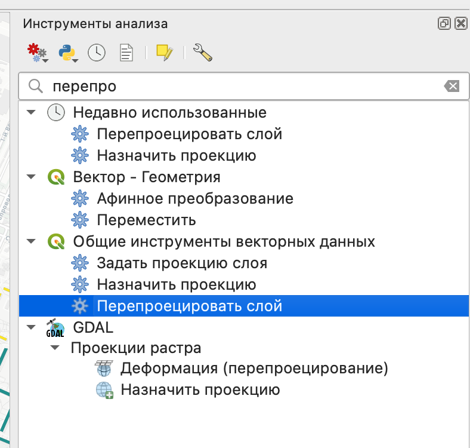{fig-align="center" width="630"}

::: callout-warning
Обратите внимание, что здесь еще есть инструменты *Задать проекцию слоя* и *Назначить проекцию*. Это инструменты для назначения системы координат, в том случае, если у слоя она неизвестна или отсутствует, о чем говорилось выше.

Разница между ними в том, что *Задать проекцию слоя* предназначена для формата shapefile, так как может создавать нужный файл формата *.prj*, в котором будут храниться параметры системы координат, а *Назначить проекцию* - для любого векторного слоя.
:::

В открывшемся окне вам необходимо выбрать нужный слой, целевую систему координат (то есть ту систему координат, в которую вы хотите перепроецировать), и необходимость сохранения.

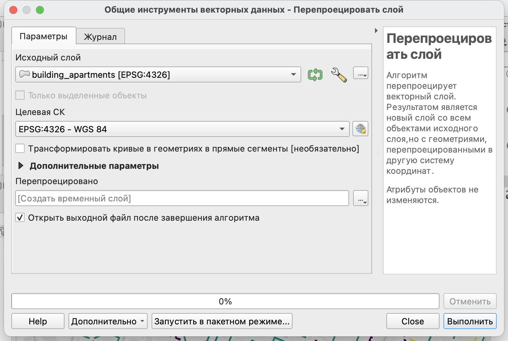

Мы с вами будем перепроецировать слой со зданиями.

Какая нам нужна целевая система координат?

В настоящее время этот слой в географической системе координат *EPSG: 4326* (вы можете проверить это в свойствах слоя), так как мы скачивали его из OSM. Это значит, что вычисления в этом слое будут выполняться в градусах (так как они являются здесь единицами измерения) и на эллипсоиде (так как это не плоская прямоугольная система координат).

Нам в дальнейшем нужно выполнять с этим слоем определенные расчеты в метрической системе: например, площадь и периметр. Поэтому необходима система координат, которая использует метры в качестве основной единицы измерения, кроме того, для большей точности расчетов эта система должна быть прямоугольной.

::: callout-important
Результаты расчетов длин, площадей и периметров на плоскости и на эллипсоиде будут отличаться друг от друга тем сильнее, чем о большей территории идет речь. И для больших территорий правильнее выполнять эти расчеты на эллипсоиде с учетом кривизны Земли.

Так как мы с вами работаем, как правило, в пределах одного города, мы можем пренебречь кривизной Земли и работать на плоскости.
:::

Идеальным вариантом для расчетов для нас будет система координат из семейства UTM (Universal Transverse Mercator - универсальная поперечная проекция Меркатора) – эта система координат является зональной, то есть определяется в пределах 6 градусных зон по долготе.

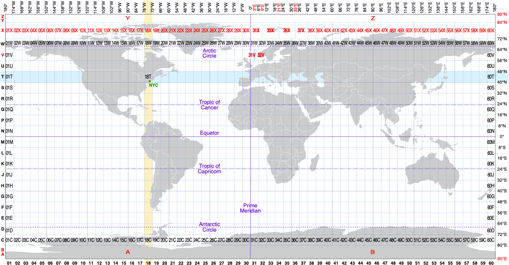{fig-align="center"}

Так как эта система координат зональная, то есть определяется только в пределах конкретных диапазонов долгот, то необходимо определять зону, в которой расположена ваша исследуемая территория.

Определить зону можно по формуле:

$$
Номер\space зоны = (Долгота + 180^\circ)/6
$$

Полученное число нужно округлить в большую сторону.

::: callout-note
Существуют специальные онлайн-калькуляторы для определения номера зоны по координатам. Например, <https://www.latlong.net/lat-long-utm.html>
:::

Открыть полный каталог систем координат для выбора нужной вам, вы можете по нажатию на кнопку 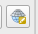{width="49"}. В этом каталоге нужно найти систему координат с тем номером зоны, который вы определили. Проще всего это сделать с помощью поиска.

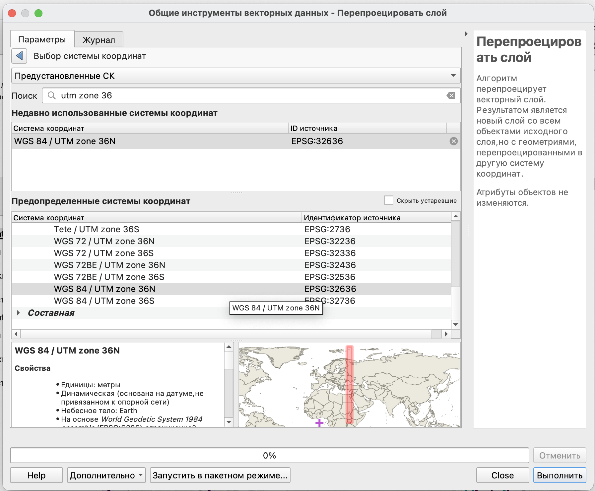{fig-align="center" width="1211"}

::: callout-warning
Обратите внимание, что эти системы координат различны для северного и южного полушарий.

Как правило, система координат для северного полушария обозначена буквой N (north), для южного - S (south).
:::

После выбора системы координат вы можете указать, сохранить ли результаты в виде временного слоя или сохранить в виде файла.

Так как нам этот слой еще понадобится в будущем, его нужно сохранить в файл.

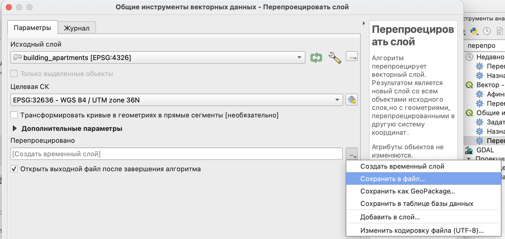{fig-align="center" width="1897"}

::: callout-important
Если вы уже сохранили свой результат как временный слой, то вы можете отдельно потом сохранить его в файл аналогично тому, как мы сохраняли результаты запросов из OSM.
:::

По итогу перепроецирования на вашей карте должен появиться новый слой, выглядящий точно также как и изначальный.

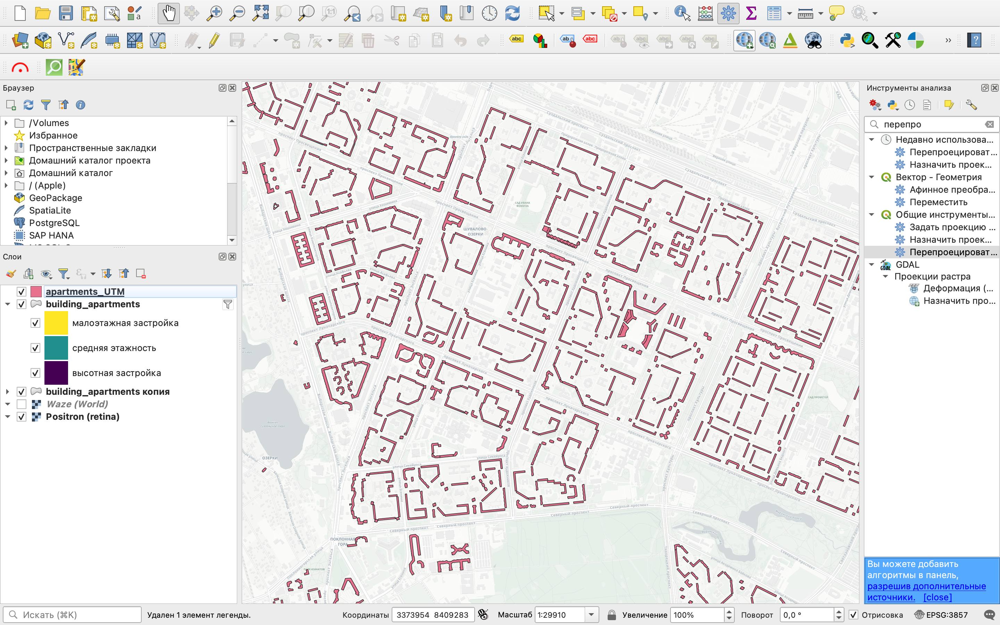

Однако он будет отличаться от исходного системой координат.

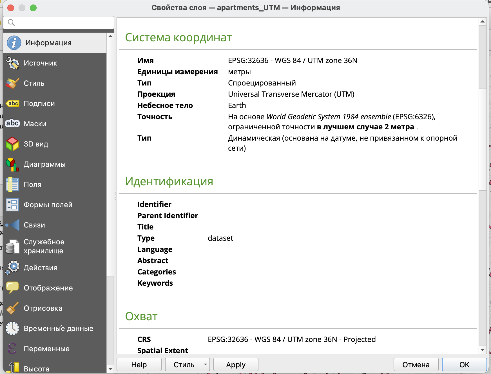{fig-align="center" width="918"}

::: callout-important
Ваш перепроецированный слой должен остаться на том же месте, что и исходный!

Если он куда-то "улетел", значит вы в чем-то ошиблись.

Почему слой в другой системе координат для нас будет выглядеть неизменно? Это связано с тем, что карту мы видим в системе координат проекта.
:::
