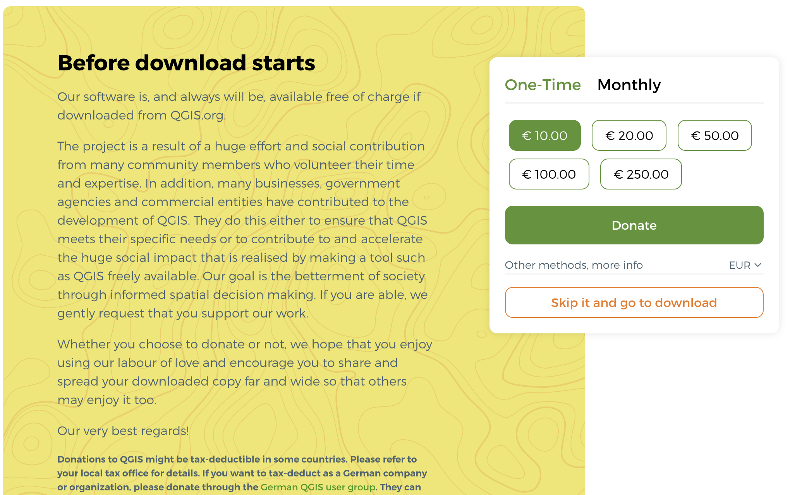
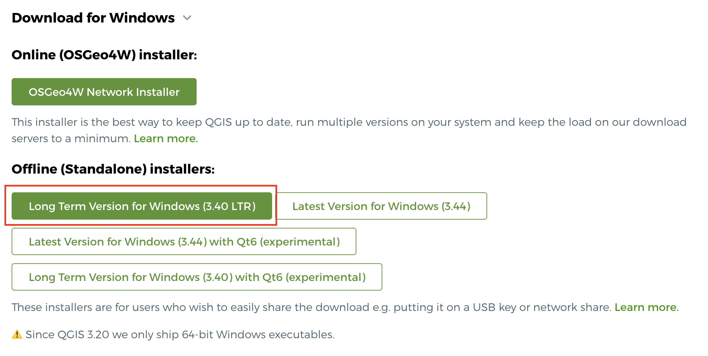
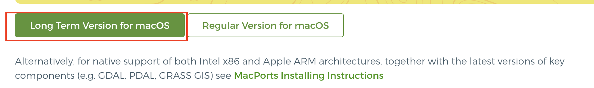
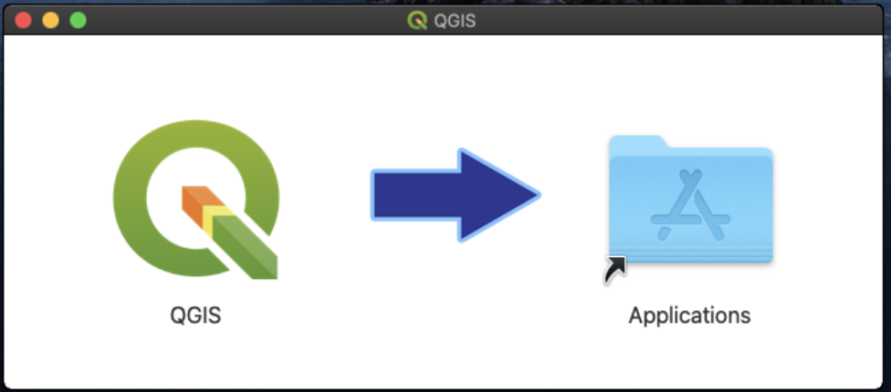
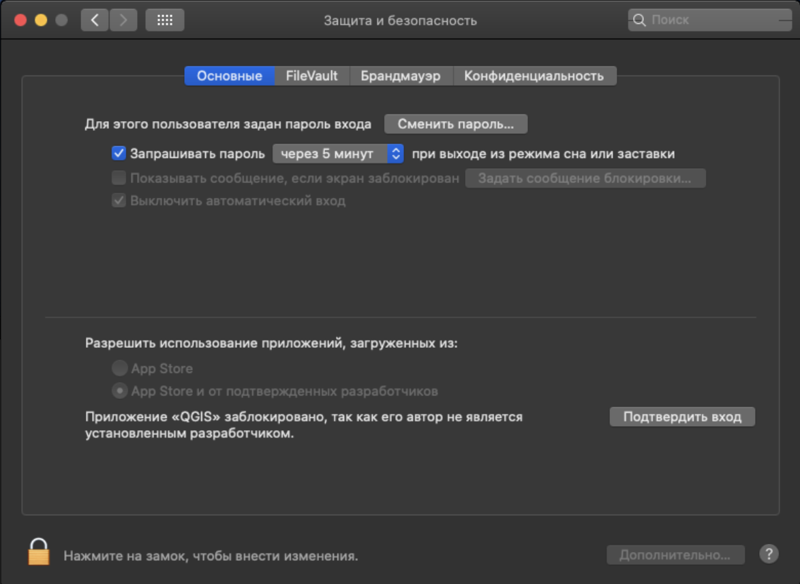

Практическая часть курса разработана для программы QGIS.

Официальный сайт программы: <https://qgis.org/>

Официальная документация: <https://qgis.org/resources/hub>

::: callout-warning
Курс разработан на основе версии ***QGIS 3.40.***

Пока *не нужно устанавливать новую мажорную версию QGIS 4.x.*
:::

# Установка программы на Windows

Скачать программу можно по ссылке <https://qgis.org/download/>

::: callout-note
Скорее всего после перехода по ссылке вы увидите форму для отправки пожертвования в фонд развития программы. Здесь вы можете просто нажать на кнопку *Skip it and go to download*, чтобы перейти к загрузке установщика.

{fig-align="center" width="1116"}
:::

Для системы Windows доступно две версии установщика:

-   Online (OSGeo4W) installer - онлайн установщик, который сразу будет устанавливать не только эту программу, но и еще некоторые дополнительные;

-   offline (standalone) installer - обычный установочный файл, который вы скачиваете и запускаете на компьютере; этот вариант более простой и понятный, рекомендую использовать его.

{fig-align="center"}

::: callout-tip
Если у вас возникла сложность с доступом к сайту, то вы можете скачать установщик по прямой ссылке <https://qgis.org/downloads/QGIS-OSGeo4W-3.40.10-1.msi>
:::

После запуска установщика вы увидите окно мастера установки, в котором нужно перейти *Далее*.

На следующем этапе согласиться с условиями использования, выбрать папку для установки.

После завершения установки программа должна появиться у вас в меню **Пуск** и в виде папки на рабочем столе, из которой доступен ярдык запуска программы.

# Установка программы на MacOS

Скачать версию для MacOS можно на той же странице <https://qgis.org/download/>

{fig-align="center"}

::: callout-tip
Если есть проблема с доступом к сайту, можно скачать по прямой ссылке <https://qgis.org/downloads/macos/qgis-macos-ltr.dmg>
:::

После запуска установщика вам нужно принять лицензионное соглашение, дождаться распаковки файла. После распаковки вы увидите окно, в котором нужно просто перетащить ярлык программы в папку с приложениями.

{fig-align="center" width="908"}

::: callout-important
При первом запуске программы вам может потребоваться разрешение на использование приложения. Для этого нужно перейти в настройки и включить соответствующие разрешения.

:::
