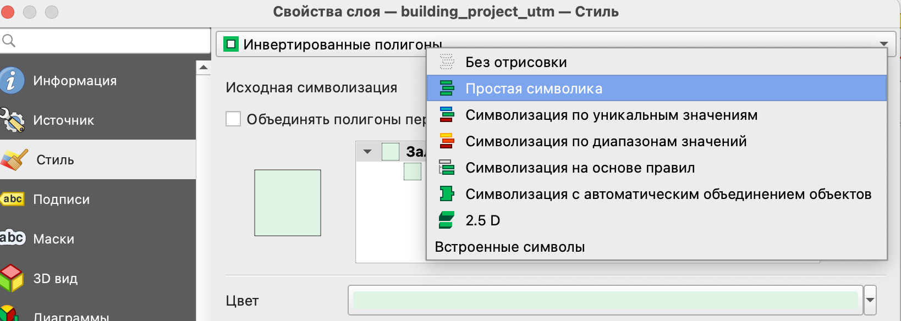

Пункт ***Стиль*** в окне свойств слоя предоставляет необходимые инструменты для отрисовки и стилизации векторных слоев. При этом существуют символов и инструменты для работы с векторными данными в целом, а также специальные типы символов, предназначенные для различных геометрий объектов (точек, линий и полигонов).

Однако для всех видов векторных слоев процесс будет повторяться: в верхней части окна содержатся инструменты для классификации и настройки стиля, а в нижней - опции отрисовки слоя.

# Общие типы стилей

Вне зависимости от типа геометрий в слое доступно 4 основных способа отображения объектов:

-   **простой символ** - позволяет отобразить все объекты слоя с использованием одного универсального символа;

-   **уникальные значения** - как правило, используется для категориальной или дискретной переменной с небольшим количеством значений, также может использовать выражение в качестве переменной;

-   **градуированный знак** - для задания символа в зависимости от числовой переменной, также позволяет использовать выражения;

-   **правила** - позволяет задавать символику на основе выражения.

::: callout-note
Следует отметить, что в QGIS нет типа символа для непрерывных величин, так как здесь они рассматриваются как частный случай градуированного знака.
:::

## Уникальные значения

При использовании типа символа *Уникальные значения* в первую очередь следует выбрать переменную, по которой будет осуществляться классификация.

Для такого типа символов следует использовать ***категориальную переменную***, то есть ту, которую нельзя ранжировать по возрастанию.

В качестве примера таких переменных можно привести:

-   тип здания по функциональному назначению - промышленное, жилое и общественное;

-   тип транспорта - автобус, трамвай, троллейбус;

-   тип почвы - чернозем, подзолистая, серая лесная и прочие.

Вместо непосредственно конкретной переменной может быть использовано выражение, что позволяет устранить необходимость создания отдельного атрибута исключительно для символизации слоя и использовать уже имеющиеся.

Отдельно может быть настроен *Символ*, который будет использоваться как базовый для всех классов (в первую очередь эта настройка будет касаться типа заливки и типа контура, а также некоторых других общих параметров).

*Цветовой ряд* используется для символизации разных категорий, кроме того этот тип символа позволяет использовать набор случайных цветов.

Так как тип символа базируется на использовании категориальных переменных, для которых предпочтительно использование цвета как основной визуальной характеристики, палитра случайных цветов в данном случае предпочтительнее, чем готовый градиент.

Автоматически при классификации будет создан пустой класс *Другие значения*, который впоследствии может быть заполнен объектами со значениями переменной, которых не было в изначальной классификации.

## Градуированный знак

Градуированный символ может применяться только для числовых показателей, так как предполагает ранжирование по возрастанию и классификацию на группы.

Градуированные знаки могут использовать не непосредственно значение конкретного атрибута, но вычисляемое выражение.

## Символизация на основе правил

В качестве правил при символизации выступают выражения, которые позволяют создавать собственные настройки отрисовки для определенных объектов, которые удовлетворяют заданным выражениями условиям.

Так, например, с помощью правила можно установить отрисовку только некоторых объектов соответствующих определенным условиям или исключить из отрисовки объекты, которые не должны быть отображены, или применить специальную символику и отдельные настройки, чтобы выделить на карте только некоторые объекты.

::: callout-tip
Выражения могут быть вложенными друг в друга, при этом выражения более низкого уровня будут применяться только к тем объектам, которые удовлетворяют условиям выражения более высокого уровня.
:::

# Типы стилей полигонов

Также как и для линейных объектов для полигонов доступна символизация с автоматическим объединением объектов, где кроме перечисленных выше исходных символизация добавлена символизация 2.5 D, о которой чуть ниже.

{fig-align="center"}

Уникальными только для полигональных объектов типами стиля являются:

{fig-align="center"}

-   **инвертированные полигоны (inverted polygons)** - позволяет делать заливку не внутрь контура, а вовне. Также как и для символизации с автоматическим объединением объектов остальные типы стилей могут выполнять роль исходной символизации;

```         
{fig-align="center"}
```

-   **2.5 D** - позволяет создать изометрическую проекцию для полигонов.

    

В изометрической проекции для полигонов доступна дальнейшая настройка символов аналогично символам стандартных полигонов.

# Маски

Маски позволяют настроить наложение символов различных слоев. Это необходимо для улучшения читаемости карты и различения символов различных слоев.

Маски добавляют настраиваемый прозрачный слой вокруг объектов для того, чтобы скрыть часть символов текущего слоя.

В качестве слоя источника маски может быть задан только слой с точечными объектами. Для слоя источника маски он должен быть установлен как тип слоя символа в настройках стиля, а для того слоя, к которому маска будет применяться, он указывается в настройках маски.

# Уровни знака

::: callout-note
Особенностью QGIS при создании стиля того или иного слоя является то, что любой символ может быть собран послойно из различных типов слоев знака.
:::

Такие типы слоев различны для разных видов основных геометрических примитивов (точек, линий и полигонов) аналогично типам символов.

Следует помнить, что, как и слои проекта, эти слои перекрывают друг друга в порядке их перечисления: слои, находящиеся в описании выше, перекрывают более низкие.

Для всех основных типов геометрий существует генератор геометрии, о котором будет рассказано отдельно.

## Точечные объекты

{fig-align="center"}

По умолчанию основным типом слоя здесь будет являться **простой маркер**, у которого могут быть настроены:

-   размер;

-   цвет заливки;

-   прозрачность;

-   параметры смещения от истинного положения;

-   обводка - толщина и цвет;

-   форма маркера.

    Все эти параметры могут быть заданы как в виде некоторого значения, так и переопределены на основе данных. То есть тот или иной параметр будет зависеть от значения атрибута объекта или вычисляемого выражения на основе атрибута/атрибутов.

Тип слоя *Маска* может быть использован при необходимости отрисовки точечного слоя поверх других слоев и подписей так, чтобы они его не перекрывали.

Тип слоя *Генератор геометрии* является общим для всех типов геометрий и подробно будет рассмотрен отдельно.

Прочие типы слоев точечного символа:

-   *анимированный маркер* - точечный объект, который использует анимированное изображение в формате *.gif* в качестве маркера (могут быть настроены основные размеры маркера);

-   *эллиптический маркер* - модификация простого маркера, для которого можно настроить отдельно ширину и высоту;

-   *маркер с заливкой* - еще одна модификация простого маркера, которая позволяет использовать те же типы заливки, что и для полигона;

-   *шрифтовой маркер* - маркер, внутри которого добавлен текстовый символ или текст, для которого может быть отдельно настроен шрифт и содержание текста (например, на основе выражения или атрибута, или просто введенный текст);

-   *растровый маркер* - использует растровое изображение (форматы *.png, .jpg, .bmp*) в качестве символа маркера;

-   *SVG маркер* - маркер, который использует в качестве символа векторное изображение в формате SVG (позволяет больше возможностей настройки, чем растровый маркер);

-   *маркер векторного поля* - кастомизируемый маркер, который может быть создан на основе атрибутов:

{fig-align="center"}

-   на плоскости - маркер задается параметрами по оси X и Y;

-   полярный - маркер с параметрами длины и угла поворота;

-   только высота - маркер с одним параметром высоты для отображения высоты расположения точек.

## Линейные объекты

{fig-align="center"}

Простая линия для линейных объектов похожа на простой маркер с основными параметрами настройки по цвету, толщине, прозрачности.

Для линейных объектов также как и для остальных есть один из основных типов слоев

-   *Генератор геометрии* и прочие, позволяющие настраивать различные параметры:

-   *стрелка* - линия со стрелкой на одном или обоих концах;

-   *штрихи вдоль линии* - линия, которая отрисовывается короткими отрезками перпендикулярными ее направлению через установленный интервал;

-   *интерполированная линия* - линия, которая может менять цвет и толщину от одного конца к другому;

-   *линия с градиентной заливкой* - линия, для которой переход в заливке происходит перпендикулярно ее направлению;

-   *маркерная линия* - линия, составленная из маркерных символов;

-   *линия из растров* - линия, составленная из растровых маркеров.

## Полигональные/площадные объекты

{fig-align="center"}

Наибольшую свободу в настройке допускают полигональные символы, так как они могут быть отрисованы как полигоны с настраиваемой заливкой, так и в некоторых типах слоев как маркеры или обводки.

Типом слоя по умолчанию здесь, как и в предыдущих типах объектов будет являться *Простая заливка*, а *Генератор геометрии* - общим типом стиля, который подробнее рассмотрен отдельно.

Некоторые из прочих типов слоев для полигонов основаны на маркерах, а некоторые на линейных стилях.

Рассмотрим прочие типы слоев для полигональных объектов:

-   *Отрисовка центроидов* - вместо полигона отрисовывается только маркер в его геометрическом центре;

-   *Градиентная заливка* - заливка полигона заданным и настроенным градиентом, который может быть настроен как на основе двух цветов, так и на основе определенного цветового ряда с различными настройками перехода;

{fig-align="center"}

-   *Заливка штриховкой* - заливка полигона происходит не сплошным цветов, а линейной штриховкой, для которой могут быть настроены как параметры линии штриховки, так и параметры частоты и поворота штрихов;

    {fig-align="center"}

-   *Заливка точками* - полигон заполняется маркерами точечных объектов с регулярным расположением;

{fig-align="center"}

-   *Заливка маркерами со случайным размещением* - полигон заполняется заданным числом маркеров со случайным расположением;

-   *Заливка растром* - в качестве заливки используются не параметры цвета, а готовое растровое изображение;

-   *Заливка SVG узором* - полигон заполняется векторным изображением в формате SVG (как и в случае с маркером SVG дает значительно больше параметров настройки, чем простое заполнение растровым изображением);

-   *Заливка градиентом из центра* - полигон заливается градиентом цветов, который выстраивается от центра к границе (в отличие от просто градиентной заливки, где градиент распространяется на объект в целом);

{fig-align="center"}

-   *Обводка* - тип слоя полигонального объекта, построенный на основе линейных типов слоев, который отображает только внешний контур объекта (подробнее о них сказано выше):

    -   *Стрелка*;

    -   *Штрихи вдоль линии*;

    -   *Интерполированная линия;*

    -   *Линия с градиентной заливкой;*

    -   *Маркерная линия*;

    -   *Линия из растров;*

    -   *простая линия*.

# Импорт готовых стилей

В QGIS кроме того, что мы можем самостоятельно создавать и настраивать стили, можно импортировать уже готовые стили или экспортировать созданные[^1].

[^1]: **Sharing style items** <https://docs.qgis.org/3.16/en/docs/user_manual/style_library/style_manager.html#sharing-style-items>

Это возможно благодаря тому, что описание стиля можно сохранить в формате XML.

Готовые стили можно скачать [здесь](https://plugins.qgis.org/styles/) или взять на гитхабе в [подборке](https://github.com/tjukanovt/qgis_styles) Топи Тюканова.

Кроме того, есть еще ресурс [QGIS Style hub](http://qgis-hub.fast-page.org/styles.php).

::: callout-caution
Обратите внимание, что некоторые стили могут иметь ограничения по типу объектов, к которым они применяются, и, в некоторых случаях, по типу системы координат, в которой должен быть слой.

Например, стиль слоя с выносками размеров применим только для слоев в *прямоугольной (спроецированной) системе координат*, так как он использует метрические единицы.
:::

Как загрузить стили по ссылке можно посмотреть в видео:

```{=html}
<iframe width="800" height="400" src="https://www.youtube.com/embed/zZW97unRBRw?si=SirM2CSJvJVJDLjn" title="YouTube video player" frameborder="0" allow="accelerometer; autoplay; clipboard-write; encrypted-media; gyroscope; picture-in-picture; web-share" referrerpolicy="strict-origin-when-cross-origin" allowfullscreen>
</iframe>
```

Загрузка готовых стилей из файла происходит аналогично, отличие только в том, что в качестве источника выбирается не URL, а файл.

Также можно пользоваться плагином [QGIS Resource sharing](https://plugins.qgis.org/plugins/qgis_resource_sharing/)
