# Уровни знака

Особенностью QGIS при создании стиля того или иного слоя является то, что любой символ может быть собран послойно из различных типов слоев знака.

Такие типы слоев различны для разных видов основных геометрических примитивов (точек, линий и полигонов) аналогично типам символов.

Следует помнить, что, как и слои проекта, эти слои перекрывают друг друга в порядке их перечисления: слои, находящиеся в описании выше, перекрывают более низкие.

Для всех основных типов геометрий существует генератор геометрии, о котором будет рассказано отдельно.

## Точечные объекты

{fig-align="center"}

По умолчанию основным типом слоя здесь будет являться **простой маркер**, у которого могут быть настроены:

-   размер;

-   цвет заливки;

-   прозрачность;

-   параметры смещения от истинного положения;

-   обводка - толщина и цвет;

-   форма маркера.

    Все эти параметры могут быть заданы как в виде некоторого значения, так и переопределены на основе данных. То есть тот или иной параметр будет зависеть от значения атрибута объекта или вычисляемого выражения на основе атрибута/атрибутов.

Тип слоя *Маска* может быть использован при необходимости отрисовки точечного слоя поверх других слоев и подписей так, чтобы они его не перекрывали.

Тип слоя *Генератор геометрии* является общим для всех типов геометрий и подробно будет рассмотрен отдельно.

Прочие типы слоев точечного символа:

-   *анимированный маркер* - точечный объект, который использует анимированное изображение в формате *.gif* в качестве маркера (могут быть настроены основные размеры маркера);

-   *эллиптический маркер* - модификация простого маркера, для которого можно настроить отдельно ширину и высоту;

-   *маркер с заливкой* - еще одна модификация простого маркера, которая позволяет использовать те же типы заливки, что и для полигона;

-   *шрифтовой маркер* - маркер, внутри которого добавлен текстовый символ или текст, для которого может быть отдельно настроен шрифт и содержание текста (например, на основе выражения или атрибута, или просто введенный текст);

-   *растровый маркер* - использует растровое изображение (форматы *.png, .jpg, .bmp*) в качестве символа маркера;

-   *SVG маркер* - маркер, который использует в качестве символа векторное изображение в формате SVG (позволяет больше возможностей настройки, чем растровый маркер);

-   *маркер векторного поля* - кастомизируемый маркер, который может быть создан на основе атрибутов:

{fig-align="center"}

-   на плоскости - маркер задается параметрами по оси X и Y;

-   полярный - маркер с параметрами длины и угла поворота;

-   только высота - маркер с одним параметром высоты для отображения высоты расположения точек.

## Линейные объекты

{fig-align="center"}

Простая линия для линейных объектов похожа на простой маркер с основными параметрами настройки по цвету, толщине, прозрачности.

Для линейных объектов также как и для остальных есть один из основных типов слоев

-   *Генератор геометрии* и прочие, позволяющие настраивать различные параметры:

-   *стрелка* - линия со стрелкой на одном или обоих концах;

-   *штрихи вдоль линии* - линия, которая отрисовывается короткими отрезками перпендикулярными ее направлению через установленный интервал;

-   *интерполированная линия* - линия, которая может менять цвет и толщину от одного конца к другому;

-   *линия с градиентной заливкой* - линия, для которой переход в заливке происходит перпендикулярно ее направлению;

-   *маркерная линия* - линия, составленная из маркерных символов;

-   *линия из растров* - линия, составленная из растровых маркеров.

## Полигональные/площадные объекты

{fig-align="center"}

Наибольшую свободу в настройке допускают полигональные символы, так как они могут быть отрисованы как полигоны с настраиваемой заливкой, так и в некоторых типах слоев как маркеры или обводки.

Типом слоя по умолчанию здесь, как и в предыдущих типах объектов будет являться *Простая заливка*, а *Генератор геометрии* - общим типом стиля, который подробнее рассмотрен отдельно.

Некоторые из прочих типов слоев для полигонов основаны на маркерах, а некоторые на линейных стилях.

Рассмотрим прочие типы слоев для полигональных объектов:

-   *Отрисовка центроидов* - вместо полигона отрисовывается только маркер в его геометрическом центре;

-   *Градиентная заливка* - заливка полигона заданным и настроенным градиентом, который может быть настроен как на основе двух цветов, так и на основе определенного цветового ряда с различными настройками перехода;

{fig-align="center"}

-   *Заливка штриховкой* - заливка полигона происходит не сплошным цветов, а линейной штриховкой, для которой могут быть настроены как параметры линии штриховки, так и параметры частоты и поворота штрихов;

    {fig-align="center"}

-   *Заливка точками* - полигон заполняется маркерами точечных объектов с регулярным расположением;

{fig-align="center"}

-   *Заливка маркерами со случайным размещением* - полигон заполняется заданным числом маркеров со случайным расположением;

-   *Заливка растром* - в качестве заливки используются не параметры цвета, а готовое растровое изображение;

-   *Заливка SVG узором* - полигон заполняется векторным изображением в формате SVG (как и в случае с маркером SVG дает значительно больше параметров настройки, чем простое заполнение растровым изображением);

-   *Заливка градиентом из центра* - полигон заливается градиентом цветов, который выстраивается от центра к границе (в отличие от просто градиентной заливки, где градиент распространяется на объект в целом);

{fig-align="center"}

-   *Обводка* - тип слоя полигонального объекта, построенный на основе линейных типов слоев, который отображает только внешний контур объекта (подробнее о них сказано выше):

    -   *Стрелка*;

    -   *Штрихи вдоль линии*;

    -   *Интерполированная линия;*

    -   *Линия с градиентной заливкой;*

    -   *Маркерная линия*;

    -   *Линия из растров;*

    -   *простая линия*.

# Исходные данные

В качестве исходнях данных мы воспользуемся числом населения в муниципальных округах города Москвы. Скачать данные можно по ссылке: <https://disk.yandex.ru/d/zCKHvmBDnZFwkg>

::: callout-warning
В папке два файла:

-   *ao.geojson* - административные округа

-   *municipal_districts.geojson* - муниципальные округа.

Скачать можно их оба сразу, но пока понадобится только второй.
:::

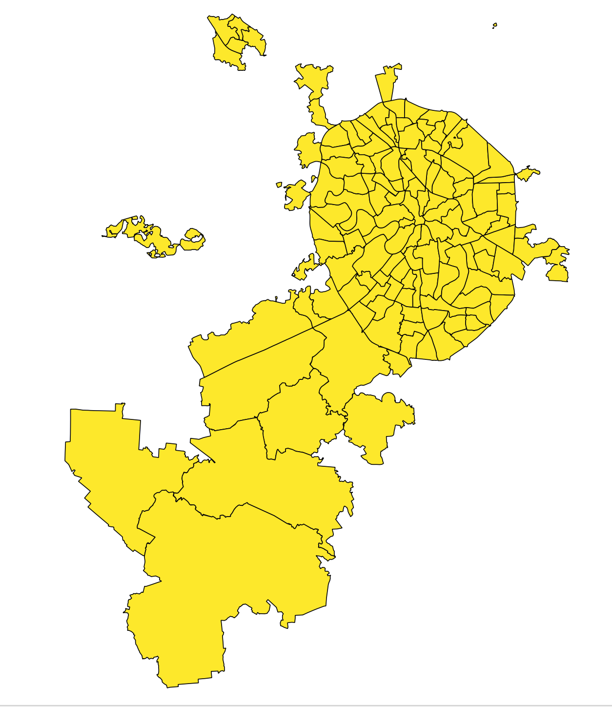{fig-align="center" width="779"}

::: callout-tip
Проект со всеми настройками стиля вы можете скачать в виде архива *Визуализация* из той же папки, что и исходные данные, или по прямой ссылке <https://disk.yandex.ru/d/Ou8wlVtMKiJu1A>
:::

# Карта пропорциональных символов

В этом типе тематических карт отображение происходит с помощью размера символов, который пропорционален величине показателя.

## Использование слоя символа

Как упоминалось выше каждый символ может быть составлен из нескольких слоев.

Добавим новый слой символа с использованием кнопки  в свойствах слоя.

Тип слоя в данном случае - *Центроиды*.

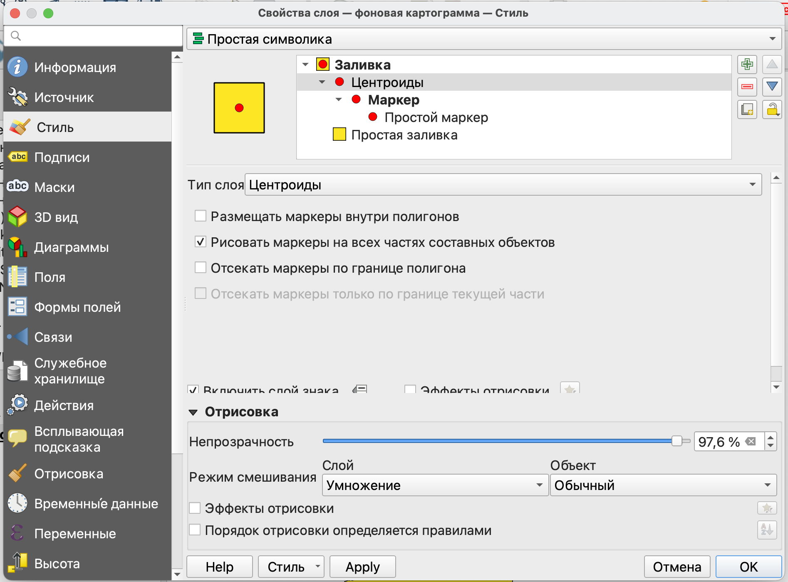{fig-align="center" width="1219"}

::: callout-note
Для того, чтобы видеть изменения слоя на карте, не закрывая окно свойств вы можете просто нажимать *Применить* (*Apply*). Таким образом изменения будут применены, но окно останется открытым.
:::

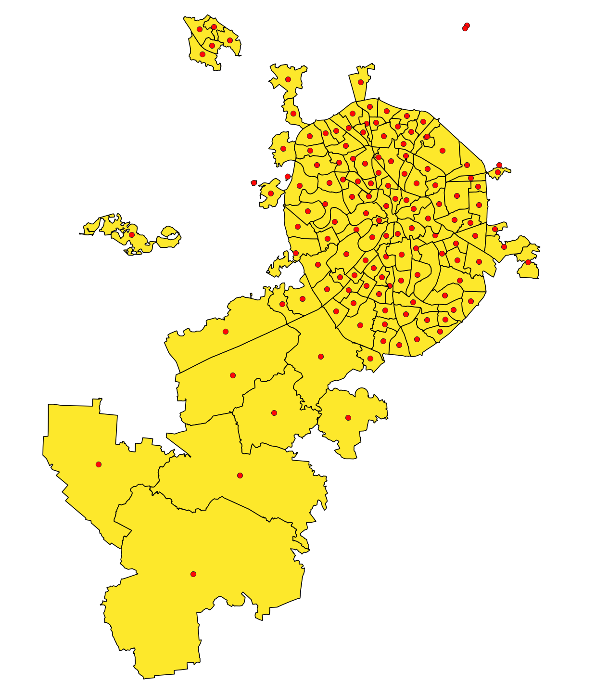{fig-align="center" width="788"}

Для получившихся центроидов нужно применить настройку *Размещать маркеры внутри полигонов* (поставить галочку напротив этих слов). Ее использование принудительно сместить точки центроидов так, чтобы они всегда были внутри полигонов, так как в противном случае для некоторых объектов сложной формы центроиды могут попасть за пределы объекта.

Опцию *Рисовать маркеры на всех частях составных объектов* же наоборот следует отключить, потому что она будет создавать дополнительные маркеры для частей мультиполигонов.

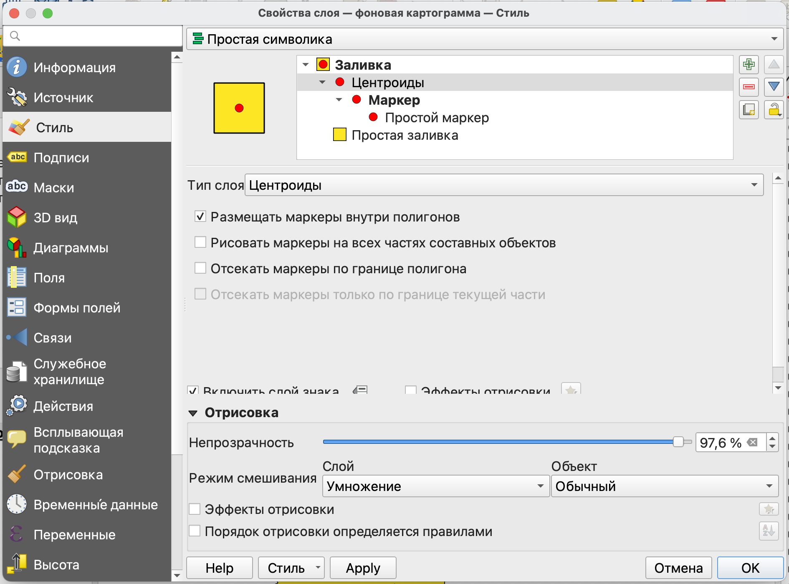{fig-align="center" width="1215"}

::: callout-tip
Для того, чтобы убрать лишнюю информацию в виде цветовой заливки полигонов с вашей карты, вы можете перейти в настройки заливки и выбрать тип заливки *Без заливки*.

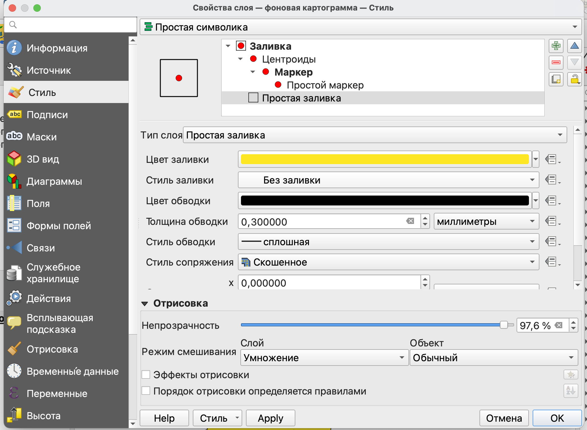{fig-align="center" width="1227"}
:::

Далее нам необходимо настроить размер маркера таким образом, чтобы он отображал количество населения (поле атрибутивной таблицы "population").

Для этого перейдем в настройки простого маркера и справа от размера нажмем кнопку *Переопределить на основе данных*.

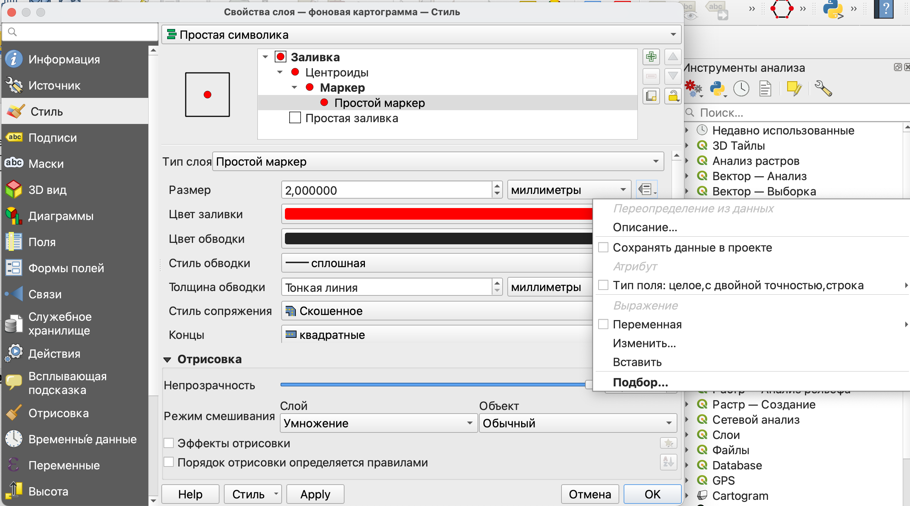{fig-align="center" width="1614"}

Здесь нам необходимо воспользоваться опцией **Подбор**.

В открывшемся окне необходимо сначала выбрать так называемый источник, то есть поле, по которому будет подбираться размер. У нас это поле "population".

Далее нужно указать минимальное и максимальное значение. Они могут быть заданы автоматически на основе атрибута нажатием на кнопку .

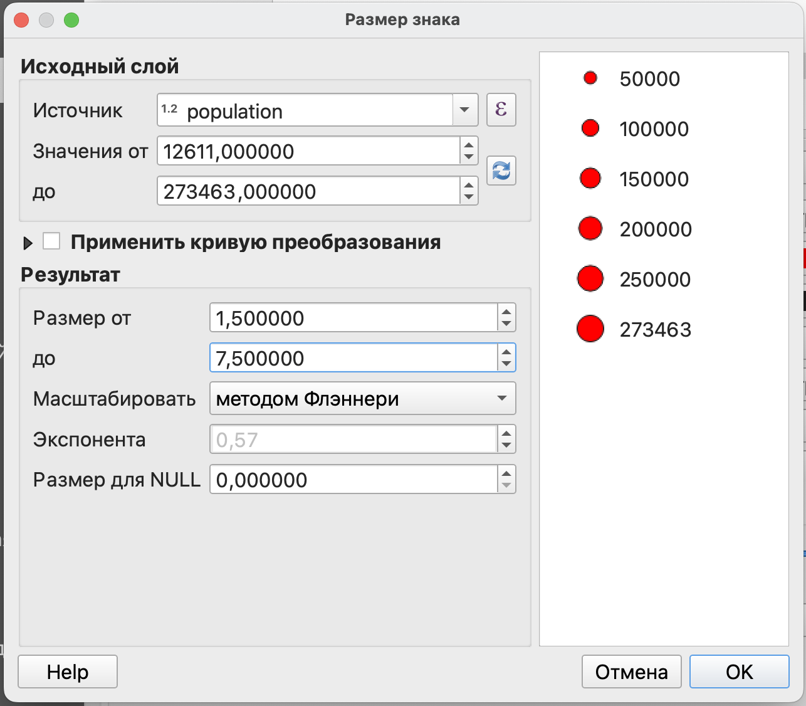{fig-align="center" width="799"}

После того, как будут выбраны значения в правой части окна вы увидите маркеры варьирубщихся размеров. Именно так они и будут масштабироваться на вашей карте.

Вы можете задать максимальный и минимальный размер символа. Желательно, чтобы разница в размерах символа была пропорциональна разнице между значениями атрибута. Например, если минимальное и максимальное значение отличаются в 10 раз, то и размер символов должен отличаться в столько же раз.

::: callout-note
Вы можете воспользоваться несколькими вариантами масштабирования, из которых метод Флэннери, установленный по умолчанию, будет наиболее оптимальным благодаря тому, что масштабирование происходит по площади символа таким образом, чтобы мы визуально хорошо и корректно считывали разницу в размерах.

Прочие способы масштабирования:

-   по площади - масштабирование происходит по площади символа;

-   радиально - масштабирование происходит по радиусу круга;

-   экспоненциально.
:::

После применения изменений вы увидите на карте ваши символы, размер которых будет пропорционален количеству населения в муниципальном округе.

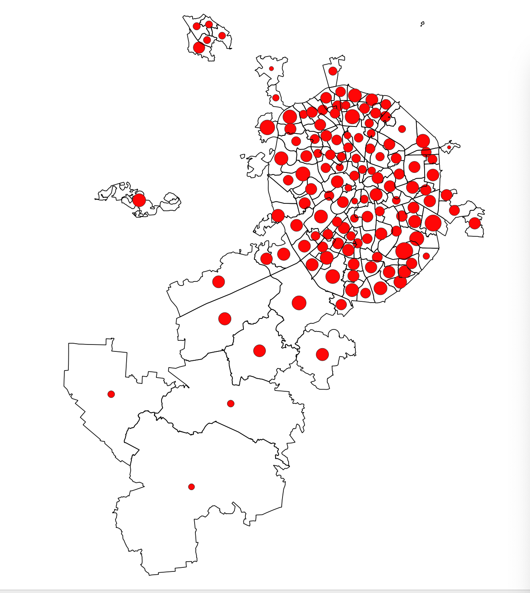{fig-align="center" width="804"}

::: callout-tip
Далее вы можете выбрать для своих маркеров цвет, обводку и прозрачность.

Рекомендуется делать их полупрозрачными для того, чтобы при наложении маркеров друг на друга вы видели все символы.

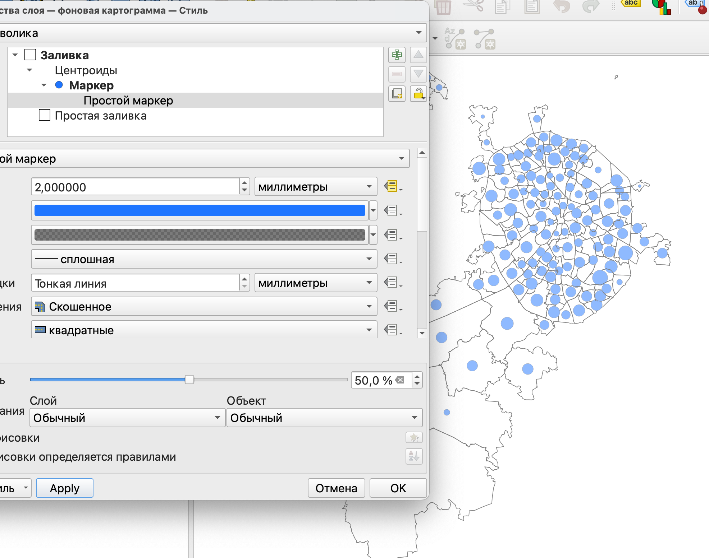{fig-align="center" width="1142"}
:::

::: callout-caution
К сожалению, большим недостатком такого подхода является то, что вы не можете создать легенду для своего слоя автоматически.
:::

## Использование генератора геометрии

::: callout-note
В том случае, если вам необходимо несколько вариантов оформления вашего слоя, то вы можете его продублировать.

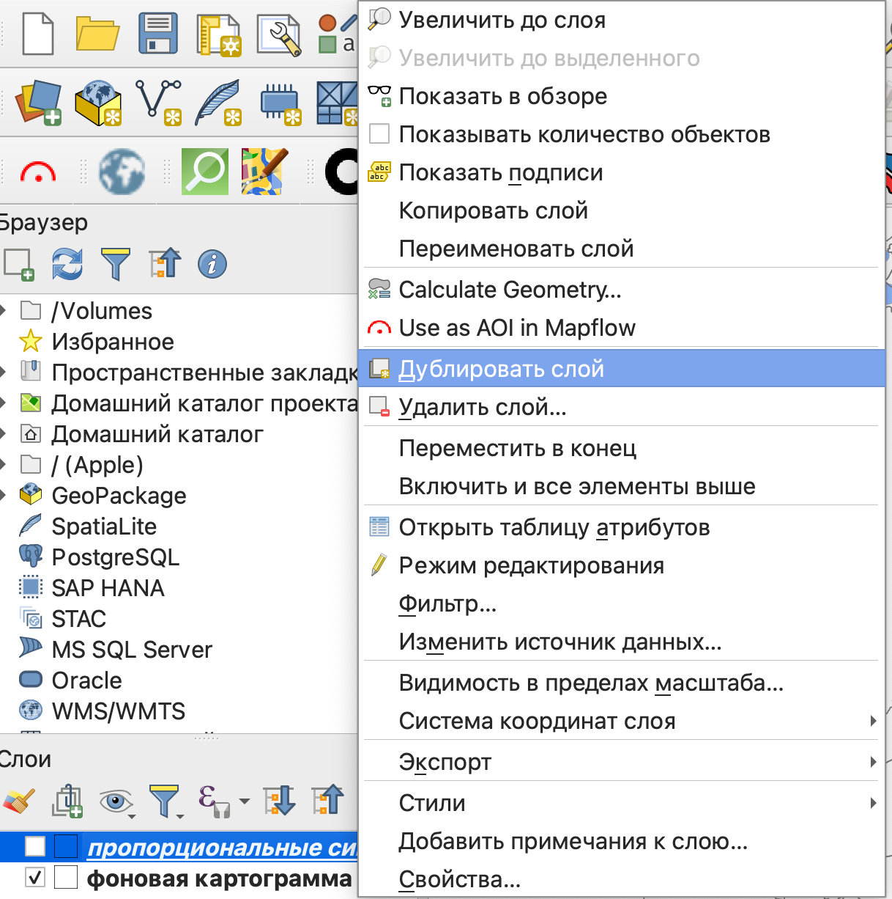{fig-align="center" width="695"}

Однако следует помнить, что все эти дубликаты будут использовать один и тот же файл, поэтому изменения будут происходить одновременно во всех слоях.

Продублированные слои вы можете переименовывать - это никак не меняет имя файла, просто присваивает слою псеводним в рамках вашего проекта.
:::

Для второго варианта карты пропорциональных символов воспользуемся *Генератором геометрии*.

Генератор геометрии может быть использован для создания сложных стилей объектов, а также визуализации объектов с использованием другого типа геометрического примитива (например, соединение точек одной линией по порядку) или отрисовки других объектов на основе исходных (например, отрисовки буферных зон вокруг объектов).

::: callout-important
Важно помнить, что генератор геометрии не меняет тип исходных объектов слоя, а просто создает новый тип отрисовки объектов. То есть геометрия останется неизменной, изменится только отображение ее на карте. Поэтому, если вам необходимо создать объект с иным типом геометрии для дальнейшей работы на основе выражения, следует пользоваться инструментом **Геометрия из выражения** из панели инструментов анализа.
:::

В нашем случае это будет создание точек на основе наших полигонов.

Удалим в дубликате нашего слоя слой символа *Центроиды* и добавим новый, выбрав *Генератор геометрии*.

По умолчанию генератор будет использовать исходные геометрии объектов.

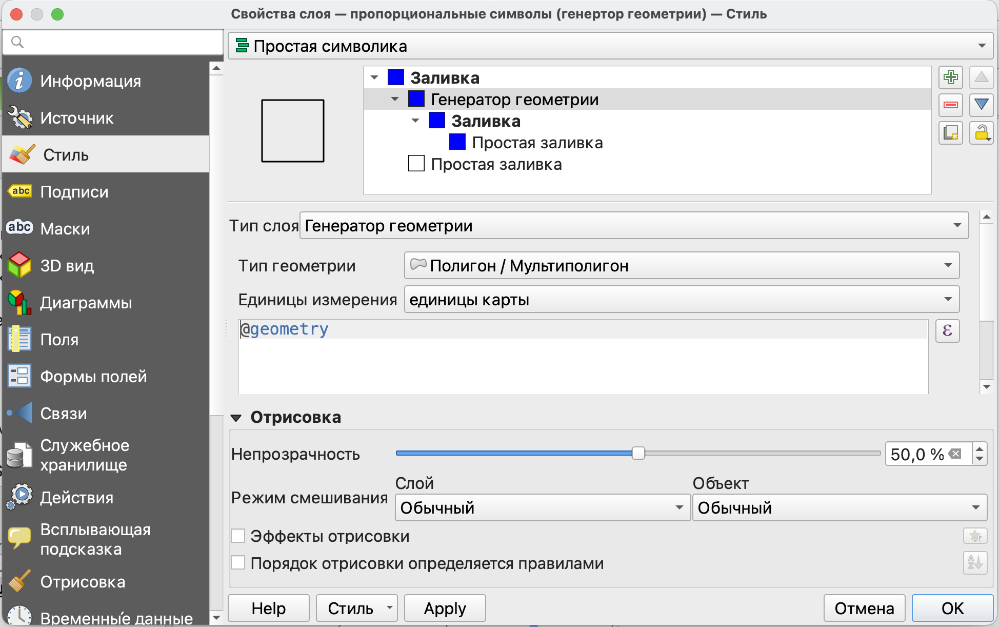{fig-align="center" width="1435"}

В первую очередь заменим тип геометрии в генераторе на *Точка/мультиточка*, а далее пропишем выражение для отрисовки точек.

Выражение может быть просто прописано с клавиатуры в том поле, где сейчас указано `@geometry` или создано с помощью редактора выражений, открывающегося по кнопке 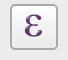 справа от поля с выражением.

Здесь необходимо прописать следующее выражение:

```         
point_on_surface(@geometry)
```

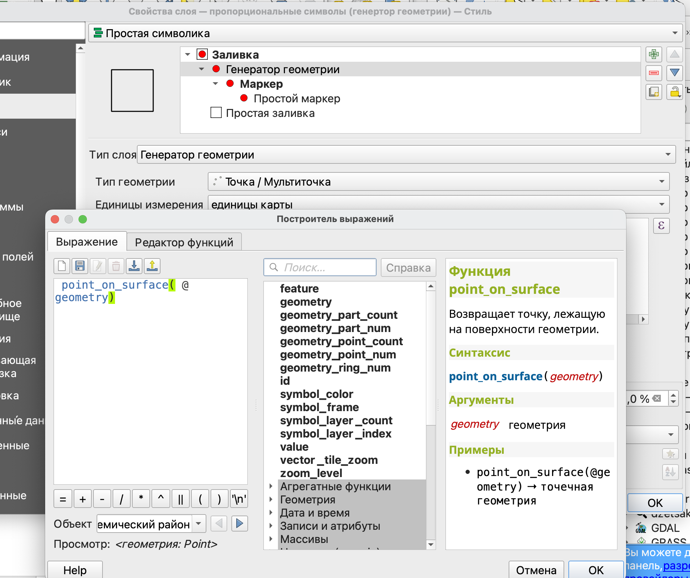{fig-align="center" width="1073"}

В данном случае `point_on_surface` - это функция, создающая точку в центре полигона, но в том случае, если центр полигона находится за его пределами, точка перемещается внутрь.

Результат применения генератора геометрии будет аналогичен предыдущему разделу.

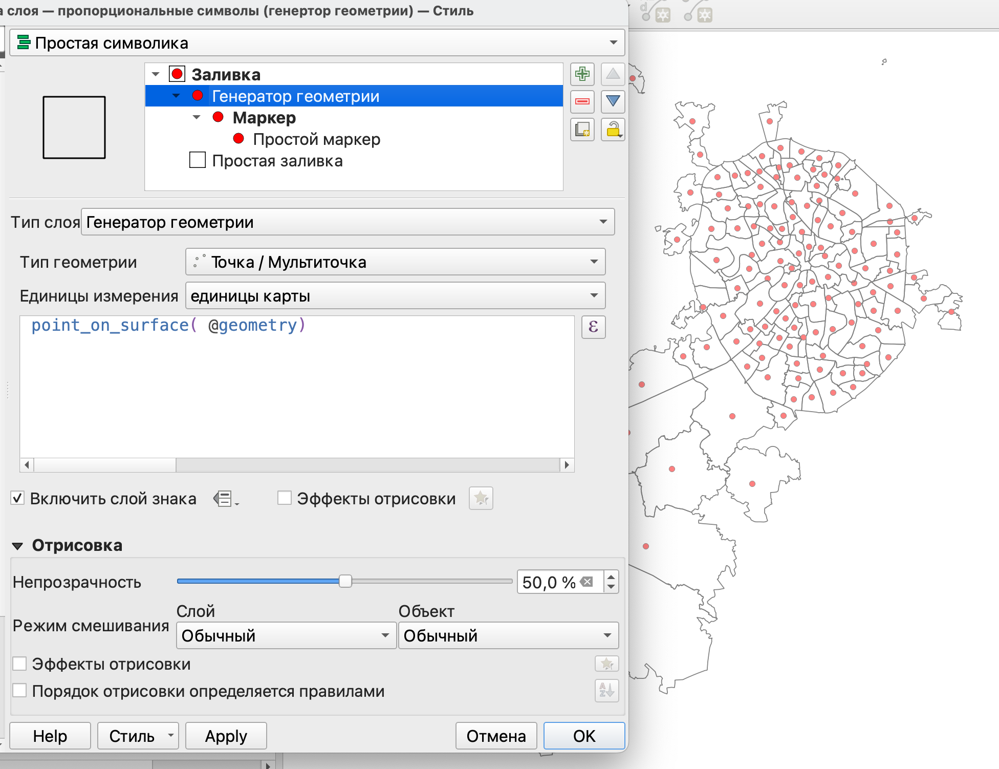{fig-align="center" width="1170"}

Далее настройка происходит аналогично предыдущему разделу.

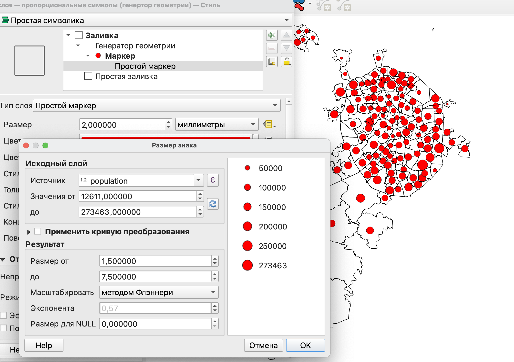{fig-align="center" width="1415"}

::: callout-tip
Размер символов как визуальная переменная хорошо сочетается с цветом, который вы можете использовать для отображения того же показателя или другого.
:::

## Создание нового слоя

Ни один из перечисленных выше двух способов не позволяет сразу создать легенду с размерами знаков.

Для создания карты пропорциональных символов так, чтобы вам было доступно создание легенды для карты, в первую очередь следует получить точечный слой на основе полигональных объектов.

Для этого воспользуемся инструментом *Точка на поверхности* из *Панели инструментов анализа*.

::: callout-note
Этот инструмент дублирует инструмент *Центроид* с одной небольшой разницей: в случае невыпуклого многоугольника при использовании *Центроида* точка будет лежать за пределами полигона, тогда как при использовании *Точки на поверхности* точка будет смещена внутрь.

Фактически это та же самая функция, которой вы пользовались в генераторе геометрии.
:::

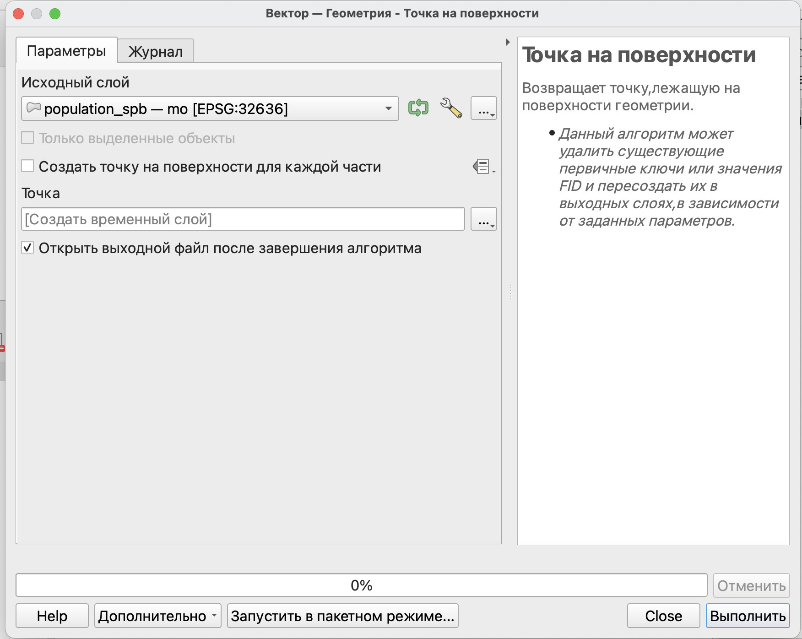{fig-align="center" width="879"}

В результате вы получите новый слой с точечными объектами, которые будут иметь те же атрибуты, что и исходные полигоны.

В первую очередь следует определить размер знаков.

{fig-align="center" width="1170"}

В открывшемся окне следует указать поле, по которому размер будет задан и его значения.

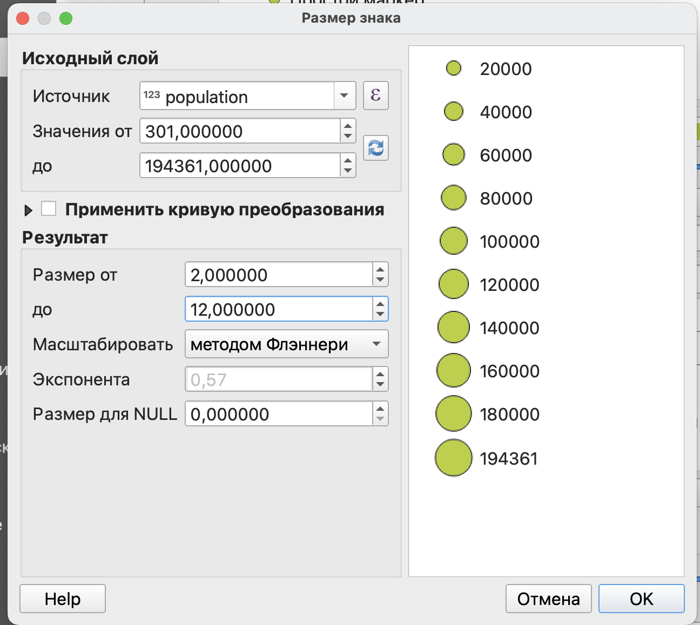{fig-align="center" width="783"}

Для того, чтобы размер символов был отображен в легенде, следует выбрать настройку *Размер условных определяется данными...*

{fig-align="center" width="1445"}

После этого вы можете настроить свою легенда и выбрать ее тип.

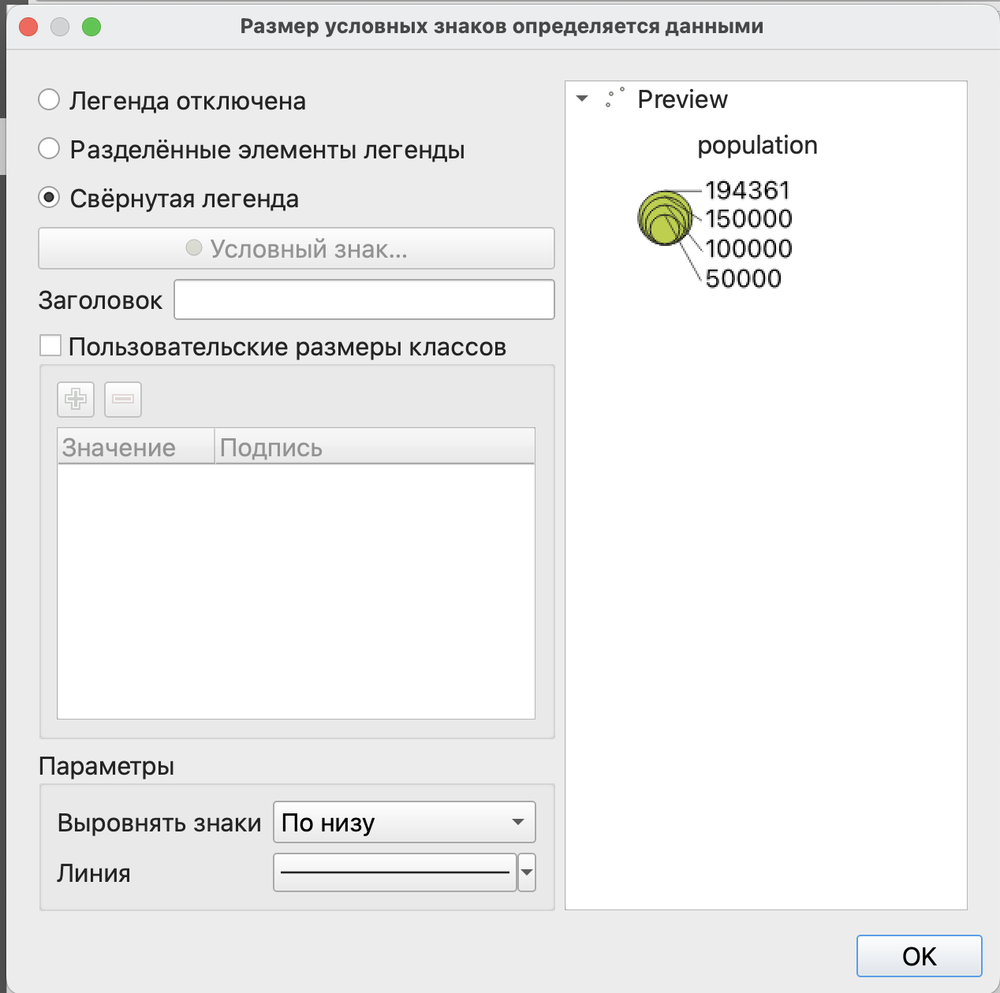{fig-align="center" width="704"}

# Карта плотности точек

В карте плотности точек количество точек будет отображать величину показателя.

Для ее создания снова воспользуемся возможностью создания многослойных символов.

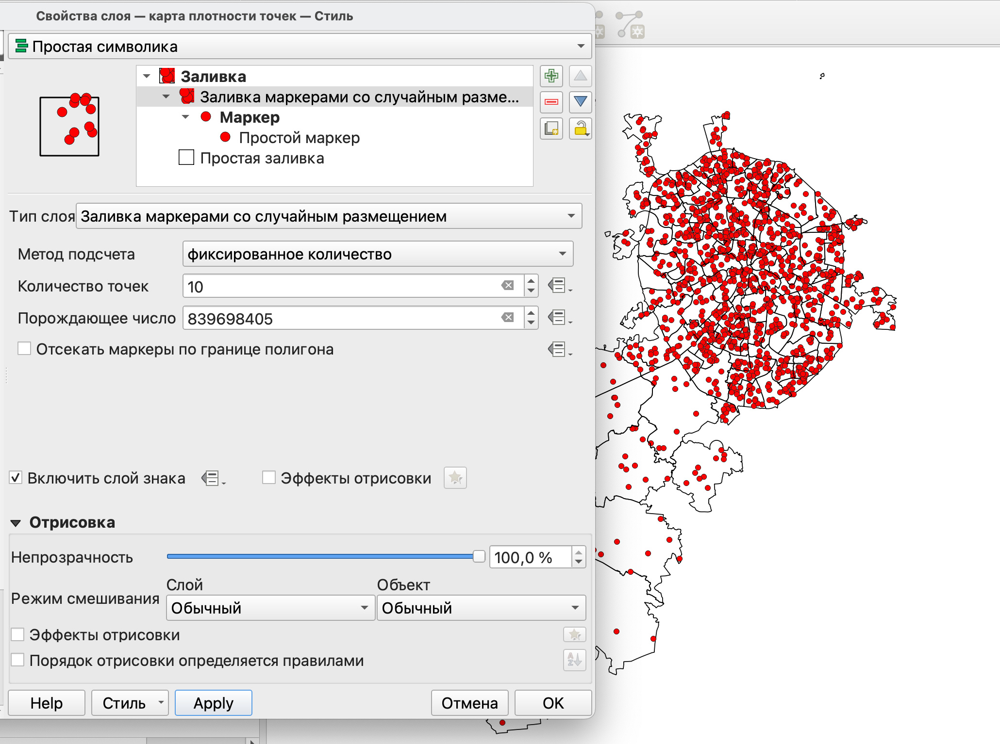{fig-align="center" width="1209"}

В этом случае каждый из полигонов будет заполнен заданным количеством маркеров, которые будут размещены случайным образом.

Так как нам необходимо, чтобы количество маркеров было пропорционально количеству населения, то воспользуемся опцией переопределения показателя из данных.

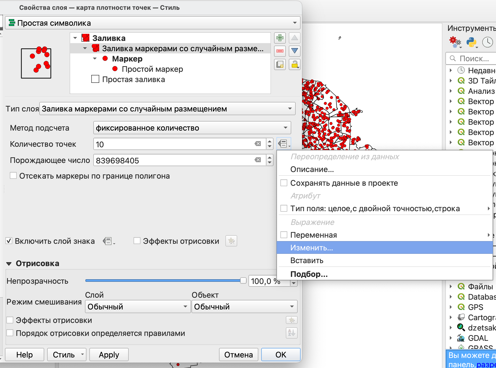{fig-align="center" width="1210"}

В открывшемся окне воспользуемся редактором выражений.

В данном случае поделим общее количество населения на 5 000, таким образом 1 точка на карте будет соответствовать 5 000 человек, проживающих в определенном муниципальном образовании.

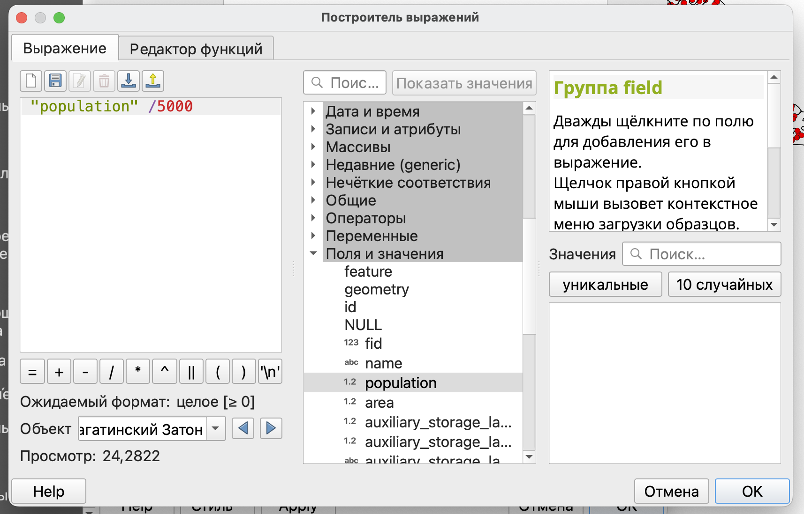{fig-align="center" width="1093"}

::: callout-important
Рекомендуется выбирать это число таким образом, чтобы в каждом из исходных объектов было хотя бы несколько точек.
:::

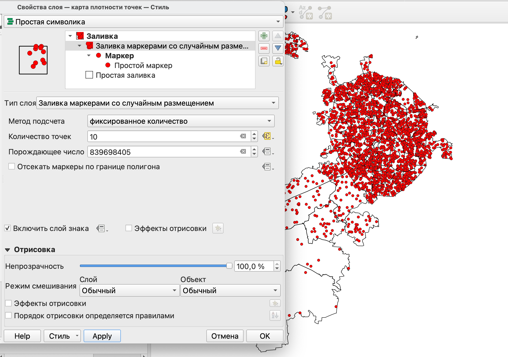{fig-align="center" width="1279"}

Здесь еще желательно настроить размер точек таким образом, чтобы они были хорошо различимы на карте.

В данном случае я убрала обводку точек и сделала их меньше.

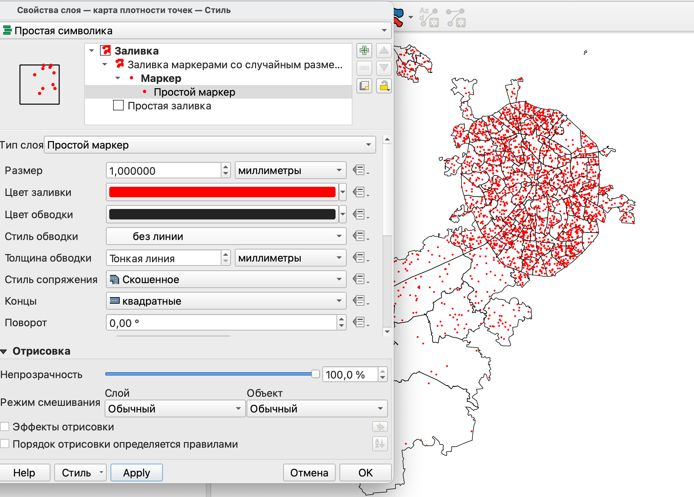{fig-align="center" width="1255"}

::: callout-note
Обратите внимание, что вы можете настраивать стиль слоев символа независимо друг от друга.
:::

# Фоновая картограмма

Фоновая картограмма - один из самых наиболее известных типов тематических карт, в которых показатель отображается цветом или штриховкой.

Для ее создания достаточно просто воспользоваться уже знакомым вам символом по диапазонам значений.

Однако следует помнить, что при использовании фоновых картограмм рекомендуется брать относительные значения показатей, например, вместо количества населения - плотность населения на единицу площади.

В наших исходных данных в таблице атрибутов приведено именно количество населения, поэтому необходимо перейти от него к плотности. Сделать это можно двумя способами: рассчитав плотность как отдельный атрибут с использованием калькулятора полей или воспользоваться выражением вместо конкретного атрибута при задании стиля символа.

Для того, чтобы рассчитать плотность нам необходима площадь наших объектов. Рассчитаем ее с использованием модуля **Calculate geometry**. После его установки, он должен быть в контекстном меню слоя, открывающемся при клике правой кнопкой мыши.

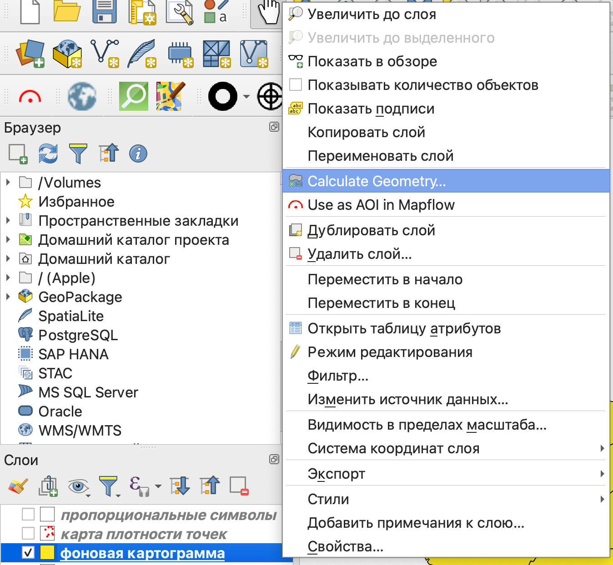{fig-align="center" width="759"}

В открывшемся окне модуля выберем расчет площади *area* в квадратных километрах и системе координат `EPSG: 32637 - UTM zone 37N`.

::: callout-note
Расчет здесь производится в этой системе координат для того, чтобы площадь считалась корректно.
:::

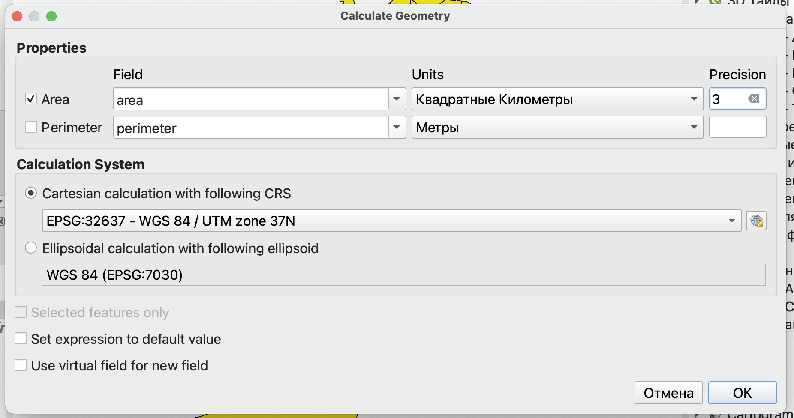{fig-align="center" width="1518"}

В результате к таблице атрибутов будет добавлено новое поле со значением площади объектов в километрах квадратных.

Для задания символики по диапазонам значений воспользуемся выражением.

```         
"population" /"area"
```

В этом выражении количество населения поделено на рассчитанную площадь муниципального образования.

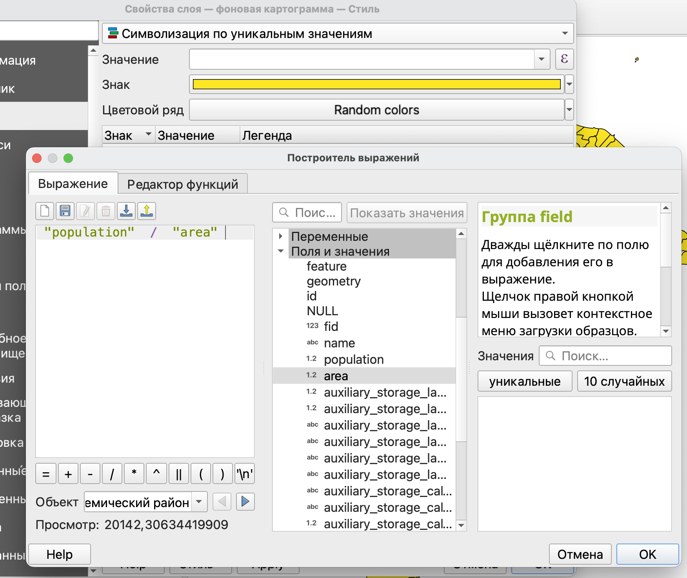{fig-align="center" width="1068"}

Для того, чтобы открылся редактор выражений следует нажать на кнопку  справа от параметра *Значение*.

Вы также можете выбрать градиент, который вам больше нравится, но рекомендуется использовать градиенты от светлого к темному (при светлом фоне) или от темного к светлому (при темном фоне).

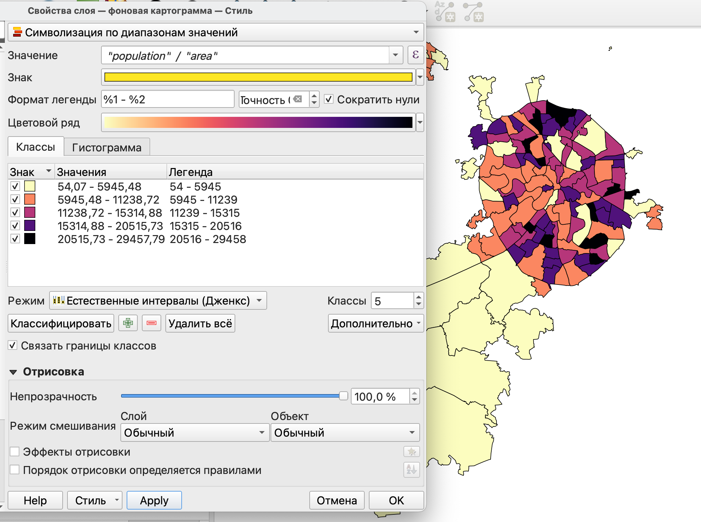{fig-align="center" width="1208"}

::: callout-tip
Если вы хотите, чтобы под вашими полигонами читалась подложка, то вы можете воспользоваться режимом смешивания.

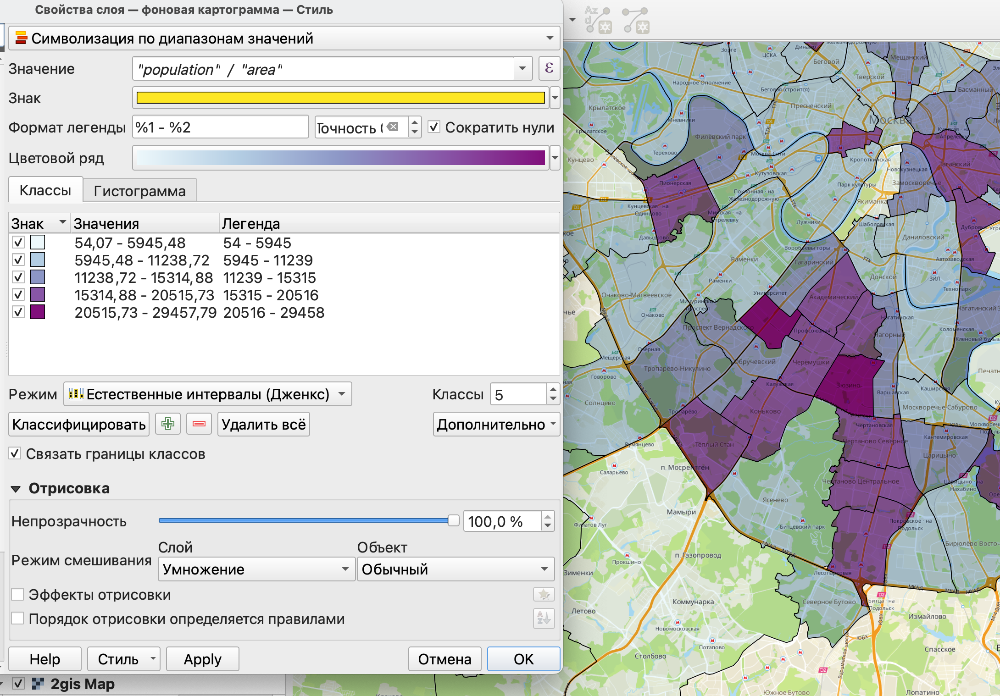{fig-align="center" width="1292"}
:::

# Анаморфная карта

Анаморфная карта предполагает отображение показателя с помощью размера объекта, но, в отличие от пропорциональных символов, здесь используется исходная геометрия объектов, которая искажается пропорционально величине показателя.

::: callout-important
Следует помнить, что в анаморфной карте искажаются форма и размер объектов.
:::

В QGIS отсутствует инструмент по умолчанию для создания анаморфной карты, поэтому следует воспользоваться модулем *Cartogram3*. Этот модуль появится у вас на панели инструментов в виде значка 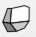{width="46"}.

В открывшемся окне модуля необходимо выбрать слой, для которого анаморфная карта рассчитывается, показатель и указать критерии остановки (максимальное число итераций или максимальная средняя ошибка).

::: callout-warning
Чем выше значения критерия остановки, тем сильнее будет искажение в итоговой карте.
:::

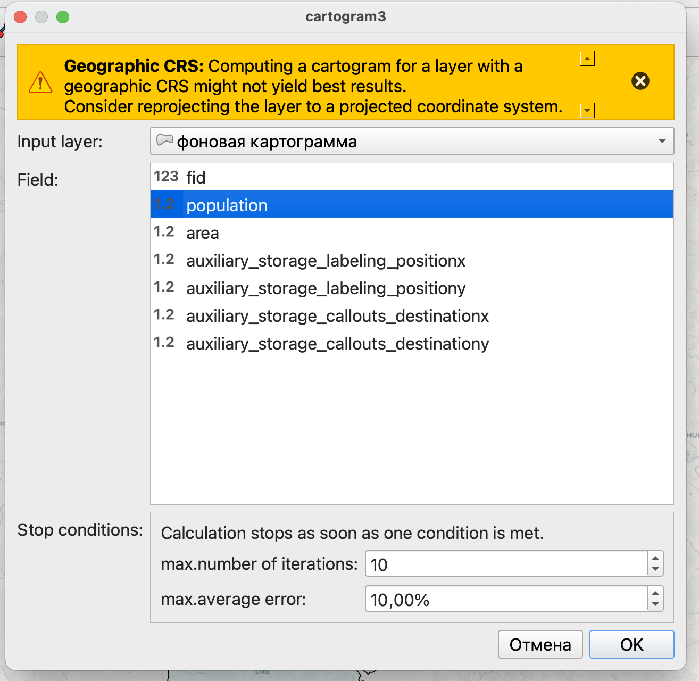{fig-align="center" width="719"}

На полученной карте муниципальные образования с большим количеством населения будут "раздуты", а с маленьким наоборот - уменьшены.

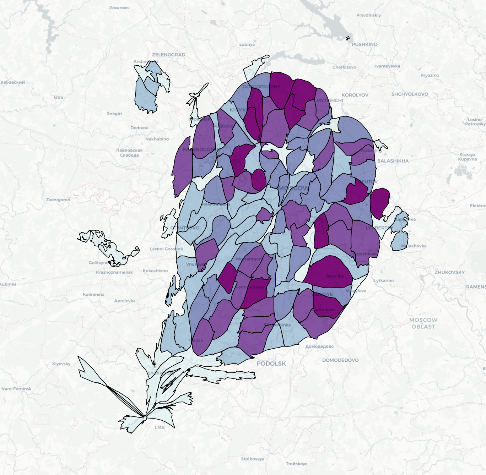{fig-align="center" width="920"}

::: callout-note
Обратите внимание, что настройки стиля были унаследованы из исходного слоя, для которого вы строили анаморфную карту.
:::

::: callout-warning
Анаморфная карта здесь создается как временный слой, поэтому не забудьте сохранить ее отдельно.
:::

# Несмежная картограмма

Несмежная картограмма отчасти следует принципу создания анаморфной карты, то есть искажает размер объектов так, чтобы он был пропорционален величине показателя, но здесь нарушается топология объектов, то есть они перестают иметь общие границы при общем сохранении формы объектов.

## Генератор геометрии

Несмежную картограмму мы создадим с использованием *Генератора геометрии*, которы позволяет создавать объекты с измененной геометрией на карте, не меняя геометрии в слое.

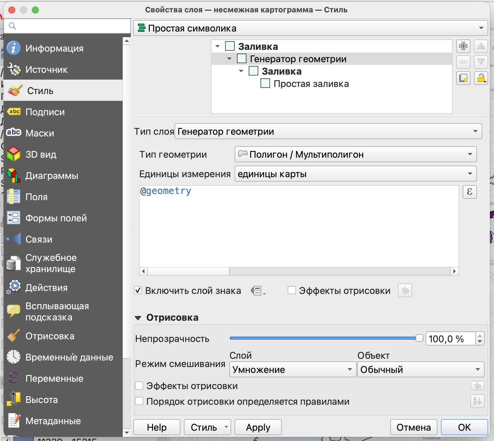{fig-align="center" width="1008"}

Для генератора воспользуемся следующим выражением:

```         
scale( $geometry, "population"/maximum("population"), "population"/maximum("population"))
```

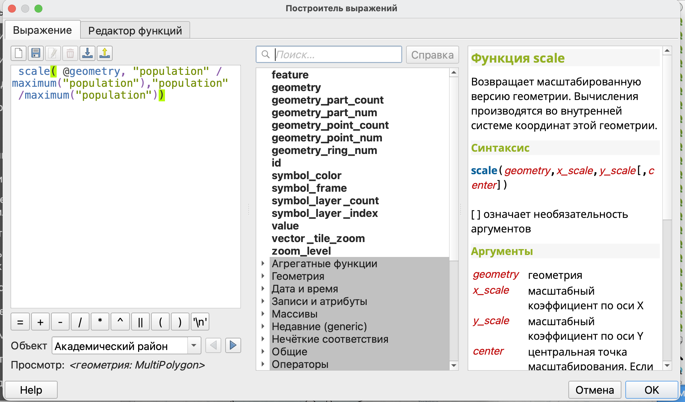{fig-align="center" width="1533"}

Это выражение масштабирует объекты, в качестве первого аргумента здесь указывается, что масштабировать, а второй и третий - это величина масштабирования по оси X и Y соответственно.

В результате вы получите слой с отмасштабированными пропорционально количеству населения муниципальными образованиями.

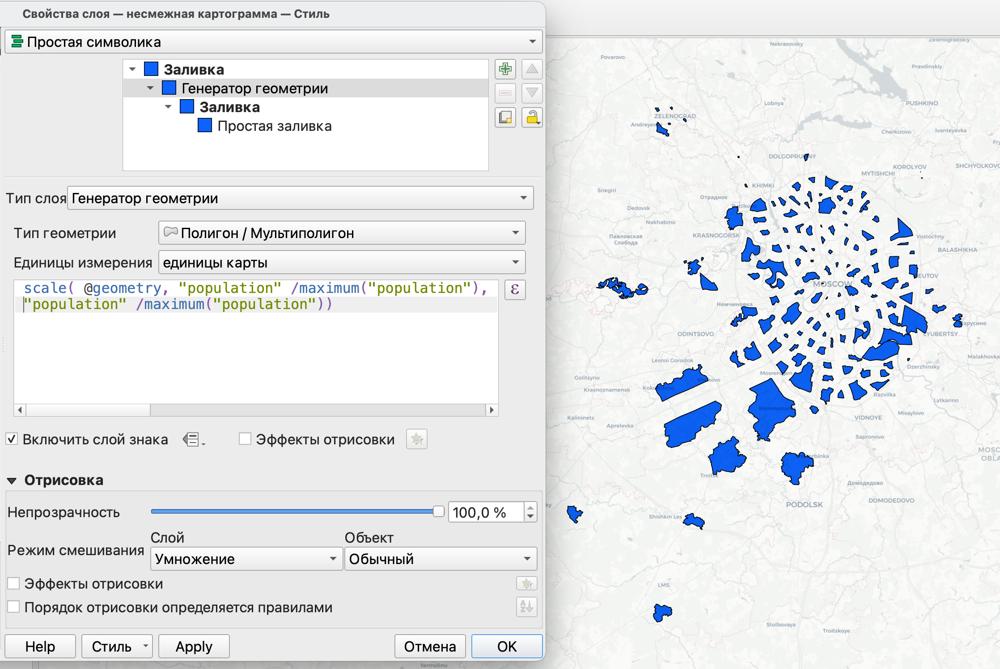{fig-align="center" width="1343"}

Если вы хотите, чтобы у вас отображались еще и истинные границы полигонов, вы можете добавить под генератор геометрии слой простой заливки.

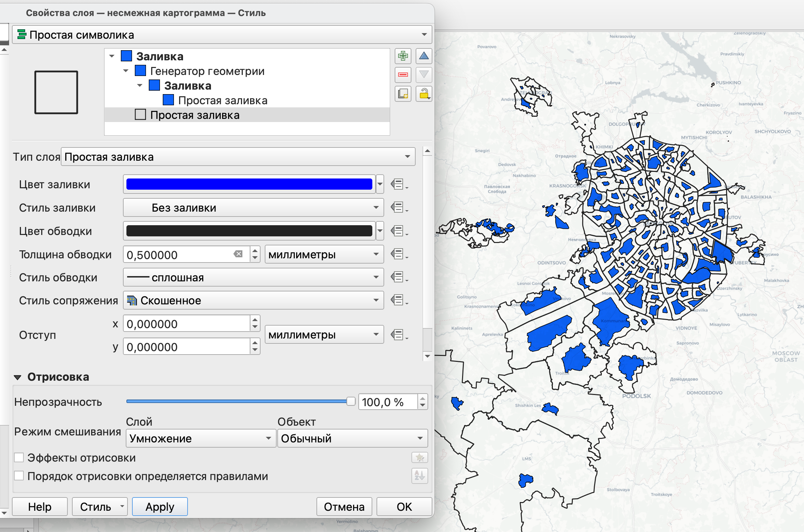{fig-align="center" width="1358"}

::: callout-note
Большим преимуществом генератора геометрии здесь является то, что нет необходимости создавать новый отдельный слой с измененными геометриями объектов.
:::

## Модуль Shape tools

Альтернативой использованию генератора геометрий является создание нового слоя с измененной геометрией.

Сделать это можно с помощью модуля *Shape tools*. После установки он появится у вас на панели инструментов.

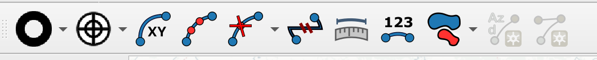{fig-align="center" width="981"}

Для изменения формы объектов воспользуемся инструментом *Geodetic transformations* из модуля.

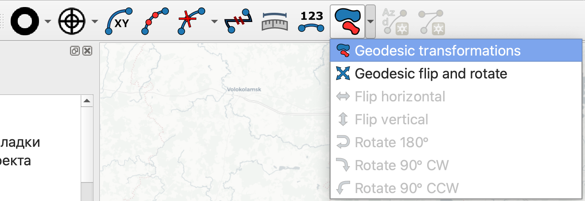{fig-align="center" width="1303"}

После запуска инструменты вы увидите несколько параметров, которые он позволяет изменить:

-   rotation angle - угол поворота объектов;

-   scale factor - масштабирование;

-   translation distance - расстояние перемещения объектов;

-   translation azimuth - направление перемещения объектов;

-   translation distance units - единицы измерения расстояния переноса.

Нам необходимо масштабировать объекты, поэтому единственный параметр, нужный нам - *scale factor*. Величина масштабирования у нас должна задаваться на основе выражения, поэтому воспользуемся переопределением из данных и опцией *Изменить*.

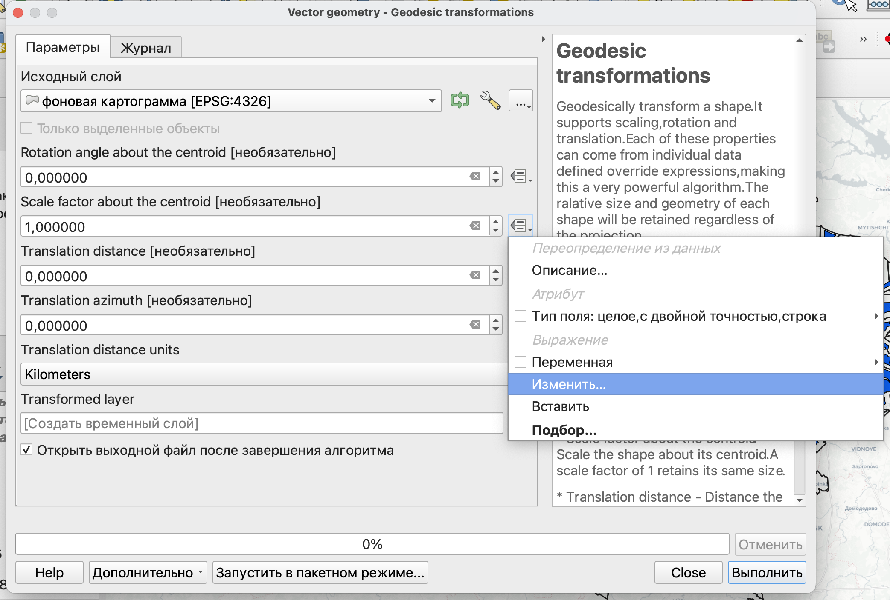{fig-align="center" width="1331"}

В открывшемся окне редактора выражений следует ввести:

```         
"population" /maximum("population")
```

То есть величина масштабирования у нас будет такая же, как мы использовали в генераторе геометрий.

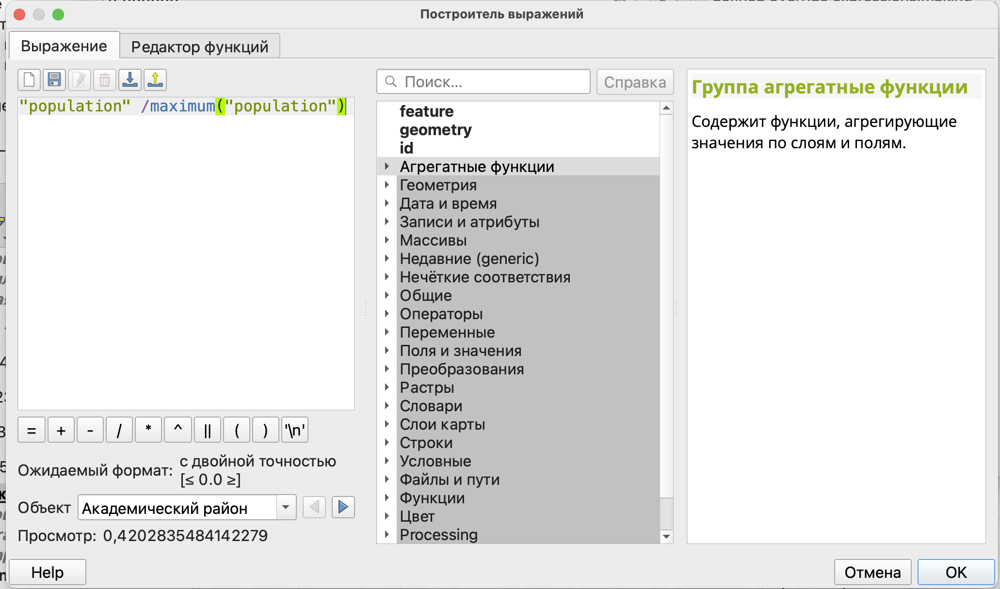{fig-align="center" width="1357"}

::: callout-warning
По умолчанию у вас здесь будет создаваться временный слой. Если вы его хотите сохранить, вы можете сразу воспользоваться опцией *Сохранить в файл*.
:::

В результате вы получите **новый слой** с измененными геометриями.

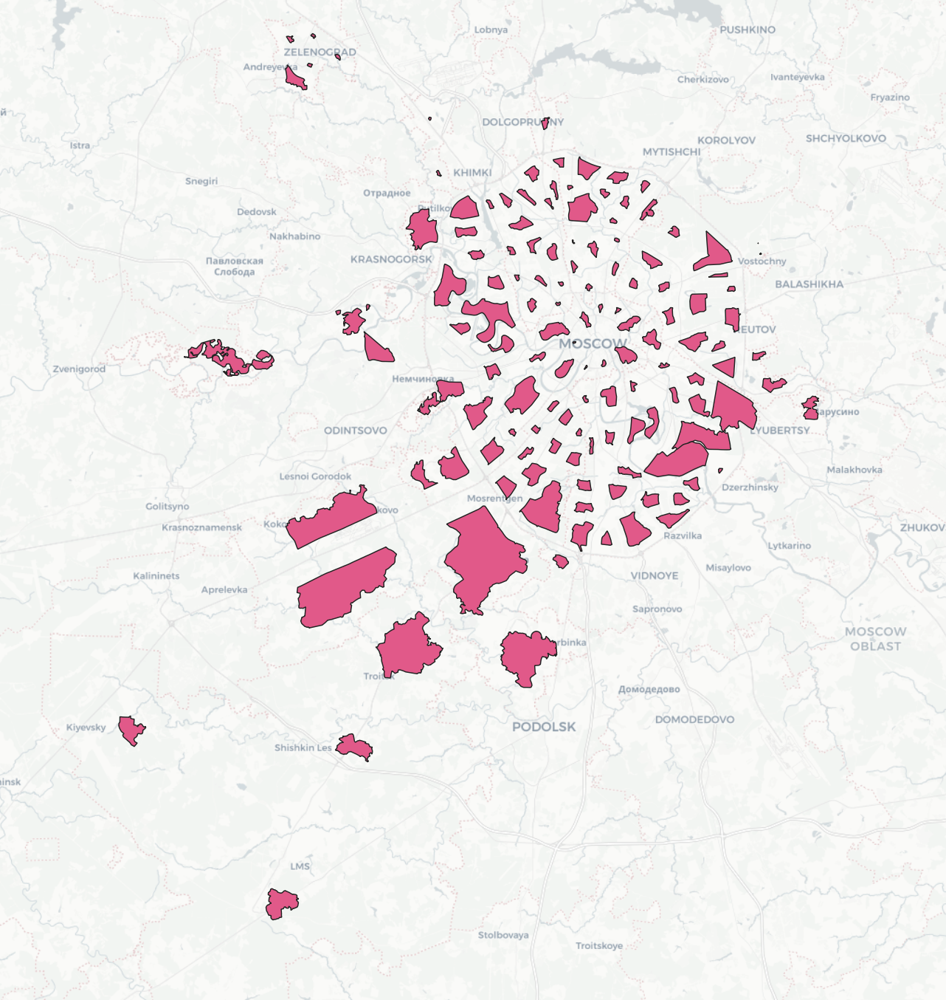{fig-align="center" width="757"}

# Создание атласа

Атлас в QGIS позволяет автоматически создать несколько листов карты на основе какого-то условия группировки.

Например, мы можем сделать атлас для нашей карты с количеством населения в муниципальных образованиях, где на одном листе будет показан один район.

Для того, чтобы сделать из макета карты атлас, то есть серию карт нам необходимо условие группировки объектов, в качестве которого будет выступать административный район.

Для того, чтобы создать карту населения по административным округам Москвы добавим в проект слой с ними (файл *ao.geojson*). Объекты этого слоя будут нужны нам в первую очередь для того, чтобы создать страницы атласа и настроить некоторые элементы отображения.

::: callout-note
Как создать макет и добавить на него карту было описано в разделе [Оформление карт и макеты](https://baltti.github.io/bachelor-gis-course/layout.html).
:::

Создадим новый макет, в котором с помощью кнопки *Настройки атласа* 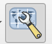{width="64"} создадим атлас.

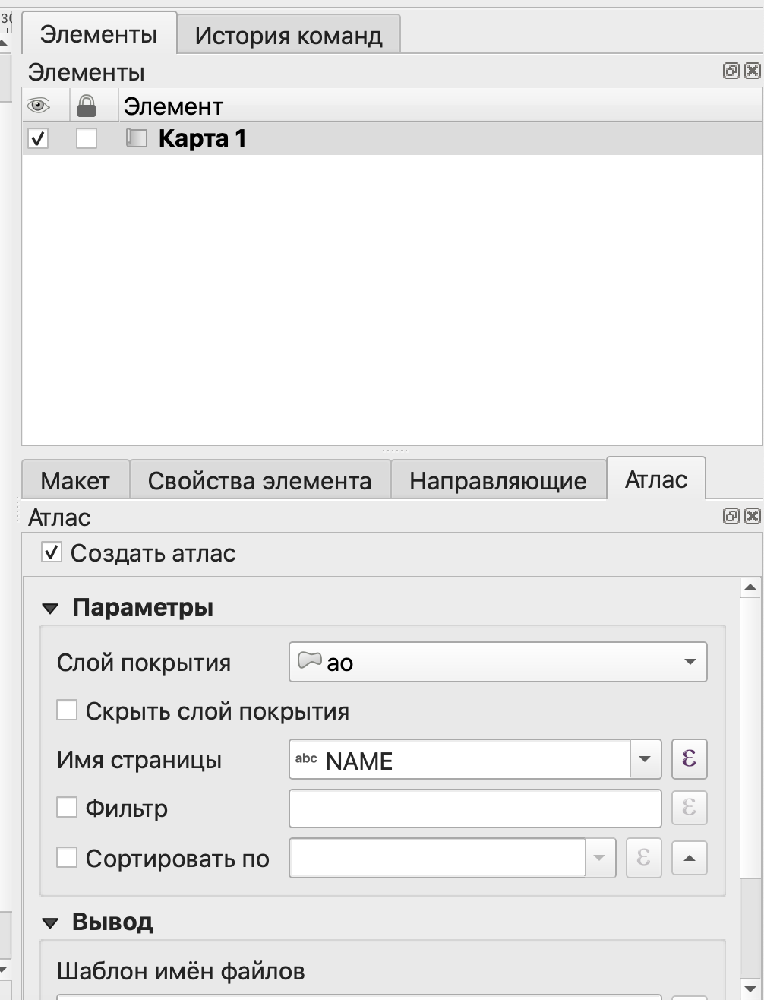{fig-align="center" width="535"}

Страницы атласа в данном случае будут создаваться по районам.

::: callout-note
Для создания страниц атласа не обязательно, чтобы слой, по которому они создаются был видимым в проекте.
:::

Просмотр страниц атласа доступен по кнопке *Предпросмотр атласа* 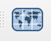{width="61"}.

Для того, чтобы масштаб карты подстраивался под содержимое настроим масштаб под объекты, определяющие страницы нашего атласа.

Для этого откроем свойства карты и найдем настройку масштаба атласа. Нужно установить настройку масштаба атласа по размерам объектов с полем. Так карта будет автоматически масштабироваться на каждом листе так, чтобы на ней размещался только один из районов.

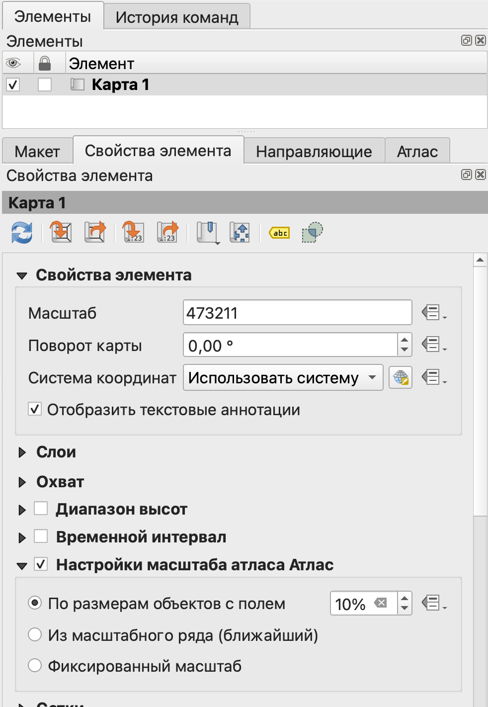{fig-align="center" width="552"}

В итоге каждый лист будет центрироваться на одном из районов, а масштаб будет подбираться так, чтобы район целиком помещался на карту.

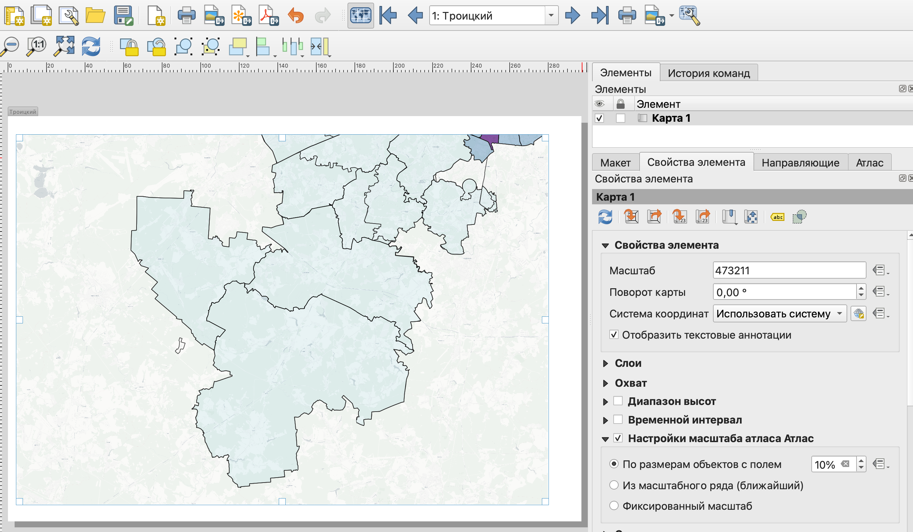{fig-align="center" width="1713"}

После открытия предпросмотра в панели инструментов макета вы увидите стрелки переключения между страницами и раскрывающийся список страниц/округов.

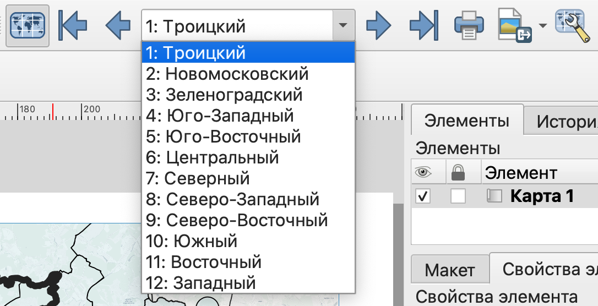{fig-align="center" width="977"}

Для того, чтобы район был очевиднее на листе, настроим стиль объектов так, чтобы район листа был обведен более толстым контуром.

Вернемся в основное окно программы, и настроим толщину обводки на основе выражения:

```         
if ( @atlas_pagename =  "NAME"  ,2, 0.3)
```

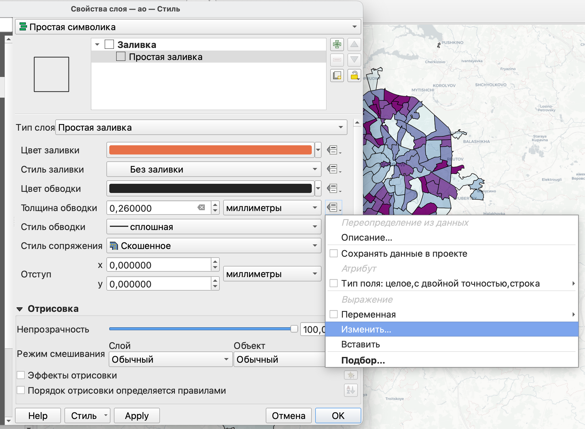{fig-align="center" width="1225"}

Это выражение с условием "если", в котором в качестве аргументов передаются:

-   условие;

-   толщина обводки в том случае, если условие выполнено;

-   толщина обводки, если условие не выполнено.

Что же значит переменная `@atlas_pagename`? Эта переменная указывает на то, что для задания стиля здесь нужно использовать тот район, на странице которого сейчас открыт наш атлас.

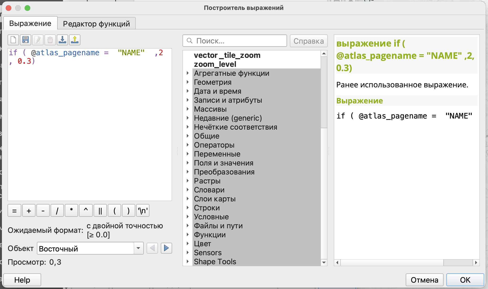{fig-align="center" width="1349"}

После этого вы увидите на карте в основном окне программы, что один из административных округов обведен более толстой линией, а также он обведен на странице атласа.

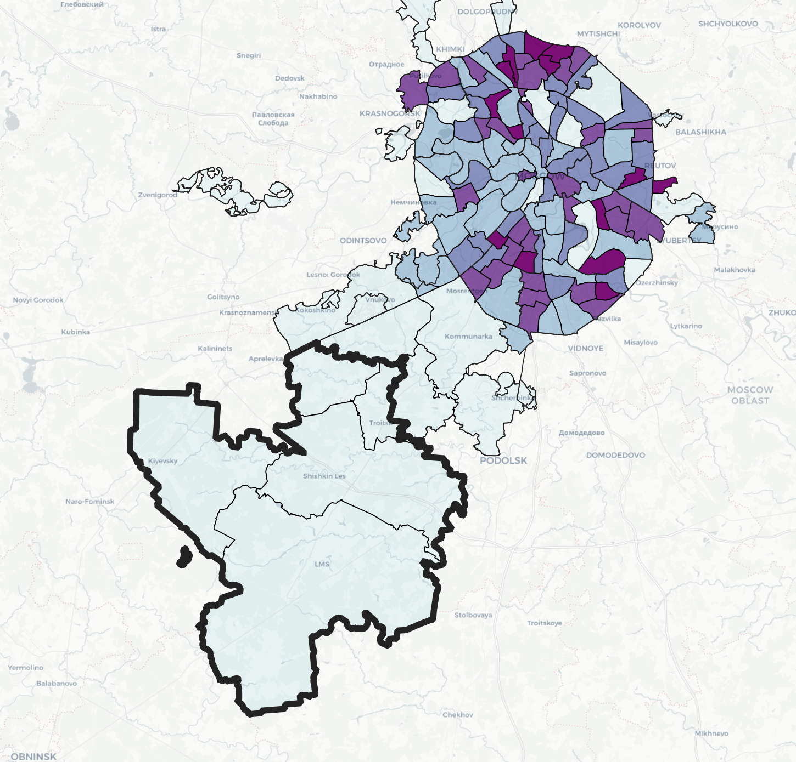{fig-align="center" width="730"}

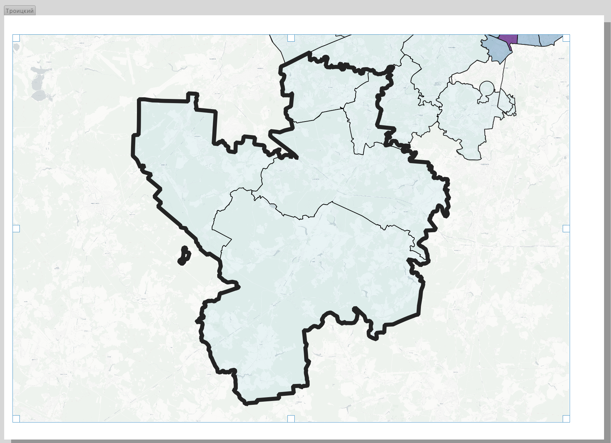{fig-align="center" width="964"}

Когда вы будете переходить со страницы на страницу атласа, у вас будет становиться более толстой обводка того округа, на страницу которого вы перешли.

# Карта точечных объектов

## Исходные данные

Исходные данные - сведения о пунктах выдачи маркетплейсов и служб доставки, которые были загружены из OSM (*shop - outpost*).

Данные в формате *geojson* (файл **shop outpost.geojson**) вы можете загрузить из папки по ссылке <https://disk.yandex.ru/d/bUOHR2aR6iny8w>

В папке также есть дополнительная папка с названием *Иконки*, которая понадобится чуть позже.
